## SQL - Funkcje okna (Window functions) <br> Lab 1

---

**Imiona i nazwiska:**
Kacper Cienkosz,
Miłosz Dubiel
--- 


Celem ćwiczenia jest przygotowanie środowiska pracy, wstępne zapoznanie się z działaniem funkcji okna (window functions) w SQL, analiza wydajności zapytań i porównanie z rozwiązaniami przy wykorzystaniu "tradycyjnych" konstrukcji SQL

Swoje odpowiedzi wpisuj w miejsca oznaczone jako:

---
> Wyniki: 

```sql
--  ...
```

---

Ważne/wymagane są komentarze.

Zamieść kod rozwiązania oraz zrzuty ekranu pokazujące wyniki, (dołącz kod rozwiązania w formie tekstowej/źródłowej)

Zwróć uwagę na formatowanie kodu

---

## Oprogramowanie - co jest potrzebne?

Do wykonania ćwiczenia potrzebne jest następujące oprogramowanie:
- MS SQL Server - wersja 2019, 2022
- PostgreSQL - wersja 15/16
- SQLite
- Narzędzia do komunikacji z bazą danych
	- SSMS - Microsoft SQL Managment Studio
	- DtataGrip lub DBeaver
-  Przykładowa baza Northwind
	- W wersji dla każdego z wymienionych serwerów

Oprogramowanie dostępne jest na przygotowanej maszynie wirtualnej

## Dokumentacja/Literatura

- Kathi Kellenberger,  Clayton Groom, Ed Pollack, Expert T-SQL Window Functions in SQL Server 2019, Apres 2019
- Itzik Ben-Gan, T-SQL Window Functions: For Data Analysis and Beyond, Microsoft 2020

- Kilka linków do materiałów które mogą być pomocne
	 - [https://learn.microsoft.com/en-us/sql/t-sql/queries/select-over-clause-transact-sql?view=sql-server-ver16](https://learn.microsoft.com/en-us/sql/t-sql/queries/select-over-clause-transact-sql?view=sql-server-ver16)
	- [https://www.sqlservertutorial.net/sql-server-window-functions/](https://www.sqlservertutorial.net/sql-server-window-functions/)
	- [https://www.sqlshack.com/use-window-functions-sql-server/](https://www.sqlshack.com/use-window-functions-sql-server/)
	- [https://www.postgresql.org/docs/current/tutorial-window.html](https://www.postgresql.org/docs/current/tutorial-window.html)
	- [https://www.postgresqltutorial.com/postgresql-window-function/](https://www.postgresqltutorial.com/postgresql-window-function/)
	- [https://www.sqlite.org/windowfunctions.html](https://www.sqlite.org/windowfunctions.html)
	- [https://www.sqlitetutorial.net/sqlite-window-functions/](https://www.sqlitetutorial.net/sqlite-window-functions/)


- Ikonki używane w graficznej prezentacji planu zapytania w SSMS opisane są tutaj:
	- [https://docs.microsoft.com/en-us/sql/relational-databases/showplan-logical-and-physical-operators-reference](https://docs.microsoft.com/en-us/sql/relational-databases/showplan-logical-and-physical-operators-reference)

## Przygotowanie

Uruchom SSMS
- Skonfiguruj połączenie  z bazą Northwind na lokalnym serwerze MS SQL 

Uruchom DataGrip (lub Dbeaver)
- Skonfiguruj połączenia z bazą Northwind
	- na lokalnym serwerze MS SQL
	- na lokalnym serwerze PostgreSQL
	- z lokalną bazą SQLite

---
# Zadanie 1 - obserwacja

Wykonaj i porównaj wyniki następujących poleceń.

```sql
select avg(unitprice) avgprice
from products p;

select avg(unitprice) over () as avgprice
from products p;

select categoryid, avg(unitprice) avgprice
from products p
group by categoryid

select avg(unitprice) over (partition by categoryid) as avgprice
from products p;
```

Jaka jest są podobieństwa, jakie różnice pomiędzy grupowaniem danych a działaniem funkcji okna?

---
> Wyniki: 

```sql
northwind.public> select avg(unitprice) avgprice from products p
[2025-03-21 10:36:29] 1 row retrieved starting from 1 in 60 ms (execution: 10 ms, fetching: 50 ms)
```
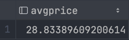

```sql
northwind.public> select avg(unitprice) over () as avgprice from products p
[2025-03-21 10:41:16] 77 rows retrieved starting from 1 in 20 ms (execution: 3 ms, fetching: 17 ms)

```

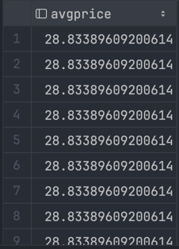


```sql
northwind.public> select categoryid, avg(unitprice) avgprice
                  from products p
                  group by categoryid
[2025-03-21 10:42:36] 8 rows retrieved starting from 1 in 20 ms (execution: 5 ms, fetching: 15 ms)
```

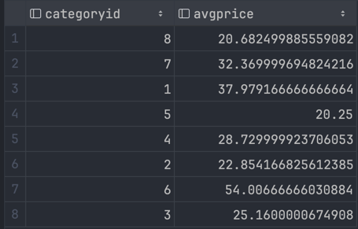

```sql
northwind.public> select avg(unitprice) over (partition by categoryid) as avgprice
				  from products p
[2025-03-21 10:44:36] 77 rows retrieved starting from 1 in 23 ms (execution: 4 ms, fetching: 19 ms)
```

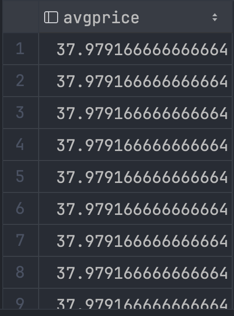

Główna różnica, którą zauważyliśmy, polega na tym, że funkcje okna nie zmieniają ilości wierszy zwracanych w wynikach zapytania.
Jedynie dodana jest kolumna z odpowiednimi wartościami przypisanymi do odpowieniego wiersza.
Grupowanie danych zmienia wyniki, ponieważ łączy wiersze na podstawie określonej kolumny, przez co liczba wyników może się zmniejszyć.

---
# Zadanie 2 - obserwacja

Wykonaj i porównaj wyniki następujących poleceń.

```sql
--1)

select p.productid, p.ProductName, p.unitprice,  
       (select avg(unitprice) from products) as avgprice  
from products p  
where productid < 10

--2)
select p.productid, p.ProductName, p.unitprice,  
       avg(unitprice) over () as avgprice  
from products p  
where productid < 10
```


Jaka jest różnica? Czego dotyczy warunek w każdym z przypadków? Napisz polecenie równoważne 
- 1) z wykorzystaniem funkcji okna. Napisz polecenie równoważne
- 2) z wykorzystaniem podzapytania

---
> Wyniki:

1) Wyniki z wykorzystaniem grupowania
```sql
northwind.public> select p.productid, p.ProductName, p.unitprice,
                         (select avg(unitprice) from products) as avgprice
                  from products p
                  where productid < 10
[2025-03-21 10:49:46] 9 rows retrieved starting from 1 in 40 ms (execution: 8 ms, fetching: 32 ms)
```
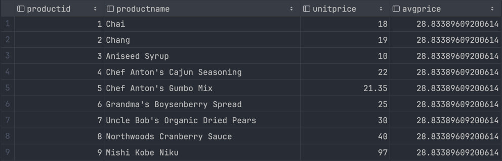

Polecenie równowążne z wykorzystaniem funkcji okna
```sql
select
	p.productid,
	p.ProductName,
	p.unitprice,
	avg(p.unitprice) over () as avgprice
from products p
order by productid
limit 9;
```

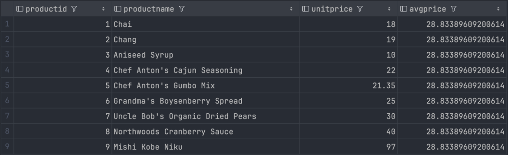

2) Wyniki z wykorzystaniem funkcji okna
```sql
northwind.public> select p.productid, p.ProductName, p.unitprice,
						 avg(unitprice) over () as avgprice
				  from products p
				  where productid < 10
[2025-03-21 10:59:34] 9 rows retrieved starting from 1 in 16 ms (execution: 3 ms, fetching: 13 ms)
```

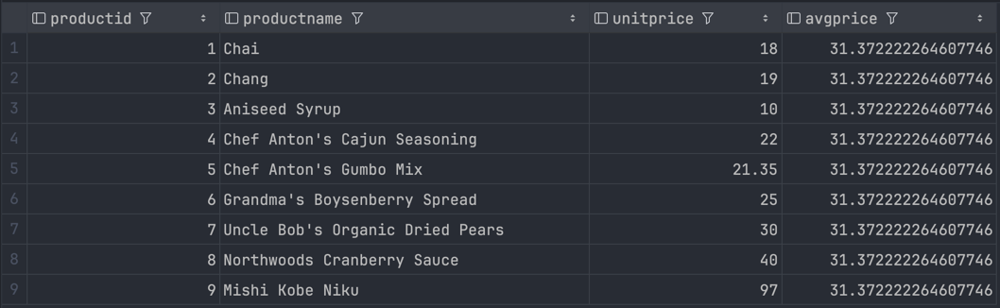

Polecenie równowążne z wykorzystaniem pozdapytania
```sql
select p.productid, p.ProductName, p.unitprice,
	   (select avg(unitprice) from products pp where pp.productid < 10) as avgprice
from products p
where productid < 10;
```

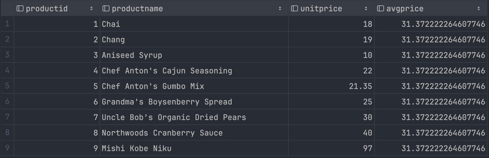

Różnica między wykorzystaniem podzapytania i funkcji okna polega na tym, że funkcja okna stosuje się do danych już zawężonych przez warunek WHERE, a podzapytanie stosuje się do wszystkich danych wybranych w podzapytaniu, a następnie wybiera odpowiednie dane na podstawie warunku.
Stąd, aby zrobić do pierwszego polecenia odpowiadające mu z wykorzystaniem funkcji okna, należy zastosować funkcję okna do wszystkich danych następnie posortować po productid i wziąć 9 pierwszysch elementów.
Aby zrobić drugie zapytanie za pomocą podzapytania, należy zawęzić dane warunkiem where w podzapytaniu.

# Zadanie 3

Baza: Northwind, tabela: products

Napisz polecenie, które zwraca: id produktu, nazwę produktu, cenę produktu, średnią cenę wszystkich produktów.

Napisz polecenie z wykorzystaniem z wykorzystaniem podzapytania, join'a oraz funkcji okna. Porównaj czasy oraz plany wykonania zapytań.

Przetestuj działanie w różnych SZBD (MS SQL Server, PostgreSql, SQLite)

W SSMS włącz dwie opcje: Include Actual Execution Plan oraz Include Live Query Statistics


W DataGrip użyj opcji Explain Plan/Explain Analyze


---
> Wyniki: 

```sql
--  ...
```

**MSSQL**

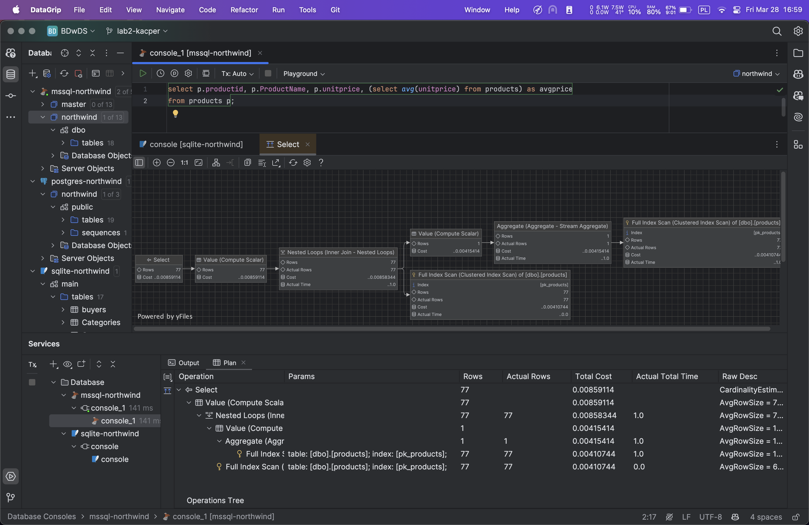

**PostgreSQL**

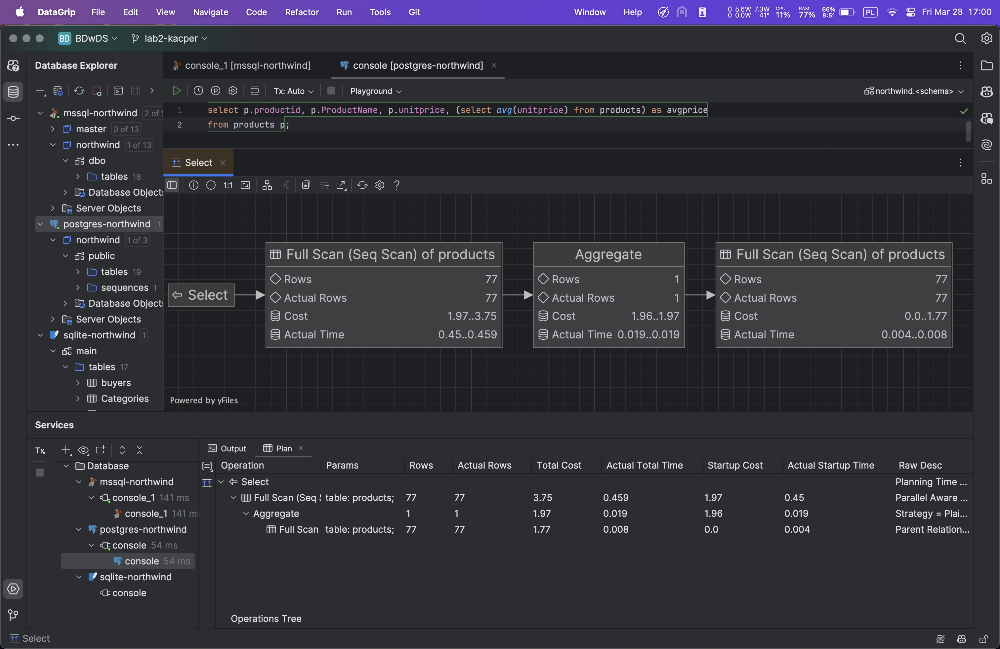

**SQLite**
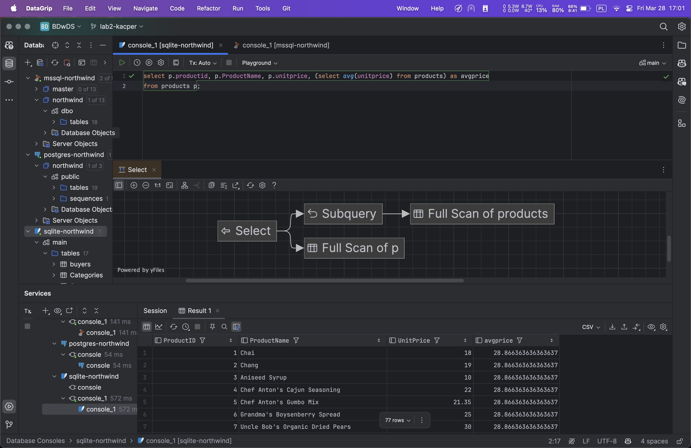
---


# Zadanie 4

Baza: Northwind, tabela products

Napisz polecenie, które zwraca: id produktu, nazwę produktu, cenę produktu, średnią cenę produktów w kategorii, do której należy dany produkt. Wyświetl tylko pozycje (produkty) których cena jest większa niż średnia cena.

Napisz polecenie z wykorzystaniem podzapytania, join'a oraz funkcji okna. Porównaj zapytania. Porównaj czasy oraz plany wykonania zapytań.

Przetestuj działanie w różnych SZBD (MS SQL Server, PostgreSql, SQLite)

---
> Wyniki: 

```sql
--  ...
```

---

|         |     |
| ------- | --- |
| zadanie | pkt |
| 1       | 1   |
| 2       | 1   |
| 3       | 1   |
| 4       | 1   |
| razem   | 4   |
