# Indeksy,  optymalizator <br>Lab1

<!-- <style scoped>
 p,li {
    font-size: 12pt;
  }
</style>  -->

<!-- <style scoped>
 pre {
    font-size: 8pt;
  }
</style>  -->


---

**Imiona i nazwiska: Kacper Cienkosz, Miłosz Dubiel**

--- 

Celem ćwiczenia jest zapoznanie się z planami wykonania zapytań (execution plans), oraz z budową i możliwością wykorzystaniem indeksów.

Swoje odpowiedzi wpisuj w miejsca oznaczone jako:

---
> Wyniki: 

```sql
--  ...
```

---

Ważne/wymagane są komentarze.

Zamieść kod rozwiązania oraz zrzuty ekranu pokazujące wyniki
- dołącz kod rozwiązania w formie tekstowej/źródłowej
- można dołączyć plik .md albo .sql

Zwróć uwagę na formatowanie kodu

## Oprogramowanie - co jest potrzebne?

Do wykonania ćwiczenia potrzebne jest następujące oprogramowanie
- MS SQL Server
- SSMS - SQL Server Management Studio    
	- ewentualnie inne narzędzie umożliwiające komunikację z MS SQL Server i analizę planów zapytań
- przykładowa baza danych AdventureWorks2017.
    
Oprogramowanie dostępne jest na przygotowanej maszynie wirtualnej


## Przygotowanie  
    
Stwórz swoją bazę danych o nazwie lab4. 

```sql
CREATE database lab1
GO

USE lab1
GO
```


# Część 1

Celem tej części ćwiczenia jest zapoznanie się z planami wykonania zapytań (execution plans) oraz narzędziem do automatycznego generowania indeksów.

## Dokumentacja/Literatura

Przydatne materiały/dokumentacja. Proszę zapoznać się z dokumentacją:
- [https://docs.microsoft.com/en-us/sql/tools/dta/tutorial-database-engine-tuning-advisor](https://docs.microsoft.com/en-us/sql/tools/dta/tutorial-database-engine-tuning-advisor)
- [https://docs.microsoft.com/en-us/sql/relational-databases/performance/start-and-use-the-database-engine-tuning-advisor](https://docs.microsoft.com/en-us/sql/relational-databases/performance/start-and-use-the-database-engine-tuning-advisor)
- [https://www.simple-talk.com/sql/performance/index-selection-and-the-query-optimizer](https://www.simple-talk.com/sql/performance/index-selection-and-the-query-optimizer)
- [https://blog.quest.com/sql-server-execution-plan-what-is-it-and-how-does-it-help-with-performance-problems/](https://blog.quest.com/sql-server-execution-plan-what-is-it-and-how-does-it-help-with-performance-problems/)


Operatory (oraz reprezentujące je piktogramy/Ikonki) używane w graficznej prezentacji planu zapytania opisane są tutaj:
- [https://docs.microsoft.com/en-us/sql/relational-databases/showplan-logical-and-physical-operators-reference](https://docs.microsoft.com/en-us/sql/relational-databases/showplan-logical-and-physical-operators-reference)

<div style="page-break-after: always;"></div>


Wykonaj poniższy skrypt, aby przygotować dane:

```sql
SELECT * INTO [ salesorderheader ]
FROM [ adventureworks2017 ].sales.[ salesorderheader ]
GO

SELECT * INTO [ salesorderdetail ]
FROM [ adventureworks2017 ].sales.[ salesorderdetail ]
GO
```


# Zadanie 1 - Obserwacja


Wpisz do MSSQL Managment Studio (na razie nie wykonuj tych zapytań):

```sql
-- zapytanie 1
SELECT *
FROM salesorderheader sh
INNER JOIN salesorderdetail sd ON sh.salesorderid = sd.salesorderid
WHERE orderdate = '2008-06-01 00:00:00.000'
GO

-- zapytanie 1.1
SELECT *
FROM salesorderheader sh
INNER JOIN salesorderdetail sd ON sh.salesorderid = sd.salesorderid
WHERE orderdate = '2013-01-28 00:00:00.000'
GO

-- zapytanie 2
SELECT orderdate,
       productid,
       SUM(orderqty) AS orderqty,
       SUM(unitpricediscount) AS unitpricediscount,
       SUM(linetotal)
FROM salesorderheader sh
INNER JOIN salesorderdetail sd ON sh.salesorderid = sd.salesorderid
GROUP BY orderdate, productid
HAVING SUM(orderqty) >= 100
GO

-- zapytanie 3
SELECT salesordernumber,
       purchaseordernumber,
       duedate,
       shipdate
FROM salesorderheader sh
INNER JOIN salesorderdetail sd ON sh.salesorderid = sd.salesorderid
WHERE orderdate IN (
    '2008-06-01', '2008-06-02', '2008-06-03', '2008-06-04', '2008-06-05'
)
GO

-- zapytanie 4
SELECT sh.salesorderid,
       salesordernumber,
       purchaseordernumber,
       duedate,
       shipdate
FROM salesorderheader sh
INNER JOIN salesorderdetail sd ON sh.salesorderid = sd.salesorderid
WHERE carriertrackingnumber IN ('ef67-4713-bd', '6c08-4c4c-b8')
ORDER BY sh.salesorderid
GO
```


Włącz dwie opcje: **Include Actual Execution Plan** oraz **Include Live Query Statistics**:

---
> Na początku włączyliśmy statystyki I/O oraz czasowe.

```sql
[2025-05-20 05:58:40] Connected
lab04> use lab04
[2025-05-20 05:58:40] [S0001][5701] Changed database context to 'lab04'.
[2025-05-20 05:58:40] completed in 14 ms
lab04> SET STATISTICS IO ON
[2025-05-20 05:58:40] completed in 4 ms
lab04> SET STATISTICS TIME ON
[2025-05-20 05:58:44] completed in 3 ms
```

---

<!-- ![[_img/index1-1.png | 500]] -->


Teraz wykonaj poszczególne zapytania (najlepiej każde analizuj oddzielnie). Co można o nich powiedzieć? Co sprawdzają? Jak można je zoptymalizować?  

---
> Wyniki: 

> **Zapytanie 1**

```sql
lab04> SELECT *
       FROM salesorderheader sh
       INNER JOIN salesorderdetail sd ON sh.salesorderid = sd.salesorderid
       WHERE orderdate = '2008-06-01 00:00:00.000'
[2025-05-20 06:00:34] [S0000][3613] SQL Server parse and compile time:
[2025-05-20 06:00:34] CPU time = 13 ms, elapsed time = 13 ms.
[2025-05-20 06:00:34] [S0000][3615] Table 'Workfile'
    Scan count 0,
    logical reads 0,
    physical reads 0,
    page server reads 0,
    read-ahead reads 0,
    page server read-ahead reads 0,
    lob logical reads 0,
    lob physical reads 0,
    lob page server reads 0,
    lob read-ahead reads 0,
    lob page server read-ahead reads 0.
[2025-05-20 06:00:34] [S0000][3615] Table 'Worktable'
    Scan count 0
    logical reads 0
    physical reads 0
    page server reads 0
    read-ahead reads 0
    page server read-ahead reads 0
    lob logical reads 0
    lob physical reads 0
    lob page server reads 0
    lob read-ahead reads 0
    lob page server read-ahead reads 0.
[2025-05-20 06:00:34] [S0000][3615] Table 'Worktable'
    Scan count 0
    logical reads 0
    physical reads 0
    page server reads 0
    read-ahead reads 0
    page server read-ahead reads 0
    lob logical reads 0
    lob physical reads 0
    lob page server reads 0
    lob read-ahead reads 0
    lob page server read-ahead reads 0.
[2025-05-20 06:00:34] [S0000][3615] Table 'salesorderheader'
    Scan count 1
    logical reads 782
    physical reads 0
    page server reads 0
    read-ahead reads 0
    page server read-ahead reads 0
    lob logical reads 0
    lob physical reads 0
    lob page server reads 0
    lob read-ahead reads 0
    lob page server read-ahead reads 0.
[2025-05-20 06:00:34] [S0000][3612] SQL Server Execution Times:
[2025-05-20 06:00:34] CPU time = 20 ms,  elapsed time = 20 ms.
[2025-05-20 06:00:34] completed in 41 ms
```

> **Po wyczyszeniu cache**

```sql
lab04> SELECT *
       FROM salesorderheader sh
       INNER JOIN salesorderdetail sd ON sh.salesorderid = sd.salesorderid
       WHERE orderdate = '2008-06-01 00:00:00.000'
[2025-05-20 06:38:04] [S0000][3613] SQL Server parse and compile time:
[2025-05-20 06:38:04] CPU time = 0 ms, elapsed time = 0 ms.
[2025-05-20 06:38:04] [S0000][3615] Table 'Workfile'.
    Scan count 0,
    logical reads 0,
    physical reads 0,
    page server reads 0,
    read-ahead reads 0,
    page server read-ahead reads 0,
    lob logical reads 0,
    lob physical reads 0,
    lob page server reads 0,
    lob read-ahead reads 0,
    lob page server read-ahead reads 0.
[2025-05-20 06:38:04] [S0000][3615] Table 'Worktable'.
    Scan count 0,
    logical reads 0,
    physical reads 0,
    page server reads 0,
    read-ahead reads 0,
    page server read-ahead reads 0,
    lob logical reads 0,
    lob physical reads 0,
    lob page server reads 0,
    lob read-ahead reads 0,
    lob page server read-ahead reads 0.
[2025-05-20 06:38:04] [S0000][3615] Table 'Worktable'.
    Scan count 0,
    logical reads 0,
    physical reads 0,
    page server reads 0,
    read-ahead reads 0,
    page server read-ahead reads 0,
    lob logical reads 0,
    lob physical reads 0,
    lob page server reads 0,
    lob read-ahead reads 0,
    lob page server read-ahead reads 0.
[2025-05-20 06:38:04] [S0000][3615] Table 'salesorderheader'.
    Scan count 1,
    logical reads 782,
    physical reads 0,
    page server reads 0,
    read-ahead reads 789,
    page server read-ahead reads 0,
    lob logical reads 0,
    lob physical reads 0,
    lob page server reads 0,
    lob read-ahead reads 0,
    lob page server read-ahead reads 0.
[2025-05-20 06:38:04] [S0000][3612] SQL Server Execution Times:
[2025-05-20 06:38:04] CPU time = 14 ms, elapsed time = 21 ms.
[2025-05-20 06:38:04] completed in 27 ms
```

> Komentarz:
>
> Pierwsze zapytanie, które uruchomiliśmy, musiało skorzystać z cache'u, który stworzył się poprzedniego dnia. Jest to o tyle ciekawe, że przed uruchomieniem tych zapytań kontener z SZBD został uruchomiony ponownie.
>
> Pierwsze zapytanie jest prostym zdobyciem informacji dotyczących zamówienia, które zostało złożone 2008-06-01 00:00:00.000. Okazało się, że nie ma takiego zamówienia.

> Plan zapytania:
>
> 

> **Zapytanie 1.1**

```sql
lab04> SELECT *
       FROM salesorderheader sh
       INNER JOIN salesorderdetail sd ON sh.salesorderid = sd.salesorderid
       WHERE orderdate = '2013-01-28 00:00:00.000'
[2025-05-20 06:09:58] [S0000][3613] SQL Server parse and compile time:
[2025-05-20 06:09:58] CPU time = 7 ms, elapsed time = 7 ms.
[2025-05-20 06:09:58] [S0000][3615] Table 'Workfile'.
    Scan count 0,
    logical reads 0,
    physical reads 0,
    page server reads 0,
    read-ahead reads 0,
    page server read-ahead reads 0,
    lob logical reads 0,
    lob physical reads 0,
    lob page server reads 0,
    lob read-ahead reads 0,
    lob page server read-ahead reads 0.
[2025-05-20 06:09:58] [S0000][3615] Table 'Worktable'.
    Scan count 0,
    logical reads 0,
    physical reads 0,
    page server reads 0,
    read-ahead reads 0,
    page server read-ahead reads 0,
    lob logical reads 0,
    lob physical reads 0,
    lob page server reads 0,
    lob read-ahead reads 0,
    lob page server read-ahead reads 0.
[2025-05-20 06:09:58] [S0000][3615] Table 'salesorderdetail'.
    Scan count 1,
    logical reads 1498,
    physical reads 0,
    page server reads 0,
    read-ahead reads 0,
    page server read-ahead reads 0,
    lob logical reads 0,
    lob physical reads 0,
    lob page server reads 0,
    lob read-ahead reads 0,
    lob page server read-ahead reads 0.
[2025-05-20 06:09:58] [S0000][3615] Table 'salesorderheader'.
    Scan count 1,
    logical reads 782,
    physical reads 0,
    page server reads 0,
    read-ahead reads 0,
    page server read-ahead reads 0,
    lob logical reads 0,
    lob physical reads 0,
    lob page server reads 0,
    lob read-ahead reads 0,
    lob page server read-ahead reads 0.
[2025-05-20 06:09:58] [S0000][3612] SQL Server Execution Times:
[2025-05-20 06:09:58] CPU time = 49 ms, elapsed time = 51 ms.
[2025-05-20 06:09:58] completed in 64 ms
```

> Plan zapytania:
>
> 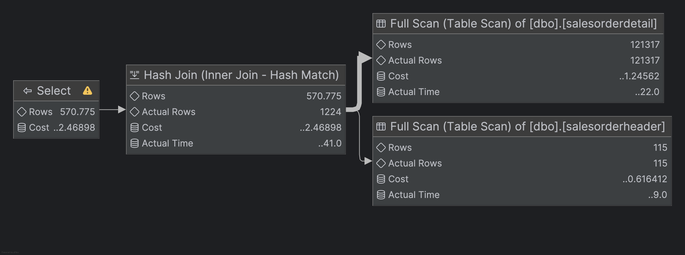

> **Po wyczyszczeniu cache**

```sql
lab04> SELECT *
       FROM salesorderheader sh
       INNER JOIN salesorderdetail sd ON sh.salesorderid = sd.salesorderid
       WHERE orderdate = '2013-01-28 00:00:00.000'
[2025-05-20 06:26:33] [S0000][3613] SQL Server parse and compile time:
[2025-05-20 06:26:33] CPU time = 0 ms, elapsed time = 0 ms.
[2025-05-20 06:26:33] [S0000][3615] Table 'Workfile'.
    Scan count 0,
    logical reads 0,
    physical reads 0,
    page server reads 0,
    read-ahead reads 0,
    page server read-ahead reads 0,
    lob logical reads 0,
    lob physical reads 0,
    lob page server reads 0,
    lob read-ahead reads 0,
    lob page server read-ahead reads 0.
[2025-05-20 06:26:33] [S0000][3615] Table 'Worktable'.
    Scan count 0,
    logical reads 0,
    physical reads 0,
    page server reads 0,
    read-ahead reads 0,
    page server read-ahead reads 0,
    lob logical reads 0,
    lob physical reads 0,
    lob page server reads 0,
    lob read-ahead reads 0,
    lob page server read-ahead reads 0.
[2025-05-20 06:26:33] [S0000][3615] Table 'salesorderdetail'.
    Scan count 1,
    logical reads 1498,
    physical reads 0,
    page server reads 0,
    read-ahead reads 1512,
    page server read-ahead reads 0,
    lob logical reads 0,
    lob physical reads 0,
    lob page server reads 0,
    lob read-ahead reads 0,
    lob page server read-ahead reads 0.
[2025-05-20 06:26:33] [S0000][3615] Table 'salesorderheader'.
    Scan count 1,
    logical reads 782,
    physical reads 0,
    page server reads 0,
    read-ahead reads 789,
    page server read-ahead reads 0,
    lob logical reads 0,
    lob physical reads 0,
    lob page server reads 0,
    lob read-ahead reads 0,
    lob page server read-ahead reads 0.
[2025-05-20 06:26:33] [S0000][3612] SQL Server Execution Times:
[2025-05-20 06:26:33] CPU time = 46 ms, elapsed time = 74 ms.
[2025-05-20 06:26:33] completed in 78 ms
```

> Komentarz:
>
> To zapytanie różni się od poprzedniego tylko i wyłącznie tym, że zmieniona została data złożenia zamówienia na 2013-01-28 00:00:00.000 i spowodowało to pobranie danych ze 115 różnych zamówień.

> Różnica pomiędzy tymi dwoma zapytaniami jest taka, że w zapytaniu 1.1 tabela `salesorderdetail` została przejrzana – logical reads 1498 vs. logical reads 0 dla zapytania 1. Tabela `salesorderheader` w obydwóch przypadkach została przejrzana w taki sam sposób jednokrotnie.

> Optymalizacja:

> Optymalizacją dwóch powyższych zapytań mogłoby być zastosowanie indeksów dla kolumn użytych w łączeniu tabel oraz filtrowaniu danych

```sql
CREATE INDEX IX_salesorderheader_id_date ON salesorderheader(salesorderid, OrderDate);

CREATE INDEX IX_salesorderdetail_header_product ON salesorderdetail(salesorderid);
```

```sql
lab04> SELECT *
       FROM salesorderheader sh
       INNER JOIN salesorderdetail sd ON sh.salesorderid = sd.salesorderid
       WHERE orderdate = '2013-01-28 00:00:00.000'
[2025-05-20 16:34:00] [S0000][3613] SQL Server parse and compile time:
[2025-05-20 16:34:00] CPU time = 0 ms, elapsed time = 0 ms.
[2025-05-20 16:34:00] [S0000][3613] SQL Server parse and compile time:
[2025-05-20 16:34:00] CPU time = 20 ms, elapsed time = 20 ms.
[2025-05-20 16:34:00] [S0000][3615] Table 'salesorderdetail'.
    Scan count 115,
    logical reads 1490,
    physical reads 5,
    page server reads 0,
    read-ahead reads 16,
    page server read-ahead reads 0,
    lob logical reads 0,
    lob physical reads 0,
    lob page server reads 0,
    lob read-ahead reads 0,
    lob page server read-ahead reads 0.
[2025-05-20 16:34:00] [S0000][3615] Table 'salesorderheader'.
    Scan count 1,
    logical reads 219,
    physical reads 1,
    page server reads 0,
    read-ahead reads 110,
    page server read-ahead reads 0,
    lob logical reads 0,
    lob physical reads 0,
    lob page server reads 0,
    lob read-ahead reads 0,
    lob page server read-ahead reads 0.
[2025-05-20 16:34:00] [S0000][3612] SQL Server Execution Times:
[2025-05-20 16:34:00] CPU time = 20 ms, elapsed time = 24 ms.
[2025-05-20 16:34:00] completed in 48 ms
```

> Dołożenie indeksów prowadzi do nieznacznego zmniejszenia odczytów logicznych z tabeli `saleorderdetail`, ale znacząco zwiększa ilość skanowań tej tabeli oraz odczytów fizycznych. Natomiast indeks na tabeli `salesorderheader` znacząco zmniejszył ilość odczytów logicznych i wprowadził tylko jeden odczyt fizyczny.

> Plan zoptymalizowanego zapytania:

> 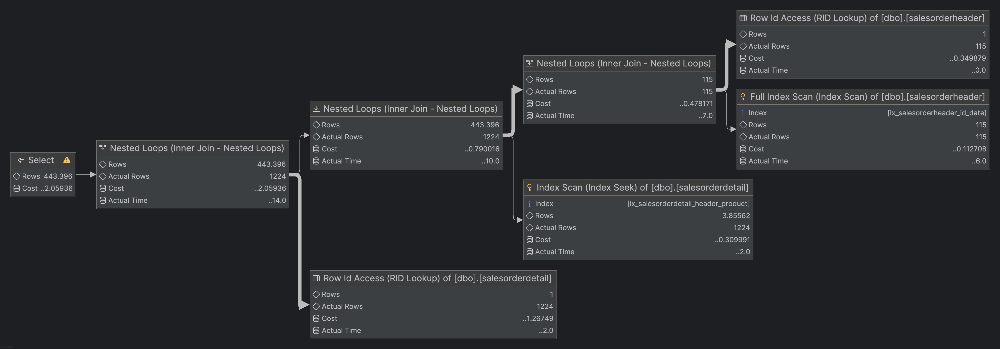

> **Zapytanie 2**

```sql
lab04> SELECT orderdate,
              productid,
              SUM(orderqty) AS orderqty,
              SUM(unitpricediscount) AS unitpricediscount,
              SUM(linetotal)
       FROM salesorderheader sh
       INNER JOIN salesorderdetail sd ON sh.salesorderid = sd.salesorderid
       GROUP BY orderdate, productid
       HAVING SUM(orderqty) >= 100
[2025-05-20 06:14:18] [S0000][3613] SQL Server parse and compile time:
[2025-05-20 06:14:18] CPU time = 23 ms, elapsed time = 23 ms.
[2025-05-20 06:14:18] [S0000][3615] Table 'salesorderheader'.
    Scan count 5,
    logical reads 782,
    physical reads 0,
    page server reads 0,
    read-ahead reads 0,
    page server read-ahead reads 0,
    lob logical reads 0,
    lob physical reads 0,
    lob page server reads 0,
    lob read-ahead reads 0,
    lob page server read-ahead reads 0.
[2025-05-20 06:14:18] [S0000][3615] Table 'salesorderdetail'.
    Scan count 5,
    logical reads 1498,
    physical reads 0,
    page server reads 0,
    read-ahead reads 0,
    page server read-ahead reads 0,
    lob logical reads 0,
    lob physical reads 0,
    lob page server reads 0,
    lob read-ahead reads 0,
    lob page server read-ahead reads 0.
[2025-05-20 06:14:18] [S0000][3615] Table 'Workfile'.
    Scan count 0,
    logical reads 0,
    physical reads 0,
    page server reads 0,
    read-ahead reads 0,
    page server read-ahead reads 0,
    lob logical reads 0,
    lob physical reads 0,
    lob page server reads 0,
    lob read-ahead reads 0,
    lob page server read-ahead reads 0.
[2025-05-20 06:14:18] [S0000][3615] Table 'Worktable'.
    Scan count 0,
    logical reads 0,
    physical reads 0,
    page server reads 0,
    read-ahead reads 0,
    page server read-ahead reads 0,
    lob logical reads 0,
    lob physical reads 0,
    lob page server reads 0,
    lob read-ahead reads 0,
    lob page server read-ahead reads 0.
[2025-05-20 06:14:18] [S0000][3612] SQL Server Execution Times:
[2025-05-20 06:14:18] CPU time = 195 ms, elapsed time = 87 ms.
[2025-05-20 06:14:18] completed in 114 ms
```

> **Po wyczyszczeniu cache**

```sql
lab04> SELECT orderdate,
              productid,
              SUM(orderqty) AS orderqty,
              SUM(unitpricediscount) AS unitpricediscount,
              SUM(linetotal)
       FROM salesorderheader sh
       INNER JOIN salesorderdetail sd ON sh.salesorderid = sd.salesorderid
       GROUP BY orderdate, productid
       HAVING SUM(orderqty) >= 100
[2025-05-20 06:30:34] [S0000][3613] SQL Server parse and compile time:
[2025-05-20 06:30:34] CPU time = 0 ms, elapsed time = 0 ms.
[2025-05-20 06:30:34] [S0000][3615] Table 'salesorderheader'.
    Scan count 5,
    logical reads 782,
    physical reads 0,
    page server reads 0,
    read-ahead reads 789,
    page server read-ahead reads 0,
    lob logical reads 0,
    lob physical reads 0,
    lob page server reads 0,
    lob read-ahead reads 0,
    lob page server read-ahead reads 0.
[2025-05-20 06:30:34] [S0000][3615] Table 'salesorderdetail'.
    Scan count 5,
    logical reads 1498,
    physical reads 0,
    page server reads 0,
    read-ahead reads 1512,
    page server read-ahead reads 0,
    lob logical reads 0,
    lob physical reads 0,
    lob page server reads 0,
    lob read-ahead reads 0,
    lob page server read-ahead reads 0.
[2025-05-20 06:30:34] [S0000][3615] Table 'Workfile'.
    Scan count 0,
    logical reads 0,
    physical reads 0,
    page server reads 0,
    read-ahead reads 0,
    page server read-ahead reads 0,
    lob logical reads 0,
    lob physical reads 0,
    lob page server reads 0,
    lob read-ahead reads 0,
    lob page server read-ahead reads 0.
[2025-05-20 06:30:34] [S0000][3615] Table 'Worktable'.
    Scan count 0,
    logical reads 0,
    physical reads 0,
    page server reads 0,
    read-ahead reads 0,
    page server read-ahead reads 0,
    lob logical reads 0,
    lob physical reads 0,
    lob page server reads 0,
    lob read-ahead reads 0,
    lob page server read-ahead reads 0.
[2025-05-20 06:30:34] [S0000][3612] SQL Server Execution Times:
[2025-05-20 06:30:34] CPU time = 189 ms, elapsed time = 84 ms.
[2025-05-20 06:30:34] completed in 88 ms
```

> Plan zapytania:
>
> 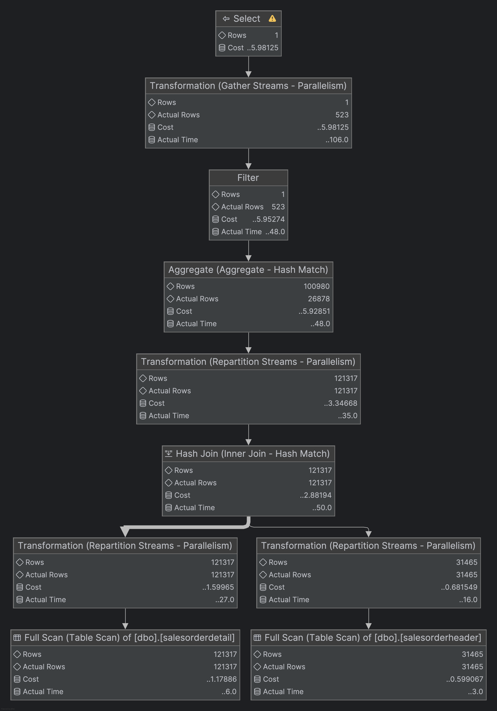

> **Zapytanie 3**

```sql
lab04> SELECT salesordernumber,
              purchaseordernumber,
              duedate,
              shipdate
       FROM salesorderheader sh
       INNER JOIN salesorderdetail sd ON sh.salesorderid = sd.salesorderid
       WHERE orderdate IN (
           '2008-06-01', '2008-06-02', '2008-06-03', '2008-06-04', '2008-06-05'
       )
[2025-05-20 06:17:41] [S0000][3613] SQL Server parse and compile time:
[2025-05-20 06:17:41] CPU time = 7 ms, elapsed time = 7 ms.
[2025-05-20 06:17:41] [S0000][3615] Table 'Workfile'.
    Scan count 0,
    logical reads 0,
    physical reads 0,
    page server reads 0,
    read-ahead reads 0,
    page server read-ahead reads 0,
    lob logical reads 0,
    lob physical reads 0,
    lob page server reads 0,
    lob read-ahead reads 0,
    lob page server read-ahead reads 0.
[2025-05-20 06:17:41] [S0000][3615] Table 'Worktable'.
    Scan count 0,
    logical reads 0,
    physical reads 0,
    page server reads 0,
    read-ahead reads 0,
    page server read-ahead reads 0,
    lob logical reads 0,
    lob physical reads 0,
    lob page server reads 0,
    lob read-ahead reads 0,
    lob page server read-ahead reads 0.
[2025-05-20 06:17:41] [S0000][3615] Table 'Worktable'.
    Scan count 0,
    logical reads 0,
    physical reads 0,
    page server reads 0,
    read-ahead reads 0,
    page server read-ahead reads 0,
    lob logical reads 0,
    lob physical reads 0,
    lob page server reads 0,
    lob read-ahead reads 0,
    lob page server read-ahead reads 0.
[2025-05-20 06:17:41] [S0000][3615] Table 'salesorderheader'.
    Scan count 1,
    logical reads 782,
    physical reads 0,
    page server reads 0,
    read-ahead reads 0,
    page server read-ahead reads 0,
    lob logical reads 0,
    lob physical reads 0,
    lob page server reads 0,
    lob read-ahead reads 0,
    lob page server read-ahead reads 0.
[2025-05-20 06:17:41] [S0000][3612] SQL Server Execution Times:
[2025-05-20 06:17:41] CPU time = 14 ms, elapsed time = 13 ms.
[2025-05-20 06:17:41] completed in 26 ms
```

> **Po wyczyszczeniu cache**

```sql
lab04> SELECT salesordernumber,
              purchaseordernumber,
              duedate,
              shipdate
       FROM salesorderheader sh
       INNER JOIN salesorderdetail sd ON sh.salesorderid = sd.salesorderid
       WHERE orderdate IN (
           '2008-06-01', '2008-06-02', '2008-06-03', '2008-06-04', '2008-06-05'
       )
[2025-05-20 06:33:16] [S0000][3613] SQL Server parse and compile time:
[2025-05-20 06:33:16] CPU time = 0 ms, elapsed time = 0 ms.
[2025-05-20 06:33:16] [S0000][3615] Table 'Workfile'.
    Scan count 0,
    logical reads 0,
    physical reads 0,
    page server reads 0,
    read-ahead reads 0,
    page server read-ahead reads 0,
    lob logical reads 0,
    lob physical reads 0,
    lob page server reads 0,
    lob read-ahead reads 0,
    lob page server read-ahead reads 0.
[2025-05-20 06:33:16] [S0000][3615] Table 'Worktable'.
    Scan count 0,
    logical reads 0,
    physical reads 0,
    page server reads 0,
    read-ahead reads 0,
    page server read-ahead reads 0,
    lob logical reads 0,
    lob physical reads 0,
    lob page server reads 0,
    lob read-ahead reads 0,
    lob page server read-ahead reads 0.
[2025-05-20 06:33:16] [S0000][3615] Table 'Worktable'.
    Scan count 0,
    logical reads 0,
    physical reads 0,
    page server reads 0,
    read-ahead reads 0,
    page server read-ahead reads 0,
    lob logical reads 0,
    lob physical reads 0,
    lob page server reads 0,
    lob read-ahead reads 0,
    lob page server read-ahead reads 0.
[2025-05-20 06:33:16] [S0000][3615] Table 'salesorderheader'.
    Scan count 1,
    logical reads 782,
    physical reads 0,
    page server reads 0,
    read-ahead reads 789,
    page server read-ahead reads 0,
    lob logical reads 0,
    lob physical reads 0,
    lob page server reads 0,
    lob read-ahead reads 0,
    lob page server read-ahead reads 0.
[2025-05-20 06:33:16] [S0000][3612] SQL Server Execution Times:
[2025-05-20 06:33:16] CPU time = 16 ms, elapsed time = 22 ms.
[2025-05-20 06:33:16] completed in 29 ms
```

> Plan zapytania:
>
> 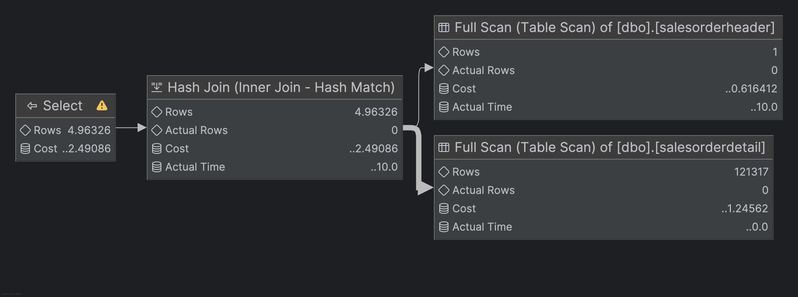

> **Zapytanie 4**

```sql
lab04> SELECT sh.salesorderid,
              salesordernumber,
              purchaseordernumber,
              duedate,
              shipdate
       FROM salesorderheader sh
       INNER JOIN salesorderdetail sd ON sh.salesorderid = sd.salesorderid
       WHERE carriertrackingnumber IN ('ef67-4713-bd', '6c08-4c4c-b8')
       ORDER BY sh.salesorderid
[2025-05-20 06:20:48] [S0000][3613] SQL Server parse and compile time:
[2025-05-20 06:20:48] CPU time = 6 ms, elapsed time = 6 ms.
[2025-05-20 06:20:48] [S0000][3615] Table 'Worktable'.
    Scan count 0,
    logical reads 0,
    physical reads 0,
    page server reads 0,
    read-ahead reads 0,
    page server read-ahead reads 0,
    lob logical reads 0,
    lob physical reads 0,
    lob page server reads 0,
    lob read-ahead reads 0,
    lob page server read-ahead reads 0.
[2025-05-20 06:20:48] [S0000][3615] Table 'Workfile'.
    Scan count 0,
    logical reads 0,
    physical reads 0,
    page server reads 0,
    read-ahead reads 0,
    page server read-ahead reads 0,
    lob logical reads 0,
    lob physical reads 0,
    lob page server reads 0,
    lob read-ahead reads 0,
    lob page server read-ahead reads 0.
[2025-05-20 06:20:48] [S0000][3615] Table 'salesorderheader'.
    Scan count 1,
    logical reads 782,
    physical reads 0,
    page server reads 0,
    read-ahead reads 0,
    page server read-ahead reads 0,
    lob logical reads 0,
    lob physical reads 0,
    lob page server reads 0,
    lob read-ahead reads 0,
    lob page server read-ahead reads 0.
[2025-05-20 06:20:48] [S0000][3615] Table 'salesorderdetail'.
    Scan count 1,
    logical reads 1498,
    physical reads 0,
    page server reads 0,
    read-ahead reads 0,
    page server read-ahead reads 0,
    lob logical reads 0,
    lob physical reads 0,
    lob page server reads 0,
    lob read-ahead reads 0,
    lob page server read-ahead reads 0.
[2025-05-20 06:20:48] [S0000][3612] SQL Server Execution Times:
[2025-05-20 06:20:48] CPU time = 35 ms, elapsed time = 34 ms.
[2025-05-20 06:20:48] completed in 48 ms
```

> **Po wyczyszczeniu cache**

```sql
lab04> SELECT sh.salesorderid,
              salesordernumber,
              purchaseordernumber,
              duedate,
              shipdate
       FROM salesorderheader sh
       INNER JOIN salesorderdetail sd ON sh.salesorderid = sd.salesorderid
       WHERE carriertrackingnumber IN ('ef67-4713-bd', '6c08-4c4c-b8')
       ORDER BY sh.salesorderid
[2025-05-20 06:36:24] [S0000][3613] SQL Server parse and compile time:
[2025-05-20 06:36:24] CPU time = 0 ms, elapsed time = 0 ms.
[2025-05-20 06:36:24] [S0000][3615] Table 'Worktable'.
    Scan count 0,
    logical reads 0,
    physical reads 0,
    page server reads 0,
    read-ahead reads 0,
    page server read-ahead reads 0,
    lob logical reads 0,
    lob physical reads 0,
    lob page server reads 0,
    lob read-ahead reads 0,
    lob page server read-ahead reads 0.
[2025-05-20 06:36:24] [S0000][3615] Table 'Workfile'.
    Scan count 0,
    logical reads 0,
    physical reads 0,
    page server reads 0,
    read-ahead reads 0,
    page server read-ahead reads 0,
    lob logical reads 0,
    lob physical reads 0,
    lob page server reads 0,
    lob read-ahead reads 0,
    lob page server read-ahead reads 0.
[2025-05-20 06:36:24] [S0000][3615] Table 'salesorderheader'.
    Scan count 1,
    logical reads 782,
    physical reads 0,
    page server reads 0,
    read-ahead reads 789,
    page server read-ahead reads 0,
    lob logical reads 0,
    lob physical reads 0,
    lob page server reads 0,
    lob read-ahead reads 0,
    lob page server read-ahead reads 0.
[2025-05-20 06:36:24] [S0000][3615] Table 'salesorderdetail'.
    Scan count 1,
    logical reads 1498,
    physical reads 0,
    page server reads 0,
    read-ahead reads 1512,
    page server read-ahead reads 0,
    lob logical reads 0,
    lob physical reads 0,
    lob page server reads 0,
    lob read-ahead reads 0,
    lob page server read-ahead reads 0.
[2025-05-20 06:36:24] [S0000][3612] SQL Server Execution Times:
[2025-05-20 06:36:24] CPU time = 42 ms, elapsed time = 56 ms.
[2025-05-20 06:36:24] completed in 63 ms
```

> Plan zapytania:
>
> 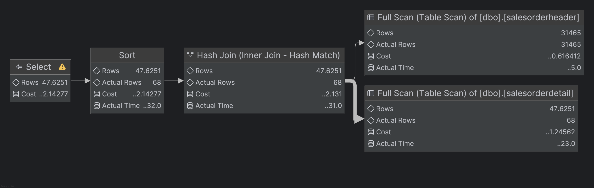

---

# Zadanie 2 - Dobór indeksów / optymalizacja

Do wykonania tego ćwiczenia potrzebne jest narzędzie SSMS

Zaznacz wszystkie zapytania, i uruchom je w **Database Engine Tuning Advisor**:

<!-- ![[_img/index1-12.png | 500]] -->


Sprawdź zakładkę **Tuning Options**, co tam można skonfigurować?

---
> Wyniki: 

```sql
--  ...
```

---


Użyj **Start Analysis**:

<!-- ![[_img/index1-3.png | 500]] -->


Zaobserwuj wyniki w **Recommendations**.

Przejdź do zakładki **Reports**. Sprawdź poszczególne raporty. Główną uwagę zwróć na koszty i ich poprawę:


<!-- ![[_img/index4-1.png | 500]] -->


Zapisz poszczególne rekomendacje:

Uruchom zapisany skrypt w Management Studio.

Opisz, dlaczego dane indeksy zostały zaproponowane do zapytań:

---
> Wyniki: 

```sql
--  ...
```

---


Sprawdź jak zmieniły się Execution Plany. Opisz zmiany:

---
> Wyniki: 
[[lab2-index-opt]]
```sql
--  ...
```

---

# Część 2

Celem ćwiczenia jest zapoznanie się z różnymi rodzajami  indeksów  oraz możliwością ich wykorzystania

## Dokumentacja/Literatura

Przydatne materiały/dokumentacja. Proszę zapoznać się z dokumentacją:
- [https://docs.microsoft.com/en-us/sql/relational-databases/indexes/indexes](https://docs.microsoft.com/en-us/sql/relational-databases/indexes/indexes)
- [https://docs.microsoft.com/en-us/sql/relational-databases/sql-server-index-design-guide](https://docs.microsoft.com/en-us/sql/relational-databases/sql-server-index-design-guide)
- [https://www.simple-talk.com/sql/performance/14-sql-server-indexing-questions-you-were-too-shy-to-ask/](https://www.simple-talk.com/sql/performance/14-sql-server-indexing-questions-you-were-too-shy-to-ask/)
- [https://www.sqlshack.com/sql-server-query-execution-plans-examples-select-statement/](https://www.sqlshack.com/sql-server-query-execution-plans-examples-select-statement/)

# Zadanie 3 - Indeksy klastrowane I nieklastrowane


Skopiuj tabelę `Customer` do swojej bazy danych:

```sql
SELECT * INTO customer
FROM adventureworks2017.sales.customer
```

Wykonaj analizy zapytań:

```sql
SELECT *
FROM customer
WHERE storeid = 594
  
SELECT *
FROM customer
WHERE storeid BETWEEN 594 AND 610
```

Zanotuj czas zapytania oraz jego koszt koszt:

---
> Wyniki:
>

### Zapytanie 1:
```sql
SELECT *
FROM customer
WHERE storeid = 594
1 row retrieved starting from 1 in 42 ms (execution: 20 ms, fetching: 22 ms)
```

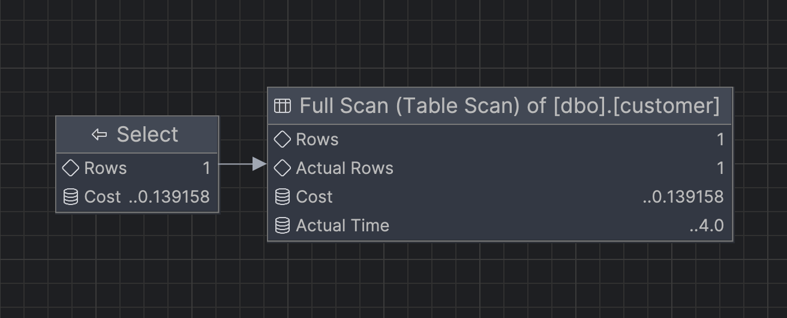

Koszt zapytania: 0.139

Wynik: 

| CustomerID | PersonID | StoreID | TerritoryID | AccountNumber | ModifiedDate             | rowguid                               |
|------------|----------|---------|-------------|----------------|--------------------------|----------------------------------------|
| 517        |          | 594     | 7           | AW00000517     | 2014-09-12 11:15:07.263  | A7726BAE-8C2D-4FE5-B25F-281083AEAF2C   |


### Zapytanie 2:
```sql
SELECT *
FROM customer
WHERE storeid BETWEEN 594 AND 610
16 rows retrieved starting from 1 in 47 ms (execution: 17 ms, fetching: 30 ms)
```

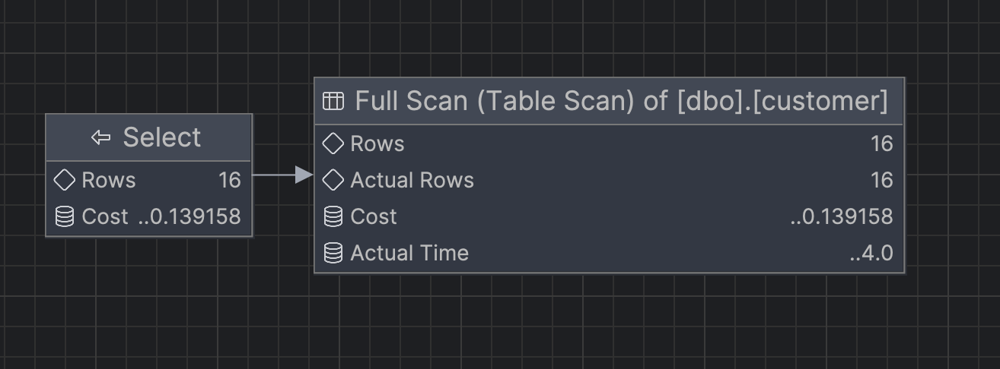

Koszt zapytania: 0.139

Wynik: 

| CustomerID | PersonID | StoreID | TerritoryID | AccountNumber | rowguid                                | ModifiedDate             |
|------------|----------|---------|-------------|----------------|----------------------------------------|--------------------------|
| 350        |          | 610     | 5           | AW00000350     | 51AF3285-9533-4172-A4B9-7E654169FB33   | 2014-09-12 11:15:07.263  |
| 353        |          | 608     | 6           | AW00000353     | 3B2E5C36-0827-4A31-B112-F347AD588822   | 2014-09-12 11:15:07.263  |
| 356        |          | 606     | 8           | AW00000356     | C5ADD2B4-2679-46D0-B6BC-649592C7DA61   | 2014-09-12 11:15:07.263  |
| 359        |          | 604     | 2           | AW00000359     | 68E332E9-2929-4149-8086-FA8D7E4BC859   | 2014-09-12 11:15:07.263  |
| 430        |          | 602     | 10          | AW00000430     | D18DFA60-7D7E-4900-A0B6-78DF78E4DEEF   | 2014-09-12 11:15:07.263  |
| 433        |          | 600     | 1           | AW00000433     | EB0B1054-FF23-4E35-BCFC-10B84B47EA47   | 2014-09-12 11:15:07.263  |
| 436        |          | 598     | 4           | AW00000436     | 506DD7E7-E6D0-49E7-ADDC-5CD6C811DD35   | 2014-09-12 11:15:07.263  |
| 517        |          | 594     | 7           | AW00000517     | A7726BAE-8C2D-4FE5-B25F-281083AEAF2C   | 2014-09-12 11:15:07.263  |
| 520        |          | 596     | 10          | AW00000520     | 34C094D7-8C79-47A5-B192-9597826BD55D   | 2014-09-12 11:15:07.263  |
| 29615      | 595      | 596     | 10          | AW00029615     | C7E5D895-EABA-4CC6-A7AB-50B8569541D3   | 2014-09-12 11:15:07.263  |
| 29616      | 597      | 598     | 4           | AW00029616     | 21DF3FF8-0A8F-434B-9290-E562B7DA6DCA   | 2014-09-12 11:15:07.263  |
| 29617      | 599      | 600     | 1           | AW00029617     | 96E154EB-8F02-4651-A117-5E248685341D   | 2014-09-12 11:15:07.263  |
| 29618      | 601      | 602     | 10          | AW00029618     | 89BE0FA2-162C-400D-9D8B-F2E557242088   | 2014-09-12 11:15:07.263  |
| 29619      | 603      | 604     | 2           | AW00029619     | F31ACC7A-52DF-456E-A5CD-63858F724AEC   | 2014-09-12 11:15:07.263  |
| 29620      | 607      | 608     | 6           | AW00029620     | A2268D9A-2511-43C3-95CC-D7DE094109F1   | 2014-09-12 11:15:07.263  |
| 29621      | 609      | 610     | 5           | AW00029621     | BFF0A6DF-D5F0-4A5D-982B-79890E20F63A   | 2014-09-12 11:15:07.263  |

Dodaj indeks:

```sql
CREATE INDEX customer_store_cls_idx ON customer(storeid)
```

### Zapytanie 1:
```sql
SELECT *
FROM customer
WHERE storeid = 594
1 row retrieved starting from 1 in 52 ms (execution: 33 ms, fetching: 19 ms)
```

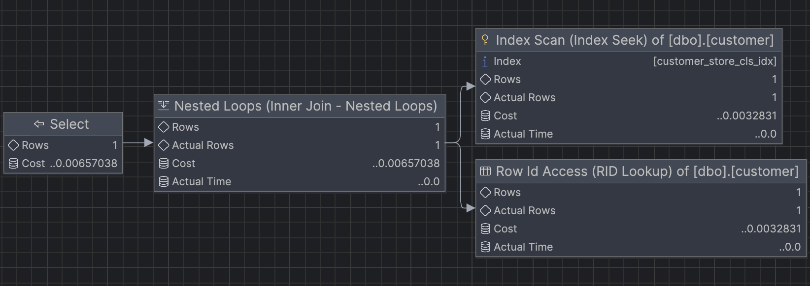

Koszt zapytania: 0.00657

Wynik: jest taki sam jak w przypadku zapytania bez indeksu


### Zapytanie 2:
```sql
SELECT *
FROM customer
WHERE storeid BETWEEN 594 AND 610
16 rows retrieved starting from 1 in 44 ms (execution: 20 ms, fetching: 24 ms)
```

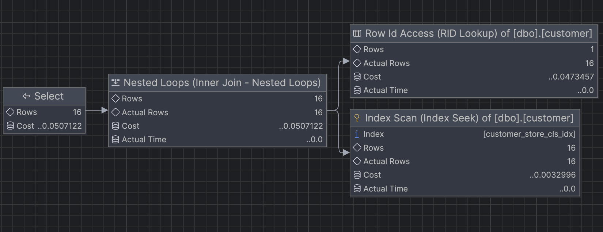

Koszt zapytania: 0.0507

Wynik: jest taki sam jak w przypadku zapytania bez indeksu

Jak zmienił się plan i czas? Czy jest możliwość optymalizacji?

Zanim utworzony został indeks serwer musiał wykonać pełen skan tabeli.
Po utworzeniu indeksu serwer wykonał Index Scan do znalezienia odpowiednich wartości StoreID.

Przed dodaniem indexu: Table Scan
Po dodaniu indexu: Index Scan + RID Lookup

Koszt zapytania znacznie się zmniejszył, natomiast czas wykonania nieznacznie wzrósł.

Może to być spowodowane tym, że serwer musiał wykonać dodatkowe operacje związane z RID Lookup przy zapytaniu `select *`.
Można wykorzystać Covering index i zawrzeć pozostałe kolumny w indeksie (korzystając z INCLUDE), aby uniknąć dodatkowych operacji.
Można skorzystać z clustered index, aby przyspieszyć wyszukiwanie, bo serwer będzie korzystać z key lookup, które jest bardziej wydajne.

---
> Wyniki: 

```sql
--  ...
```


Dodaj indeks klastrowany:

```sql
CREATE clustered INDEX customer_store_cls_idx ON customer(storeid)
```

Czy zmienił się plan/koszt/czas? Skomentuj dwa podejścia w wyszukiwaniu krotek.


---
> Wyniki: 

```sql
--  ...
```


# Zadanie 4 - dodatkowe kolumny w indeksie

Celem zadania jest porównanie indeksów zawierających dodatkowe kolumny.

Skopiuj tabelę `Address` do swojej bazy danych:

```sql
SELECT * INTO address
FROM adventureworks2017.person.address
```

W tej części będziemy analizować następujące zapytanie:

```sql
SELECT addressline1,
    addressline2,
    city,
    stateprovinceid,
    postalcode
FROM address
WHERE postalcode BETWEEN n'98000' AND n'99999'
```

```sql
CREATE INDEX address_postalcode_1 ON address (postalcode) INCLUDE (
    addressline1,
    addressline2,
    city,
    stateprovinceid
);
GO

CREATE INDEX address_postalcode_2 ON address (
    postalcode,
    addressline1,
    addressline2,
    city,
    stateprovinceid
);
GO
```

Czy jest widoczna różnica w planach/kosztach zapytań? 
- w sytuacji gdy nie ma indeksów
- przy wykorzystaniu indeksu:
	- address_postalcode_1
	- address_postalcode_2
Jeśli tak to jaka? 

Aby wymusić użycie indeksu użyj `WITH(INDEX(Address_PostalCode_1))` po `FROM`

> Wyniki: 

> **Zapytanie bez indeksów**

```sql
lab04> SELECT addressline1,
              addressline2,
              city,
              stateprovinceid,
              postalcode
       FROM address
       WHERE postalcode BETWEEN '98000' AND '99999'
[2025-05-20 07:14:41] [S0000][3613] SQL Server parse and compile time:
[2025-05-20 07:14:41] CPU time = 7 ms, elapsed time = 8 ms.
[2025-05-20 07:14:41] [S0000][3613] SQL Server parse and compile time:
[2025-05-20 07:14:41] CPU time = 0 ms,
    elapsed time = 0 ms.
[2025-05-20 07:14:41] [S0000][3615] Table 'address'.
    Scan count 1,
    logical reads 342,
    physical reads 0,
    page server reads 0,
    read-ahead reads 356,
    page server read-ahead reads 0,
    lob logical reads 0,
    lob physical reads 0,
    lob page server reads 0,
    lob read-ahead reads 0,
    lob page server read-ahead reads 0.
[2025-05-20 07:14:41] [S0000][3612] SQL Server Execution Times:
[2025-05-20 07:14:41] CPU time = 9 ms, elapsed time = 19 ms.
[2025-05-20 07:14:41] completed in 31 ms
```

> Plan zapytania:
>
> 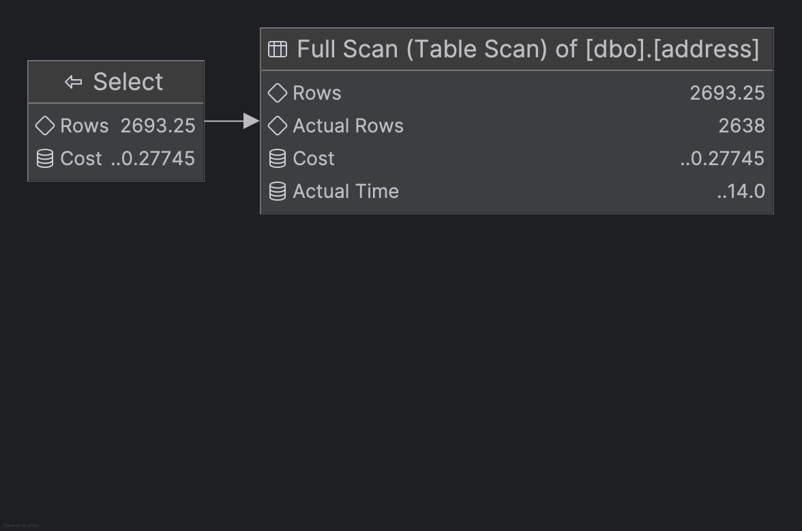

> Po wykonaniu tego zapytania wyczyściliśmy cache.

> **Stworzenie pierwszego indeksu**

```sql
lab04> CREATE INDEX address_postalcode_1 ON address (postalcode) INCLUDE (
           addressline1,
           addressline2,
           city,
           stateprovinceid
       )
[2025-05-20 07:17:40] [S0000][3613] SQL Server parse and compile time:
[2025-05-20 07:17:40] CPU time = 5 ms, elapsed time = 5 ms.
[2025-05-20 07:17:40] [S0000][3615] Table 'Worktable'.
    Scan count 0,
    logical reads 0,
    physical reads 0,
    page server reads 0,
    read-ahead reads 0,
    page server read-ahead reads 0,
    lob logical reads 0,
    lob physical reads 0,
    lob page server reads 0,
    lob read-ahead reads 0,
    lob page server read-ahead reads 0.
[2025-05-20 07:17:40] [S0000][3615] Table 'address'.
    Scan count 1,
    logical reads 342,
    physical reads 0,
    page server reads 0,
    read-ahead reads 356,
    page server read-ahead reads 0,
    lob logical reads 0,
    lob physical reads 0,
    lob page server reads 0,
    lob read-ahead reads 0,
    lob page server read-ahead reads 0.
[2025-05-20 07:17:40] [S0000][3612] SQL Server Execution Times:
[2025-05-20 07:17:40] CPU time = 89 ms, elapsed time = 101 ms.
[2025-05-20 07:17:40] completed in 110 ms
```

> Plan zapytania:
>
> 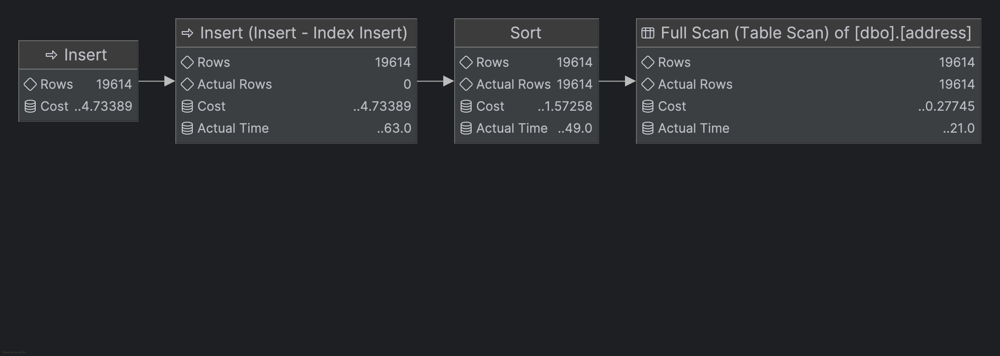

> Po wykonaniu tego zapytania wyczyściliśmy cache.

> **Zapytanie z pierwszym indeksem**

```sql
lab04> SELECT addressline1,
              addressline2,
              city,
              stateprovinceid,
              postalcode
       FROM address WITH(INDEX(address_postalcode_1))
       WHERE postalcode BETWEEN '98000' AND '99999'
[2025-05-20 15:27:19] [S0000][3613] SQL Server parse and compile time:
[2025-05-20 15:27:19] CPU time = 0 ms, elapsed time = 0 ms.
[2025-05-20 15:27:19] [S0000][3615] Table 'address'.
    Scan count 1,
    logical reads 32,
    physical reads 1,
    page server reads 0,
    read-ahead reads 30,
    page server read-ahead reads 0,
    lob logical reads 0,
    lob physical reads 0,
    lob page server reads 0,
    lob read-ahead reads 0,
    lob page server read-ahead reads 0.
[2025-05-20 15:27:19] [S0000][3612] SQL Server Execution Times:
[2025-05-20 15:27:19] CPU time = 5 ms, elapsed time = 6 ms.
[2025-05-20 15:27:19] completed in 10 ms
```

> Plan zapytania:
>
> 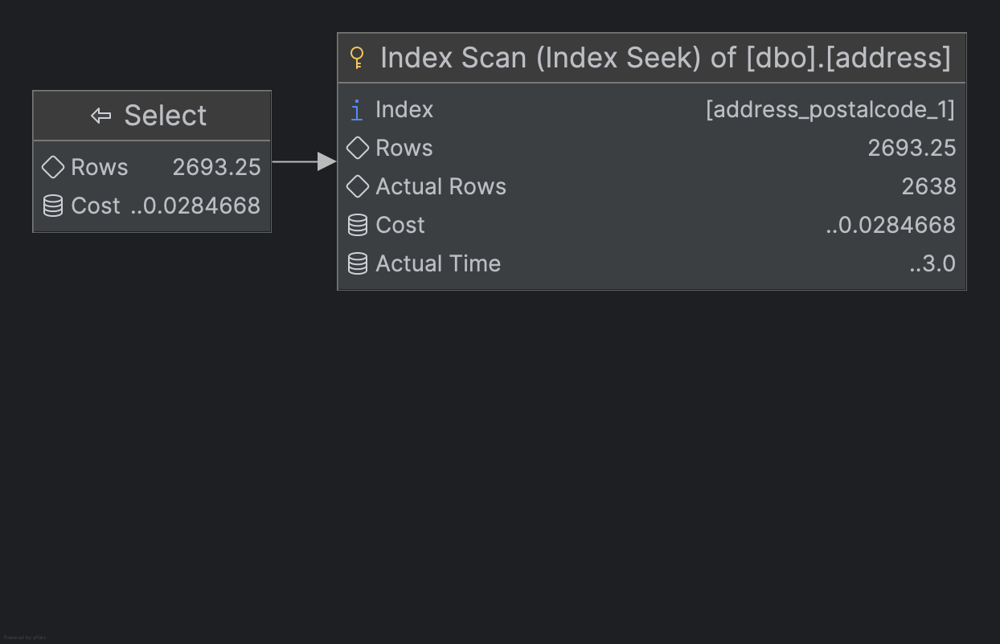

> Po wykonaniu tego zapytania wyczyściliśmy cache.

> **Stworzenie drugiego indeksu**

```sql
lab04> CREATE INDEX address_postalcode_2 ON address (
           postalcode,
           addressline1,
           addressline2,
           city,
           stateprovinceid
       )
[2025-05-20 15:31:04] [S0000][3613] SQL Server parse and compile time:
[2025-05-20 15:31:04] CPU time = 0 ms, elapsed time = 0 ms.
[2025-05-20 15:31:04] [S0000][3615] Table 'Worktable'.
    Scan count 0,
    logical reads 0,
    physical reads 0,
    page server reads 0,
    read-ahead reads 0,
    page server read-ahead reads 0,
    lob logical reads 0,
    lob physical reads 0,
    lob page server reads 0,
    lob read-ahead reads 0,
    lob page server read-ahead reads 0.
[2025-05-20 15:31:04] [S0000][3615] Table 'address'.
    Scan count 1,
    logical reads 222,
    physical reads 0,
    page server reads 0,
    read-ahead reads 229,
    page server read-ahead reads 0,
    lob logical reads 0,
    lob physical reads 0,
    lob page server reads 0,
    lob read-ahead reads 0,
    lob page server read-ahead reads 0.
[2025-05-20 15:31:04] [S0000][3612] SQL Server Execution Times:
[2025-05-20 15:31:04] CPU time = 56 ms, elapsed time = 63 ms.
[2025-05-20 15:31:04] completed in 67 ms
```

> Plan zapytania:
>
> 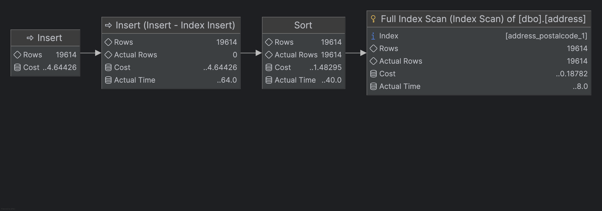

> Po wykonaniu tego zapytania wyczyściliśmy cache.

> **Zapytanie z drugim indeksem**

```sql
lab04> SELECT addressline1,
              addressline2,
              city,
              stateprovinceid,
              postalcode
       FROM address WITH (INDEX(address_postalcode_2))
       WHERE postalcode BETWEEN '98000' AND '99999'
[2025-05-20 15:32:37] [S0000][3613] SQL Server parse and compile time:
[2025-05-20 15:32:37] CPU time = 0 ms, elapsed time = 0 ms.
[2025-05-20 15:32:37] [S0000][3613] SQL Server parse and compile time:
[2025-05-20 15:32:37] CPU time = 6 ms, elapsed time = 6 ms.
[2025-05-20 15:32:37] [S0000][3615] Table 'address'.
    Scan count 1,
    logical reads 34,
    physical reads 1,
    page server reads 0,
    read-ahead reads 30,
    page server read-ahead reads 0,
    lob logical reads 0,
    lob physical reads 0,
    lob page server reads 0,
    lob read-ahead reads 0,
    lob page server read-ahead reads 0.
[2025-05-20 15:32:37] [S0000][3612] SQL Server Execution Times:
[2025-05-20 15:32:37] CPU time = 5 ms, elapsed time = 7 ms.
[2025-05-20 15:32:37] completed in 17 ms
```

> Plan zapytania:
>
> 

> Po wykonaniu tego zapytania wyczyściliśmy cache.

Sprawdź rozmiar Indeksów:

```sql
SELECT i.name AS indexname,
       SUM(s.used_page_count) * 8 AS indexsizekb
FROM sys.dm_db_partition_stats AS s
INNER JOIN sys.indexes AS i ON s.object_id = i.object_id
    AND s.index_id = i.index_id
WHERE i.name = 'address_postalcode_1'
    OR i.name = 'address_postalcode_2'
GROUP BY i.name
GO
```

Który jest większy? Jak można skomentować te dwa podejścia do indeksowania? Które kolumny na to wpływają?


> Wyniki: 

```sql
lab04> SELECT i.name AS indexname,
              SUM(s.used_page_count) * 8 AS indexsizekb
       FROM sys.dm_db_partition_stats AS s
                INNER JOIN sys.indexes AS i ON s.object_id = i.object_id
           AND s.index_id = i.index_id
       WHERE i.name = 'address_postalcode_1'
          OR i.name = 'address_postalcode_2'
       GROUP BY i.name
[2025-05-20 15:34:25] [S0000][3613] SQL Server parse and compile time:
[2025-05-20 15:34:25] CPU time = 0 ms, elapsed time = 0 ms.
[2025-05-20 15:34:25] [S0000][3615] Table 'Worktable'.
    Scan count 0,
    logical reads 0,
    physical reads 0,
    page server reads 0,
    read-ahead reads 0,
    page server read-ahead reads 0,
    lob logical reads 0,
    lob physical reads 0,
    lob page server reads 0,
    lob read-ahead reads 0,
    lob page server read-ahead reads 0.
[2025-05-20 15:34:25] [S0000][3615] Table 'sysschobjs'.
    Scan count 0,
    logical reads 4,
    physical reads 1,
    page server reads 0,
    read-ahead reads 0,
    page server read-ahead reads 0,
    lob logical reads 0,
    lob physical reads 0,
    lob page server reads 0,
    lob read-ahead reads 0,
    lob page server read-ahead reads 0.
[2025-05-20 15:34:25] [S0000][3615] Table 'sysidxstats'.
    Scan count 378,
    logical reads 765,
    physical reads 2,
    page server reads 0,
    read-ahead reads 24,
    page server read-ahead reads 0,
    lob logical reads 0,
    lob physical reads 0,
    lob page server reads 0,
    lob read-ahead reads 0,
    lob page server read-ahead reads 0.
[2025-05-20 15:34:25] [S0000][3615] Table 'sysrowsets'.
    Scan count 1,
    logical reads 5,
    physical reads 0,
    page server reads 0,
    read-ahead reads 0,
    page server read-ahead reads 0,
    lob logical reads 0,
    lob physical reads 0,
    lob page server reads 0,
    lob read-ahead reads 0,
    lob page server read-ahead reads 0.
[2025-05-20 15:34:25] [S0000][3612] SQL Server Execution Times:
[2025-05-20 15:34:25] CPU time = 11 ms, elapsed time = 14 ms.
[2025-05-20 15:34:25] completed in 19 ms
```

> Rezultat zapytania:
>
> | indexname            | indexsizekb |
> | :------------------- | :---------- |
> | address_postalcode_1 | 1784        |
> | address_postalcode_2 | 1808        |


# Zadanie 5 – Indeksy z filtrami

Celem zadania jest poznanie indeksów z filtrami.

Skopiuj tabelę `BillOfMaterials` do swojej bazy danych:

```sql
SELECT * INTO billofmaterials
FROM adventureworks2017.production.billofmaterials
```


W tej części analizujemy zapytanie:

```sql
SELECT productassemblyid,
       componentid,
       startdate
FROM billofmaterials
WHERE enddate IS NOT NULL
    AND componentid = 327
    AND startdate >= '2010-08-05'
```

Zastosuj indeks:

```sql
CREATE nonclustered INDEX billofmaterials_cond_idx ON billofmaterials (componentid, startdate)
WHERE enddate IS NOT NULL
```

Sprawdź czy działa.

Przeanalizuj plan dla poniższego zapytania:

Czy indeks został użyty? Dlaczego?

Indeks nie został użyty. Spełniał on warunek `enddate is not null`.
Możliwe, że serwer SQL nie użył indeksu, ponieważ nie byłoby to optymalne.

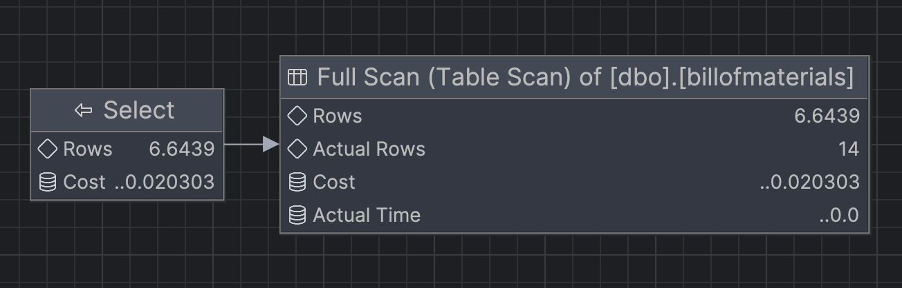

> Wyniki: 

```sql
SELECT productassemblyid,
       componentid,
       startdate
FROM billofmaterials
WHERE enddate IS NOT NULL
    AND componentid = 327
    AND startdate >= '2010-08-05'
14 rows retrieved starting from 1 in 66 ms (execution: 28 ms, fetching: 38 ms)
```

Spróbuj wymusić indeks. Co się stało, dlaczego takie zachowanie?

> Wyniki: 

```sql
SELECT productassemblyid,
       componentid,
       startdate
FROM billofmaterials WITH (INDEX(billofmaterials_cond_idx))
WHERE enddate IS NOT NULL
    AND componentid = 327
    AND startdate >= '2010-08-05';
14 rows retrieved starting from 1 in 29 ms (execution: 13 ms, fetching: 16 ms)
```

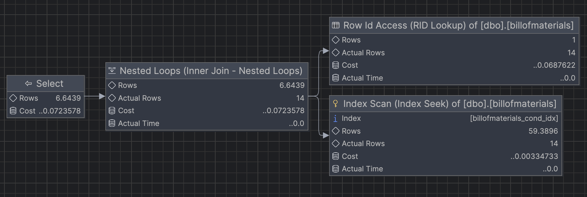

Po wymuszeniu indeksu plan zapytania zmienił się. Oznacza to, że serwer SQL poprzednio umyślnie nie użył indeksu, ponieważ nie byłoby to optymalne.
Jeśli porównamy koszt zapytania z indeksem i bez niego, to zauważymy, że koszt zapytania z indeksem jest wyższy.
Oznacza to, że istotinie serwer SQL umyślnie nie użył indeksu.


---

Punktacja:

|         |     |
| ------- | --- |
| zadanie | pkt |
| 1       | 3   |
| 2       | 3   |
| 3       | 3   |
| 4       | 3   |
| 5       | 3   |
| razem   | 15  |
|         |     |
