# Indeksy, optymalizator <br>Lab 2

<!-- <style scoped>
 p,li {
    font-size: 12pt;
  }
</style>  -->

<!-- <style scoped>
 pre {
    font-size: 8pt;
  }
</style>  -->

---

**Imię i nazwisko: Kacper Cienkosz, Miłosz Dubiel**

---

Celem ćwiczenia jest zapoznanie się z planami wykonania zapytań (execution plans), oraz z budową i możliwością wykorzystaniem indeksów

Swoje odpowiedzi wpisuj w miejsca oznaczone jako:

---

> Wyniki:

```sql
--  ...
```

---

Ważne/wymagane są komentarze.

Zamieść kod rozwiązania oraz zrzuty ekranu pokazujące wyniki, (dołącz kod rozwiązania w formie tekstowej/źródłowej)

Zwróć uwagę na formatowanie kodu

## Oprogramowanie - co jest potrzebne?

Do wykonania ćwiczenia potrzebne jest następujące oprogramowanie

- MS SQL Server
- SSMS - SQL Server Management Studio
  - ewentualnie inne narzędzie umożliwiające komunikację z MS SQL Server i analizę planów zapytań
- przykładowa baza danych AdventureWorks2017.

Oprogramowanie dostępne jest na przygotowanej maszynie wirtualnej

## Przygotowanie

Uruchom Microsoft SQL Managment Studio.

Stwórz swoją bazę danych o nazwie lab2.

```sql
CREATE DATABASE lab2
GO

USE lab2
GO
```

Przydatne wywołania w MSSQL:

```sql
SET STATISTICS IO ON
SET STATISTICS TIME ON

-- Use this when you want to clear the cache
-- Recommended after each query
CHECKPOINT;
GO
DBCC DROPCLEANBUFFERS
```

<div style="page-break-after: always;"></div>

# Zadanie 1

Skopiuj tabelę `Person` do swojej bazy danych:

```sql
SELECT businessentityid,
       persontype,
       namestyle,
       title,
       firstname,
       middlename,
       lastname,
       suffix,
       emailpromotion,
       rowguid,
       modifieddate
INTO person
FROM adventureworks2017.person.person
```

---

Wykonaj analizę planu dla trzech zapytań:

```sql
SELECT *
FROM [ person ]
WHERE lastname = 'Agbonile'

SELECT *
FROM [ person ]
WHERE lastname = 'Agbonile'
    AND firstname = 'Osarumwense'

SELECT *
FROM [ person ]
WHERE firstname = 'Osarumwense'
```

Co można o nich powiedzieć?

---

> Wyniki:

### Zapytanie 1
```sql
SELECT *
FROM person
WHERE lastname = 'Agbonile'
[S0000][3613] SQL Server parse and compile time:
CPU time = 47 ms, elapsed time = 50 ms.
[S0000][3613] SQL Server parse and compile time:
CPU time = 0 ms, elapsed time = 0 ms.
[S0000][3615]
Table 'person'.
Scan count 1,
logical reads 207,
physical reads 0,
page server reads 0,
read-ahead reads 0,
page server read-ahead reads 0,
lob logical reads 0,
lob physical reads 0,
lob page server reads 0,
lob read-ahead reads 0,
lob page server read-ahead reads 0.
[S0000][3612] SQL Server Execution Times:
CPU time = 4 ms,  elapsed time = 3 ms.
1 row retrieved starting from 1 in 97 ms (execution: 59 ms, fetching: 38 ms)
```

> Plan zapytania:
>
> 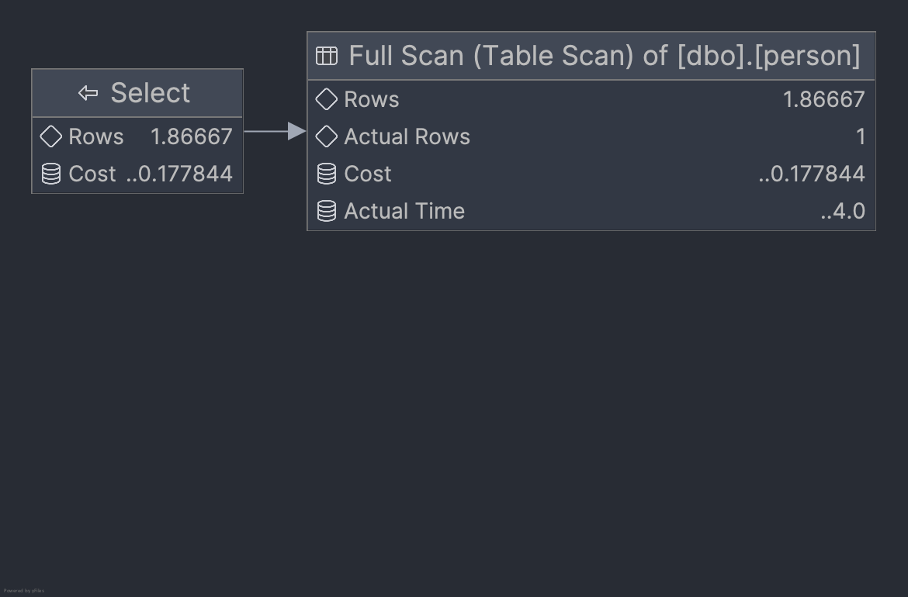

### Zapytanie 2
```sql
lab2> SELECT *
      FROM person
      WHERE lastname = 'Agbonile'
        AND firstname = 'Osarumwense'
[S0000][3613] SQL Server parse and compile time:
CPU time = 46 ms, elapsed time = 46 ms.
[S0000][3613] SQL Server parse and compile time:
CPU time = 0 ms, elapsed time = 0 ms.
[S0000][3615]
Table 'person'.
Scan count 1,
logical reads 207,
physical reads 0,
page server reads 0,
read-ahead reads 0,
page server read-ahead reads 0,
lob logical reads 0,
lob physical reads 0, lob page server reads 0,
lob read-ahead reads 0,
lob page server read-ahead reads 0.
[S0000][3612] SQL Server Execution Times:
CPU time = 3 ms,  elapsed time = 2 ms.
1 row retrieved starting from 1 in 75 ms (execution: 54 ms, fetching: 21 ms)
```

> Plan zapytania:
>
> 

### Zapytanie 3
```sql
SELECT *
FROM person
WHERE firstname = 'Osarumwense'
[S0000][3613] SQL Server parse and compile time:
CPU time = 6 ms, elapsed time = 7 ms.
[S0000][3613] SQL Server parse and compile time:
CPU time = 0 ms, elapsed time = 0 ms.
[S0000][3615]
Table 'person'.
Scan count 1,
logical reads 207,
physical reads 0,
page server reads 0,
read-ahead reads 0,
page server read-ahead reads 0,
lob logical reads 0,
lob physical reads 0,
lob page server reads 0,
lob read-ahead reads 0,
lob page server read-ahead reads 0.
[S0000][3612] SQL Server Execution Times:
CPU time = 7 ms,  elapsed time = 10 ms.
1 row retrieved starting from 1 in 44 ms (execution: 22 ms, fetching: 22 ms)
```

> Plan zapytania:
>
> 

> Wszystkie trzy zapytania wykonują pełne skanowanie tabeli `person`, ponieważ nie ma indeksu, który mógłby przyspieszyć wyszukiwanie. W każdym przypadku liczba odczytów logicznych jest taka sama (207), co wskazuje na to, że SQL Server przeszukuje całą tabelę.

Przygotuj indeks obejmujący te zapytania:

```sql
CREATE INDEX person_first_last_name_idx
ON person(lastname, firstname)
```

Sprawdź plan zapytania. Co się zmieniło?

---

> Wyniki:

### Zapytanie 1

```sql
SELECT *
FROM person
WHERE lastname = 'Agbonile'
```

> Plan zapytania:
> 
### Zapytanie 2

```sql
SELECT *
FROM person
WHERE lastname = 'Agbonile'
AND firstname = 'Osarumwense'
```
> Plan zapytania:
> 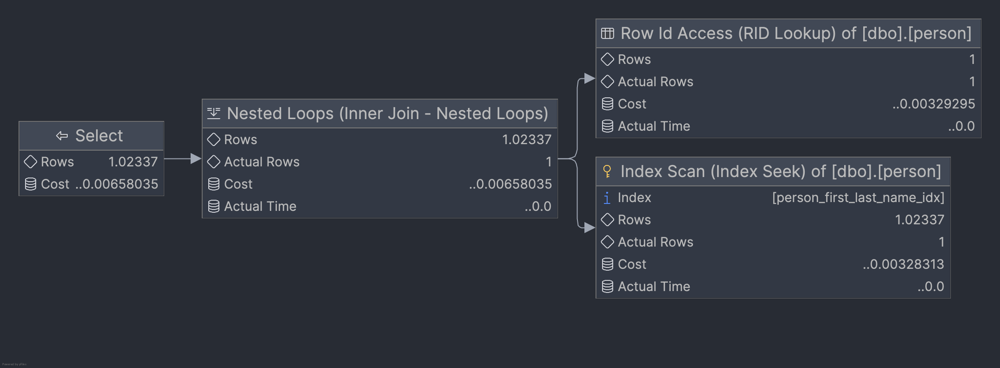
### Zapytanie 3

```sql
SELECT *
FROM person
WHERE firstname = 'Osarumwense'
```
> Plan zapytania:
> 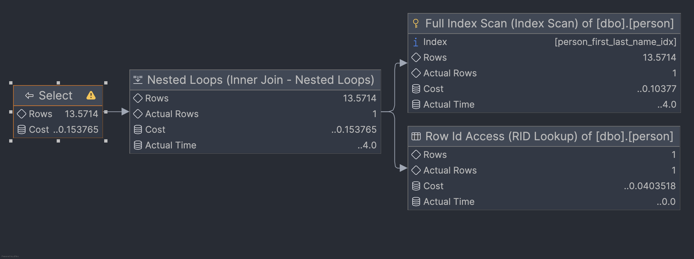
> Po dodaniu indeksu `person_first_last_name_idx`, plany zapytań uległy znaczącej zmianie. Teraz SQL Server korzysta z indeksu.

> W przypadku pierwszego zapytania serwer wykonuje **`INDEX SEEK`**, co oznacza, że bezpośrednio przeszukuje indeks, zamiast skanować całą tabelę.

> Drugie zapytanie również korzysta z indeksu, ale wykonuje **`INDEX SEEK`** z dodatkowymi warunkami na kolumnę `firstname`, co jest bardziej efektywne niż pełne skanowanie tabeli. W tym zapytaniu wykorzystywany jest cały indeks, co znacznie poprawia wydajność. Widać to poprzez koszt zapytania.

> Trzecie zapytanie również korzysta z indeksu, ale w tym przypadku SQL Server wykonuje **`FULL INDEX SCAN`**, ponieważ nie ma warunku na kolumnę `lastname`. To oznacza, że serwer przeszukuje wszystkie wiersze w indeksie, ale nadal jest to bardziej efektywne niż pełne skanowanie tabeli. Wynika to z zasady **lefft-prefix**. Mówi ona, że żeby zapytanie z indeksem było efektywne, musi wykorzystywać kolumny indeksu w kolejności, w jakiej zostały zdefiniowane.

Przeprowadź ponownie analizę zapytań tym razem dla parametrów: `FirstName = ‘Angela’` `LastName = ‘Price’`. (Trzy zapytania, różna kombinacja parametrów).

Czym różni się ten plan od zapytania o `'Osarumwense Agbonile'` . Dlaczego tak jest?

> Wyniki:

### Zapytanie 1

```sql
SELECT *
FROM person
WHERE lastname = 'Price'
```
> Plan zapytania:
> 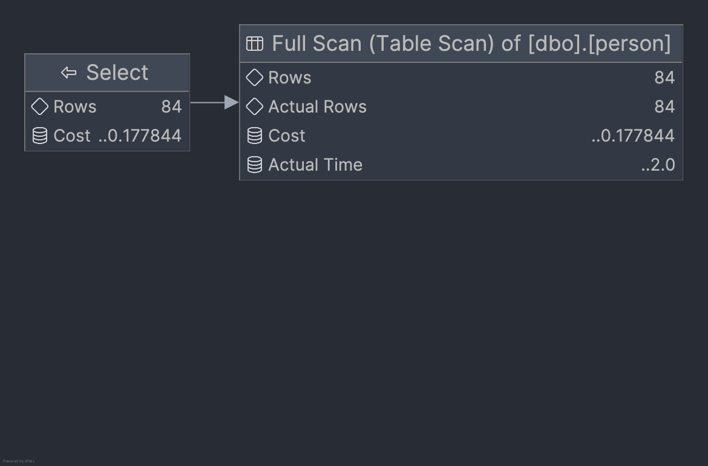
### Zapytanie 2

```sql
SELECT *
FROM person
WHERE lastname = 'Price'
AND firstname = 'Angela'
```
> Plan zapytania:
> 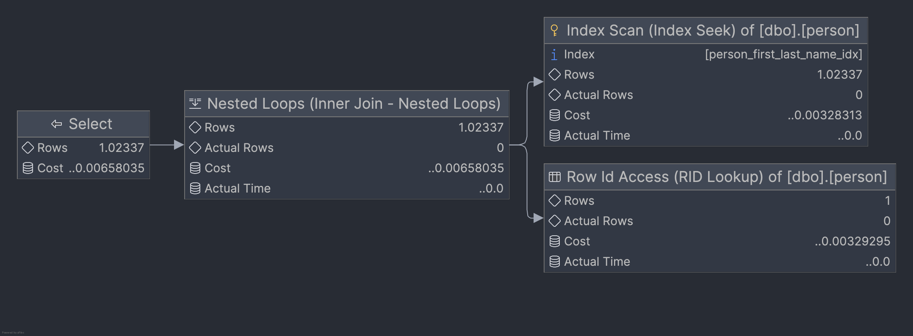
### Zapytanie 3

```sql
SELECT *
FROM person
WHERE firstname = 'Angela'
``` 
> Plan zapytania:
> 
> W przypadku zapytań z parametrami `FirstName = 'Angela'` i `LastName = 'Price'` serwer nie zdecydował się wykorzystać indeksu w przypadku pierwszego i trzeciego zapytania. Jest tak ponieważ zarówno imię Angela, jak i nazwisko Price występują w tabeli wiele razy, więc SQL Server uznał, że pełne skanowanie tabeli będzie bardziej efektywne niż korzystanie z indeksu, który ustalony jest według nazwiska i imieni.


# Zadanie 2

Skopiuj tabelę Product do swojej bazy danych:

```sql
SELECT * INTO product
FROM adventureworks2017.production.product
```

Stwórz indeks z warunkiem przedziałowym:

```sql
CREATE nonclustered INDEX product_range_idx
ON product (productsubcategoryid, listprice) INCLUDE (name)
WHERE productsubcategoryid >= 27
    AND productsubcategoryid <= 36
```

Sprawdź, czy indeks jest użyty w zapytaniu:

```sql
SELECT name,
       productsubcategoryid,
       listprice
FROM product
WHERE productsubcategoryid >= 27
    AND productsubcategoryid <= 36
```

> 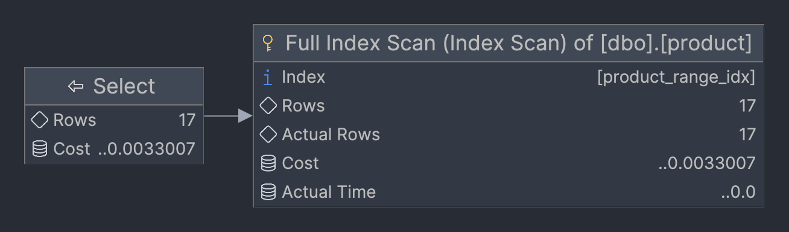
> 
> Tak, został wykorzystany indeks.

Sprawdź, czy indeks jest użyty w zapytaniu, który jest dopełnieniem zbioru:

```sql
SELECT name,
       productsubcategoryid,
       listprice
FROM product
WHERE productsubcategoryid < 27
    OR productsubcategoryid > 36
```

> 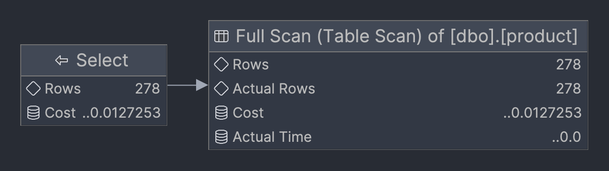
> 
> Nie został wykorzystany indeks.

Skomentuj oba zapytania. Czy indeks został użyty w którymś zapytaniu, dlaczego? Jak działają indeksy z warunkiem?

> Indeksy z warunkiem są używane tylko wtedy, gdy zapytanie pasuje do warunku. W przeciwnym razie, SQL Server nie użyje indeksu, ponieważ nie przyniesie to korzyści w wydajności. W naszym przypadku, w pierwszym zapytaniu warunek był spełniony, więc indeks został użyty. W drugim zapytaniu warunek nie był spełniony, więc SQL Server zdecydował się na pełne skanowanie tabeli.
> 
> Indeks z warunkiem działa w ten sposób, że tylko te wiersze, które spełniają określony warunek, są indeksowane. Dzięki temu można zaoszczędzić miejsce i przyspieszyć wyszukiwanie danych, ale tylko dla zapytań, które pasują do tego warunku.

---

> Wyniki:

```sql
--  ...
```

# Zadanie 3

Skopiuj tabelę `PurchaseOrderDetail` do swojej bazy danych:

```sql
SELECT *
INTO purchaseorderdetail
FROM adventureworks2017.purchasing.purchaseorderdetail
```

Wykonaj analizę zapytania:

```sql
SELECT rejectedqty,
       ((rejectedqty / orderqty) * 100) AS rejectionrate,
       productid,
       duedate
FROM purchaseorderdetail
ORDER BY rejectedqty DESC, productid ASC
```

---

> Wyniki:

```sql
lab05> SELECT rejectedqty,
              ((rejectedqty / orderqty) * 100) AS rejectionrate,
              productid,
              duedate
       FROM purchaseorderdetail
       ORDER BY rejectedqty DESC, productid ASC
[2025-05-28 17:22:53] [S0000][3613] SQL Server parse and compile time:
[2025-05-28 17:22:53] CPU time = 2 ms, elapsed time = 3 ms.
[2025-05-28 17:22:53] [S0000][3615] Table 'Worktable'.
    Scan count 0,
    logical reads 0,
    physical reads 0,
    page server reads 0,
    read-ahead reads 0,
    page server read-ahead reads 0,
    lob logical reads 0,
    lob physical reads 0,
    lob page server reads 0,
    lob read-ahead reads 0,
    lob page server read-ahead reads 0.
[2025-05-28 17:22:53] [S0000][3615] Table 'purchaseorderdetail'.
    Scan count 1,
    logical reads 78,
    physical reads 0,
    page server reads 0,
    read-ahead reads 78,
    page server read-ahead reads 0,
    lob logical reads 0,
    lob physical reads 0,
    lob page server reads 0,
    lob read-ahead reads 0,
    lob page server read-ahead reads 0.
[2025-05-28 17:22:53] [S0000][3612] SQL Server Execution Times:
[2025-05-28 17:22:53] CPU time = 21 ms, elapsed time = 22 ms.
[2025-05-28 17:22:53] completed in 29 ms
```

> Plan zapytania:
>
> 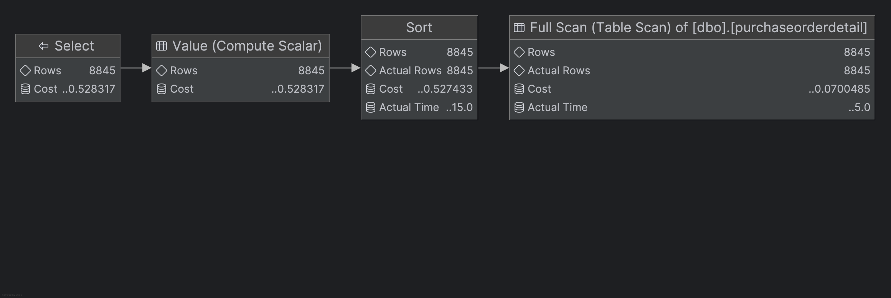

Która część zapytania ma największy koszt?

> Patrząc na surowy rezultat planu zapytania, dostępny w DataGrip w formie pseudo-tabelki, którą przytoczymy tutaj w okrojonej formie, zawierającej tylko potrzebne infromacje:
>
> | Step            | EstimatedCPU | EstimatedIO | EstimatedTotalSubtreeCost | Estimated step cost (własne obliczenia) |
> |-----------------|--------------|-------------|---------------------------|-----------------------------------------|
> | Full table scan | 0.009808     | 0.0602405   | 0.0700485                 | 0.0700485                               |
> | Sort            | 0.446123     | 0.0112613   | 0.527433                  | 0.4573845                               |
> | Value           | 0.0008845    | 0.0         | 0.528317                  | 0.000884                                |
> | Select          | N/A          | N/A         | 0.528317                  | 0.0                                     |
>
> Z tabelki wynika, że największy koszt wiązał się z posortowaniem rekordów, który był ponad 6-krotnie wyższy od kosztu wykonania pełnego skanu tabeli.

Jaki indeks można zastosować aby zoptymalizować koszt zapytania? Przygotuj polecenie tworzące index. Ponownie wykonaj analizę zapytania.

> Do optymalizacji tego zapytania można zastosować **`CLUSTERED`** indeks zawierający kolumny, które występują w klauzuli `ORDER BY`, razem z zastosowaniem takiej samej kolejności (sortowania rekordów) jak w zapytaniu.

```sql
CREATE CLUSTERED INDEX idx_purchaseorderdetail_rejectedqty_productid
ON purchaseorderdetail (rejectedqty DESC, productid ASC);

SELECT rejectedqty,
       ((rejectedqty / orderqty) * 100) AS rejectionrate,
       productid,
       duedate
FROM purchaseorderdetail WITH(
    INDEX(idx_purchaseorderdetail_rejectedqty_productid)
)
ORDER BY rejectedqty DESC, productid ASC
```

---

> Wyniki:

> Stworzenie indeksu `idx_purchaseorderdetail_rejectedqty_productid`:

```sql
lab05> CREATE CLUSTERED INDEX idx_purchaseorderdetail_rejectedqty_productid
           ON purchaseorderdetail (rejectedqty DESC, productid ASC)
[2025-05-28 18:09:59] [S0000][3613] SQL Server parse and compile time:
[2025-05-28 18:09:59] CPU time = 1 ms, elapsed time = 1 ms.
[2025-05-28 18:09:59] [S0000][3615] Table 'purchaseorderdetail'.
    Scan count 1,
    logical reads 87,
    physical reads 0,
    page server reads 0,
    read-ahead reads 87,
    page server read-ahead reads 0,
    lob logical reads 0,
    lob physical reads 0,
    lob page server reads 0,
    lob read-ahead reads 0,
    lob page server read-ahead reads 0.
[2025-05-28 18:09:59] [S0000][3612] SQL Server Execution Times:
[2025-05-28 18:09:59] CPU time = 30 ms, elapsed time = 39 ms.
[2025-05-28 18:09:59] completed in 46 ms
```

> Wykonanie zapytania w oparciu o indeks:

```sql
lab05> SELECT rejectedqty,
              ((rejectedqty / orderqty) * 100) AS rejectionrate,
              productid,
              duedate
       FROM purchaseorderdetail WITH(
           INDEX(idx_purchaseorderdetail_rejectedqty_productid)
       )
       ORDER BY rejectedqty DESC, productid ASC
[2025-05-28 18:11:23] [S0000][3613] SQL Server parse and compile time:
[2025-05-28 18:11:23] CPU time = 0 ms, elapsed time = 0 ms.
[2025-05-28 18:11:23] [S0000][3613] SQL Server parse and compile time:
[2025-05-28 18:11:23] CPU time = 6 ms, elapsed time = 7 ms.
[2025-05-28 18:11:23] [S0000][3615] Table 'purchaseorderdetail'.
    Scan count 1,
    logical reads 89,
    physical reads 1,
    page server reads 0,
    read-ahead reads 87,
    page server read-ahead reads 0,
    lob logical reads 0,
    lob physical reads 0,
    lob page server reads 0,
    lob read-ahead reads 0,
    lob page server read-ahead reads 0.
[2025-05-28 18:11:23] [S0000][3612] SQL Server Execution Times:
[2025-05-28 18:11:23] CPU time = 11 ms, elapsed time = 16 ms.
[2025-05-28 18:11:23] completed in 28 ms
```

> Plan zapytania:
>
> 

> Okrojona tabelka z rezultatem surowego planu zapytania:
>
> | Step            | EstimatedCPU | EstimatedIO | EstimatedTotalSubtreeCost | Estimated step cost (własne obliczenia) |
> |-----------------|--------------|-------------|---------------------------|-----------------------------------------|
> | Full index scan | 0.0098865    | 0.0668287   | 0.0767152                 | 0.0767152                               |
> | Value           | 0.0008845    | 0.0         | 0.0775997                 | 0.0008845 (= EstimatedCPU)              |
> | Select          | N/A          | N/A         | 0.0775997                 | 0.0                                     |
>
> Porównując koszty z zapytania bez użycia indeksu oraz z jego użyciem, to widać dużą różnicę rzędu prawie 7-krotności kosztu z indeksem (0.528317 vs. 0.0775997). Pokazuje to, że zastosowanie w tym wypadku `CLUSTERED` indeksu daje bardzo dużą optymalizację kosztu zapytania.
>
> Zapytanie z użyciem indeksu jest również szybsze czasowo:
>
> |             | CPU time | Elapsed time | Completed |
> |-------------|----------|--------------|-----------|
> | bez indeksu | 21 ms    | 22 ms        | 29 ms     |
> | z indeksem  | 11 ms    | 16 ms        | 28 ms     |
>
> Co prawda niewiele szybsze, ale jednak 😄.

---

> Drugą opcją jest stworzenie **`NONCLUSTERED`** indeksu, który zawiera klauzulę `INCLUDE` z kolumnami, które nie są związane z sortowaniem w tym zapytaniu, ale są "wyciągane" przy jego pomocy.

```sql
CREATE NONCLUSTERED INDEX idx_purchaseorderdetail_rejectedqty_productid_include
ON purchaseorderdetail (rejectedqty DESC, productid ASC)
INCLUDE (duedate, orderqty);

SELECT rejectedqty,
       ((rejectedqty / orderqty) * 100) AS rejectionrate,
       productid,
       duedate
FROM purchaseorderdetail WITH(
    INDEX(idx_purchaseorderdetail_rejectedqty_productid_include)
)
ORDER BY rejectedqty DESC, productid ASC
```

> Wyniki:

```sql
lab05> CREATE NONCLUSTERED INDEX idx_purchaseorderdetail_rejectedqty_productid_include
           ON purchaseorderdetail (rejectedqty DESC, productid ASC)
           INCLUDE (duedate, orderqty)
[2025-05-28 18:24:58] [S0000][3613] SQL Server parse and compile time:
[2025-05-28 18:24:58] CPU time = 1 ms, elapsed time = 1 ms.
[2025-05-28 18:24:58] [S0000][3615] Table 'purchaseorderdetail'.
    Scan count 1,
    logical reads 87,
    physical reads 0,
    page server reads 0,
    read-ahead reads 87,
    page server read-ahead reads 0,
    lob logical reads 0,
    lob physical reads 0,
    lob page server reads 0,
    lob read-ahead reads 0,
    lob page server read-ahead reads 0.
[2025-05-28 18:24:58] [S0000][3612] SQL Server Execution Times:
[2025-05-28 18:24:58] CPU time = 22 ms, elapsed time = 29 ms.
[2025-05-28 18:24:58] completed in 34 ms
```

```sql
lab05> SELECT rejectedqty,
              ((rejectedqty / orderqty) * 100) AS rejectionrate,
              productid,
              duedate
       FROM purchaseorderdetail WITH(
           INDEX(idx_purchaseorderdetail_rejectedqty_productid_include)
       )
       ORDER BY rejectedqty DESC, productid ASC
[2025-05-28 18:26:09] [S0000][3613] SQL Server parse and compile time:
[2025-05-28 18:26:09] CPU time = 0 ms, elapsed time = 0 ms.
[2025-05-28 18:26:09] [S0000][3613] SQL Server parse and compile time:
[2025-05-28 18:26:09] CPU time = 5 ms, elapsed time = 5 ms.
[2025-05-28 18:26:09] [S0000][3615] Table 'purchaseorderdetail'.
    Scan count 1,
    logical reads 39,
    physical reads 1,
    page server reads 0,
    read-ahead reads 37,
    page server read-ahead reads 0,
    lob logical reads 0,
    lob physical reads 0,
    lob page server reads 0,
    lob read-ahead reads 0,
    lob page server read-ahead reads 0.
[2025-05-28 18:26:09] [S0000][3612] SQL Server Execution Times:
[2025-05-28 18:26:09] CPU time = 12 ms, elapsed time = 14 ms.
[2025-05-28 18:26:09] completed in 23 ms
```

> Plan zapytania:
>
> 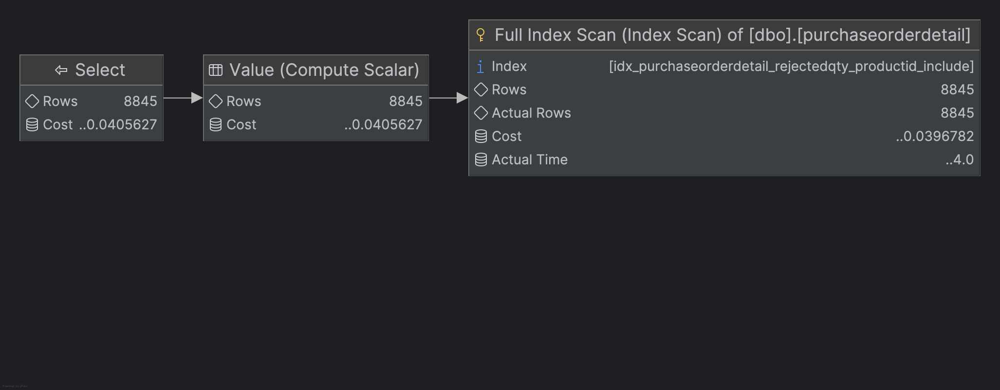

> Okrojona tabelka z rezultatem surowego planu zapytania:
>
> | Step            | EstimatedCPU | EstimatedIO | EstimatedTotalSubtreeCost | Estimated step cost (własne obliczenia) |
> |-----------------|--------------|-------------|---------------------------|-----------------------------------------|
> | Full index scan | 0.0098865    | 0.0297917   | 0.0396782                 | 0.0396782                               |
> | Value           | 0.0008845    | 0.0         | 0.0405627                 | 0.0008845 (= EstimatedCPU)              |
> | Select          | N/A          | N/A         | 0.0405627                 | 0.0                                     |
>
> Użycie `NONCLUSTERED` indeksu pozwoliło na jeszcze lepszą optymalizację kosztu zapytania. Zeszliśmy z kosztu 0.528317 (bez indeksu), przez koszt 0.0775997 (z indeksem `CLUSTERED`) aż do kosztu 0.0405627 (z indeksem `NONCLUSTERED`).
>
> Istotnym elementem tej optymalizacji przy użyciu indeksu `NONCLUSTERED` jest wykorzystanie klauzuli `INCLUDE` i zawarcie w niej kolumn, po których nie sortujemy, ale je "wyciągamy" – bez tej klauzuli skorzystanie z samego indeksu `NONCLUSTERED` dało nam wynik kosztu na ponad 3-krotnie gorszym poziomie niż bez indeksu (koszt ~1.5).
>
> Zapytanie z użyciem indeksu `NONCLUSTERED` jest też szybsze czasowo niż dwa poprzednie (w aspekcie _Completed_):
>
> |                           | CPU time | Elapsed time | Completed |
> |---------------------------|----------|--------------|-----------|
> | bez indeksu               | 21 ms    | 22 ms        | 29 ms     |
> | z indeksem `CLUSTERED`    | 11 ms    | 16 ms        | 28 ms     |
> | z indeksem `NONCLUSTERED` | 12 ms    | 14 ms        | 23 ms     |
>
> Oczywiście, ta przewaga jest tak minimalna, że ciężko to będzie odczuć gołym okiem, a dodatkowo nie wiemy, czy nie mieści się w błędzie pomiarowym związanym z innymi procesami następującymi w środowisku testowym.
>
> Warto jeszcze zwrócić uwagę na liczbę odczytów logicznych i fizycznych wykonanych zapytań:
>
> |                           | logical reads | physical reads | read-ahead reads |
> |---------------------------|---------------|----------------|------------------|
> | bez indeksu               | 78            | 0              | 78               |
> | z indeksem `CLUSTERED`    | 89            | 1              | 87               |
> | z indeksem `NONCLUSTERED` | 39            | 1              | 37               |
>
> _Wszystkie z tych wyników zostały obliczone po wyczyszczeniu cache'u._
>
> Widać tutaj ogromną różnicę zapytania z indeksem `NONCLUSTERED`, które jest wygranym w tym pojedynku. Warto natomiast zauważyć, że użycie indeksu `CLUSTERED` zwiększyło zarówno ilość odczytów logicznych, jak i fizycznych, względem zapytania bez indeksu.

# Zadanie 4 – indeksy column store

Celem zadania jest poznanie indeksów typu column store

Utwórz tabelę testową:

```sql
CREATE TABLE dbo.saleshistory(
    salesorderid INT NOT NULL,
    salesorderdetailid INT NOT NULL,
    carriertrackingnumber NVARCHAR(25) NULL,
    orderqty SMALLINT NOT NULL,
    productid INT NOT NULL,
    specialofferid INT NOT NULL,
    unitprice MONEY NOT NULL,
    unitpricediscount MONEY NOT NULL,
    linetotal NUMERIC(38, 6) NOT NULL,
    rowguid UNIQUEIDENTIFIER NOT NULL,
    modifieddate DATETIME NOT NULL
)
```

Załóż indeks:

```sql
CREATE CLUSTERED INDEX saleshistory_idx
ON saleshistory(salesorderdetailid)
```

Wypełnij tablicę danymi:

(UWAGA `GO 100` oznacza 100 krotne wykonanie polecenia. Jeżeli podejrzewasz, że Twój serwer może to zbyt przeciążyć, zacznij od GO 10, GO 20, GO 50 (w sumie już będzie 80))

```sql
INSERT INTO saleshistory
SELECT sh. *
FROM adventureworks2017.sales.salesorderdetail sh
GO 100
```

Sprawdź jak zachowa się zapytanie, które używa obecny indeks:

```sql
SELECT productid,
       SUM(unitprice),
       AVG(unitprice),
       SUM(orderqty),
       AVG(orderqty)
FROM saleshistory
GROUP BY productid
ORDER BY productid
```

Załóż indeks typu column store:

```sql
CREATE NONCLUSTERED COLUMNSTORE INDEX saleshistory_columnstore
ON saleshistory(unitprice, orderqty, productid)
```

Sprawdź różnicę pomiędzy przetwarzaniem w zależności od indeksów. Porównaj plany i opisz różnicę.
Co to są indeksy colums store? Jak działają? (poszukaj materiałów w internecie/literaturze)

---

> Wyniki:

> **Zapytanie z indeksem `saleshistory_idx`**

```sql
lab05> SELECT productid,
              SUM(unitprice),
              AVG(unitprice),
              SUM(orderqty),
              AVG(orderqty)
       FROM saleshistory WITH(INDEX(saleshistory_idx))
       GROUP BY productid
       ORDER BY productid
[2025-05-28 19:10:27] [S0000][3613] SQL Server parse and compile time:
[2025-05-28 19:10:27] CPU time = 19 ms, elapsed time = 22 ms.
[2025-05-28 19:10:27] [S0000][3615] Table 'saleshistory'.
    Scan count 5,
    logical reads 343119,
    physical reads 3,
    page server reads 0,
    read-ahead reads 343327,
    page server read-ahead reads 0,
    lob logical reads 0,
    lob physical reads 0,
    lob page server reads 0,
    lob read-ahead reads 0,
    lob page server read-ahead reads 0.
[2025-05-28 19:10:27] [S0000][3615] Table 'Worktable'.
    Scan count 0,
    logical reads 0,
    physical reads 0,
    page server reads 0,
    read-ahead reads 0,
    page server read-ahead reads 0,
    lob logical reads 0,
    lob physical reads 0,
    lob page server reads 0,
    lob read-ahead reads 0,
    lob page server read-ahead reads 0.
[2025-05-28 19:10:27] [S0000][3612] SQL Server Execution Times:
[2025-05-28 19:10:27] CPU time = 2383 ms, elapsed time = 5511 ms.
[2025-05-28 19:10:27] completed in 5 s 544 ms
```
> Plan zapytania:
>
> 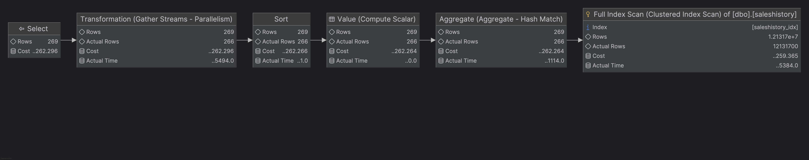

> Okrojona tabelka z rezultatem surowego planu zapytania:
>
> | Step            | EstimatedCPU | EstimatedIO | EstimatedTotalSubtreeCost | Estimated step cost (własne obliczenia) |
> | --------------- | ------------ | ----------- | ------------------------- | --------------------------------------- |
> | Full index scan | 6.67251      | 252.693     | 259.365                   | 259.365                                 |
> | Aggregate       | 2.89842      | 0.0         | 262.264                   | 2.899                                   |
> | Value           | 0.0          | 0.0         | 262.264                   | 0.0                                     |
> | Sort            | 0.000219373  | 0.00187688  | 262.266                   | 0.002                                   |
> | Transformation  | 0.0305796    | 0.0         | 262.296                   | 0.03                                    |
> | Select          | N/A          | N/A         | 262.296                   | 0.0                                     |

> **Zapytanie z indeksem `saleshistory_columnstore`**

```sql
lab05> SELECT productid,
              SUM(unitprice),
              AVG(unitprice),
              SUM(orderqty),
              AVG(orderqty)
       FROM saleshistory WITH(INDEX(saleshistory_columnstore))
       GROUP BY productid
       ORDER BY productid
[2025-05-28 19:10:55] [S0000][3613] SQL Server parse and compile time:
[2025-05-28 19:10:55] CPU time = 35 ms, elapsed time = 38 ms.
[2025-05-28 19:10:55] [S0000][3615] Table 'saleshistory'.
    Scan count 8,
    logical reads 0,
    physical reads 0,
    page server reads 0,
    read-ahead reads 0,
    page server read-ahead reads 0,
    lob logical reads 3761,
    lob physical reads 42,
    lob page server reads 0,
    lob read-ahead reads 7905,
    lob page server read-ahead reads 0.
[2025-05-28 19:10:55] [S0000][3642] Table 'saleshistory'. Segment reads 13, segment skipped 0.
[2025-05-28 19:10:55] [S0000][3615] Table 'Worktable'.
    Scan count 0,
    logical reads 0,
    physical reads 0,
    page server reads 0,
    read-ahead reads 0,
    page server read-ahead reads 0,
    lob logical reads 0,
    lob physical reads 0,
    lob page server reads 0,
    lob read-ahead reads 0,
    lob page server read-ahead reads 0.
[2025-05-28 19:10:55] [S0000][3612] SQL Server Execution Times:
[2025-05-28 19:10:55] CPU time = 131 ms, elapsed time = 114 ms.
[2025-05-28 19:10:55] completed in 160 ms
```

> Plan zapytania:
>
> 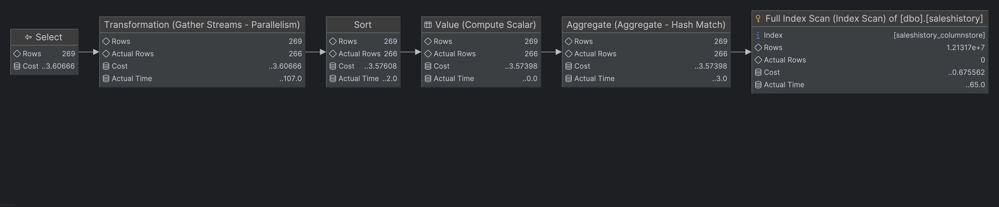

> Okrojona tabelka z rezultatem surowego planu zapytania:
>
> | Step            | EstimatedCPU | EstimatedIO | EstimatedTotalSubtreeCost | Estimated step cost (własne obliczenia) |
> | --------------- | ------------ | ----------- | ------------------------- | --------------------------------------- |
> | Full index scan | 0.667251     | 0.00831019  | 0.675562                  | 0.675562                                |
> | Aggregate       | 2.89842      | 0.0         | 3.57398                   | 2.898418                                |
> | Value           | 0.0          | 0.0         | 3.57398                   | 0.0                                     |
> | Sort            | 0.000219373  | 0.00187688  | 3.57608                   | 0.0021                                  |
> | Transformation  | 0.0305796    | 0.0         | 3.60666                   | 0.03058                                 |
> | Select          | N/A          | N/A         | 3.60666                   | 0.0                                     |

Sprawdź różnicę pomiędzy przetwarzaniem w zależności od indeksów. Porównaj plany i opisz różnicę.

> Porównując ze sobą wyniki z dwóch powyższych tabel, widać bardzo wyraźnie, że wszystkie kroki oprócz pierwszego (Aggregate, Value, Sort, Transformation, Select) są prawie identyczne w obydwóch zapytaniach.
>
> Jedyna różnica (ogromna) wynika z dokonanego pełnego skanu tabeli za pomocą dwóch różnych indeksów. "Klasyczny" indeks `CLUSTERED` wiąże się z ogromnym kosztem wykonania (259.365). Ten bardzo duży koszt robi się jeszcze bardziej drastyczny, gdy spojrzymy na koszt wykonania pełnego skanu za pomocą indeksu `COLUMNSTORE` – wtedy koszt wyniósł 0.675562 i jest on prawie 400-krotnie mniejszy od kosztu dla indeksu `CLUSTERED`.
>
> Różnica w kosztach tych dwóch zapytań niesie ze sobą również różnicę w czasie wykonania zapytań:
>
> |                      | CPU time | Elapsed time | Completed |
> | -------------------- | -------- | ------------ | --------- |
> | indeks `CLUSTERED`   | 2383 ms  | 5511 ms      | 5544 ms   |
> | indeks `COLUMNSTORE` | 131 ms   | 114 ms       | 160 ms    |
>
> Różnice w czasach są kolosalne: ponad 5 sekund dla zapytania z indeksem `CLUSTERED` względem 160 milisekund dla zapytania z indeksem `COLUMNSTORE`!

Co to są indeksy colums store? Jak działają? (poszukaj materiałów w internecie/literaturze)

> Indeksy typu `COLUMNSTORE` zostały zaprojektowane aby przyspieszyć analizy dużych zbiorów danych (np. w hurtowniach danych). Charakteryzują się tym, że przechowują dane w formacie kolumnowym, a nie wierszowym.
>
> Pozwala to na dużo szybsze wykonywanie zapytań analitycznych, które wykorzystują funkcje agregujące. Ich dodatkową zaletą jest również dużo łatwiejsza i lepsza kompresja danych, co pozwala na zmniejszenie rozmiaru danych przechowywanych. Ponadto, indeksy `COLUMNSTORE` pozwalają na tzw. _Batch execution_, czyli przetwarzanie wsadowe/wektorowe, które pozwala przetwarzać wiele wierszy jednocześnie.
>
> Minusem dla tego typu indeksów jest z pewnością częste wykonywanie operacji `INSERT/UPDATE/DELETE` na pojedynczych rekordach oraz dostęp do wielu kolumn z jednego wiersza (co jest dosyć zrozumiałe, skoro dane są trzymane w formacie kolumnowym).
>
> Źródło: [Microsoft's article: Columnstore indexes: overview](https://learn.microsoft.com/en-us/sql/relational-databases/indexes/columnstore-indexes-overview?view=sql-server-ver17)

# Zadanie 5 – własne eksperymenty

Należy zaprojektować tabelę w bazie danych, lub wybrać dowolny schemat danych (poza używanymi na zajęciach), a następnie wypełnić ją danymi w taki sposób, aby zrealizować poszczególne punkty w analizie indeksów. Warto wygenerować sobie tabele o większym rozmiarze.

Do analizy, proszę uwzględnić następujące rodzaje indeksów:

- Klastrowane (np.  dla atrybutu nie będącego kluczem głównym)
- Nieklastrowane
- Indeksy wykorzystujące kilka atrybutów, indeksy include
- Filtered Index (Indeks warunkowy)
- Kolumnowe

## Analiza

Proszę przygotować zestaw zapytań do danych, które:

- wykorzystują poszczególne indeksy
- które przy wymuszeniu indeksu działają gorzej, niż bez niego (lub pomimo założonego indeksu, tabela jest w pełni skanowana)
  Odpowiedź powinna zawierać:
- Schemat tabeli
- Opis danych (ich rozmiar, zawartość, statystyki)
- Opis indeksu
- Przygotowane zapytania, wraz z wynikami z planów (zrzuty ekranow)
- Komentarze do zapytań, ich wyników
- Sprawdzenie, co proponuje Database Engine Tuning Advisor (porównanie czy udało się Państwu znaleźć odpowiednie indeksy do zapytania)

> Wyniki:

```sql
--  ...
```

|         |     |     |
| ------- | --- | --- |
| zadanie | pkt |     |
| 1       | 2   |     |
| 2       | 2   |     |
| 3       | 2   |     |
| 4       | 2   |     |
| 5       | 5   |     |
| razem   | 13  |     |
