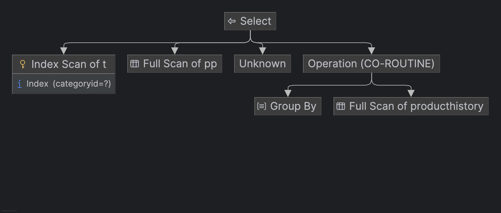
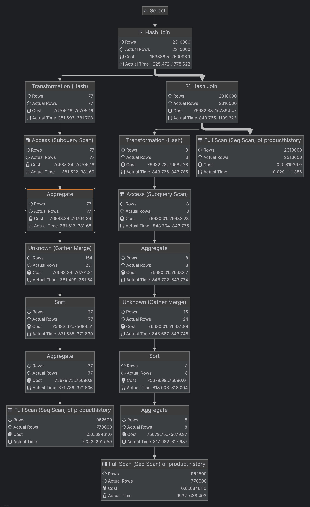
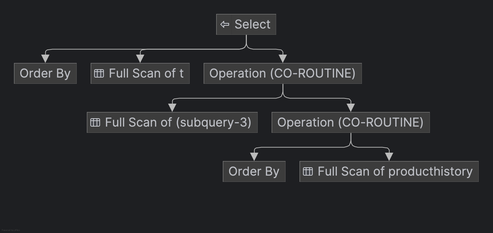

## SQL - Funkcje okna (Window functions) <br> Lab 2

---

**Imiona i nazwiska: Kacper Cienkosz, Miłosz Dubiel**

--- 


Celem ćwiczenia jest zapoznanie się z działaniem funkcji okna (window functions) w SQL, analiza wydajności zapytań i porównanie z rozwiązaniami przy wykorzystaniu "tradycyjnych" konstrukcji SQL

Swoje odpowiedzi wpisuj w miejsca oznaczone jako:

---
> Wyniki: 

```sql
--  ...
```

---

### Ważne/wymagane są komentarze.

Zamieść kod rozwiązania oraz zrzuty ekranu pokazujące wyniki, (dołącz kod rozwiązania w formie tekstowej/źródłowej)

Zwróć uwagę na formatowanie kodu

---

## Oprogramowanie - co jest potrzebne?

Do wykonania ćwiczenia potrzebne jest następujące oprogramowanie:
- MS SQL Server - wersja 2019, 2022
- PostgreSQL - wersja 15/16/17
- SQLite
- Narzędzia do komunikacji z bazą danych
	- SSMS - Microsoft SQL Managment Studio
	- DtataGrip lub DBeaver
-  Przykładowa baza Northwind/Northwind3
	- W wersji dla każdego z wymienionych serwerów

Oprogramowanie dostępne jest na przygotowanej maszynie wirtualnej

## Dokumentacja/Literatura

- Kathi Kellenberger,  Clayton Groom, Ed Pollack, Expert T-SQL Window Functions in SQL Server 2019, Apres 2019
- Itzik Ben-Gan, T-SQL Window Functions: For Data Analysis and Beyond, Microsoft 2020

- Kilka linków do materiałów które mogą być pomocne
	 - [https://learn.microsoft.com/en-us/sql/t-sql/queries/select-over-clause-transact-sql?view=sql-server-ver16](https://learn.microsoft.com/en-us/sql/t-sql/queries/select-over-clause-transact-sql?view=sql-server-ver16)
	- [https://www.sqlservertutorial.net/sql-server-window-functions/](https://www.sqlservertutorial.net/sql-server-window-functions/)
	- [https://www.sqlshack.com/use-window-functions-sql-server/](https://www.sqlshack.com/use-window-functions-sql-server/)
	- [https://www.postgresql.org/docs/current/tutorial-window.html](https://www.postgresql.org/docs/current/tutorial-window.html)
	- [https://www.postgresqltutorial.com/postgresql-window-function/](https://www.postgresqltutorial.com/postgresql-window-function/)
	- [https://www.sqlite.org/windowfunctions.html](https://www.sqlite.org/windowfunctions.html)
	- [https://www.sqlitetutorial.net/sqlite-window-functions/](https://www.sqlitetutorial.net/sqlite-window-functions/)


- W razie potrzeby - opis Ikonek używanych w graficznej prezentacji planu zapytania w SSMS jest tutaj:
	- [https://docs.microsoft.com/en-us/sql/relational-databases/showplan-logical-and-physical-operators-reference](https://docs.microsoft.com/en-us/sql/relational-databases/showplan-logical-and-physical-operators-reference)

## Przygotowanie

Uruchom SSMS
- Skonfiguruj połączenie  z bazą Northwind na lokalnym serwerze MS SQL 

Uruchom DataGrip (lub Dbeaver)
- Skonfiguruj połączenia z bazą Northwind3
	- na lokalnym serwerze MS SQL
	- na lokalnym serwerze PostgreSQL
	- z lokalną bazą SQLite

Można też skorzystać z innych narzędzi klienckich (wg własnego uznania)

Oryginalna baza Northwind jest bardzo mała. Warto zaobserwować działanie na nieco większym zbiorze danych.

Baza Northwind3 zawiera dodatkową tabelę product_history
- 2,2 mln wierszy

Bazę Northwind3 można pobrać z moodle (zakładka - Backupy baz danych)

Można też wygenerować tabelę product_history przy pomocy skryptu

Skrypt dla SQL Srerver

Stwórz tabelę o następującej strukturze:

```sql
create table product_history(
   id int identity(1,1) not null,
   productid int,
   productname varchar(40) not null,
   supplierid int null,
   categoryid int null,
   quantityperunit varchar(20) null,
   unitprice decimal(10,2) null,
   quantity int,
   value decimal(10,2),
   date date,
 constraint pk_product_history primary key clustered
    (id asc )
)
```

Wygeneruj przykładowe dane:

Dla 30000 iteracji, tabela będzie zawierała nieco ponad 2mln wierszy (dostostu ograniczenie do możliwości swojego komputera)

Skrypt dla SQL Srerver

```sql
declare @i int  
set @i = 1  
while @i <= 30000  
begin  
    insert product_history  
    select productid, ProductName, SupplierID, CategoryID,   
         QuantityPerUnit,round(RAND()*unitprice + 10,2),  
         cast(RAND() * productid + 10 as int), 0,  
         dateadd(day, @i, '1940-01-01')  
    from products  
    set @i = @i + 1;  
end;  
  
update product_history  
set value = unitprice * quantity  
where 1=1;
```


Skrypt dla Postgresql

```sql
create table product_history(
   id int generated always as identity not null  
       constraint pkproduct_history
            primary key,
   productid int,
   productname varchar(40) not null,
   supplierid int null,
   categoryid int null,
   quantityperunit varchar(20) null,
   unitprice decimal(10,2) null,
   quantity int,
   value decimal(10,2),
   date date
);
```

Wygeneruj przykładowe dane:

Skrypt dla Postgresql

```sql
do $$  
begin  
  for cnt in 1..30000 loop  
    insert into product_history(productid, productname, supplierid,   
           categoryid, quantityperunit,  
           unitprice, quantity, value, date)  
    select productid, productname, supplierid, categoryid,   
           quantityperunit,  
           round((random()*unitprice + 10)::numeric,2),  
           cast(random() * productid + 10 as int), 0,  
           cast('1940-01-01' as date) + cnt  
    from products;  
  end loop;  
end; $$;  
  
update product_history  
set value = unitprice * quantity  
where 1=1;
```


Wykonaj polecenia: `select count(*) from product_history`,  potwierdzające wykonanie zadania

---
> Wyniki: 

Dla wszystkich trzech systemów bazodanowych polecenie:

```sql
select count(*) from producthistory; -- 2310000
```

zwróciło wynik `2310000`.

---

# Zadanie 1

Baza: Northwind, tabela product_history

Napisz polecenie, które zwraca: id pozycji, id produktu, nazwę produktu, id_kategorii, cenę produktu, średnią cenę produktów w kategorii do której należy dany produkt. Wyświetl tylko pozycje (produkty) których cena jest większa niż średnia cena.

W przypadku długiego czasu wykonania ogranicz zbiór wynikowy do kilkuset/kilku tysięcy wierszy

pomocna może być konstrukcja ` with `

```sql
with t as (

....
)
select * from t
where id between ....
```

Napisz polecenie z wykorzystaniem podzapytania, join'a oraz funkcji okna. Porównaj zapytania. Porównaj czasy oraz plany wykonania zapytań.

Przetestuj działanie w różnych SZBD (MS SQL Server, PostgreSql, SQLite)

---

> Wyniki:

## MSSQL

### Podzapytanie

```sql
SELECT id,
       productid,
       productname,
       categoryid,
       unitprice
FROM producthistory
WHERE unitprice > (
    SELECT AVG(unitprice)
    FROM producthistory AS t
    WHERE t.categoryid = producthistory.categoryid
)
```

#### Plan zapytania:


#### Czas wykonania: 182 \[ms\]

#### Koszt: 49.168

### Join

```sql
SELECT id,
    productid,
    productname,
    pp.categoryid,
    unitprice
FROM producthistory AS pp
JOIN (
    SELECT categoryid,
        AVG(unitprice) AS avgprice
    FROM producthistory
    GROUP BY categoryid
) AS t ON pp.categoryid = t.categoryid
WHERE pp.unitprice > t.avgprice;
```

#### Plan zapytania:


#### Czas wykonania: 198 \[ms\]

#### Koszt: 49.168

### Funkcja okna

```sql
WITH t AS (
    SELECT id,
        productid,
        productname,
        categoryid,
        unitprice,
        AVG(unitprice) OVER (PARTITION BY categoryid) AS avgprice
    FROM producthistory
)

SELECT *
FROM t
WHERE t.unitprice > t.avgprice;
```

#### Plan zapytania:


#### Czas wykonania: 230 \[ms\]

#### Koszt: 69.7459

### Porównanie wyników

<!-- TODO -->

## PostgreSQL
<!-- TODO we can also check the version with WHERE id <= 10_000 -->

### Podzapytanie

```sql
WITH limited_data AS (
    SELECT *
    FROM producthistory
    ORDER BY id
    LIMIT 10000
)
SELECT id,
    productid,
    productname,
    categoryid,
    unitprice
FROM limited_data
WHERE unitprice > (
    SELECT AVG(unitprice)
    FROM limited_data AS t
    WHERE t.categoryid = limited_data.categoryid
);
```

#### Plan zapytania:


#### Czas wykonania: 3151.958 \[ms\]

#### Koszt: 2252228.45

### Join

```sql
SELECT id,
       productid,
       productname,
       pp.categoryid,
       unitprice
FROM producthistory AS pp
JOIN (
    SELECT categoryid,
           AVG(unitprice) AS avgprice
    FROM producthistory
    GROUP BY categoryid
) AS t ON pp.categoryid = t.categoryid
WHERE pp.unitprice > t.avgprice;
```

#### Plan zapytania:


#### Czas wykonania: 1174.49 \[ms\]

#### Koszt: 163587.09

### Funkcja okna

```sql
WITH t AS (
    SELECT id,
        productid,
        productname,
        categoryid,
        unitprice,
        AVG(unitprice) over (PARTITION BY categoryid) AS avgprice
    FROM producthistory
)

SELECT *
FROM t
WHERE t.unitprice > t.avgprice;
```

#### Plan zapytania:


#### Czas wykonania: 2522.537 \[ms\]

#### Koszt: 523998.9

### Porównanie wyników

<!-- TODO -->

## SQLite

### Podzapytanie

```sql
WITH limited_data AS (
    SELECT *
    FROM producthistory
    ORDER BY id
    LIMIT 100000
)
SELECT id,
    productid,
    productname,
    categoryid,
    unitprice
FROM limited_data
WHERE unitprice > (
    SELECT AVG(unitprice)
    FROM limited_data AS t
    WHERE t.categoryid = limited_data.categoryid
);
```
#### Plan zapytania:


#### Czas wykonania: 161229 \[ms\] (Nie ufam temu, to było mierzone sqlite3 CLI)

#### Koszt: --

### Join

```sql
SELECT id,
    productid,
    productname,
    pp.categoryid,
    unitprice
FROM producthistory AS pp
JOIN (
    SELECT categoryid,
        AVG(unitprice) AS avgprice
    FROM producthistory
    GROUP BY categoryid
) AS t ON pp.categoryid = t.categoryid
WHERE pp.unitprice > t.avgprice;
```

#### Plan zapytania:



#### Czas wykonania: 1462 \[ms\]

#### Koszt: --

### Funkcja okna

```sql
WITH t AS (
    SELECT id,
        productid,
        productname,
        categoryid,
        unitprice,
        AVG(unitprice) over (PARTITION BY categoryid) AS avgprice
    FROM producthistory
)

SELECT *
FROM t
WHERE t.unitprice > t.avgprice;
```

#### Plan zapytania:


#### Czas wykonania: 2602 \[ms\]

#### Koszt: --

### Porównanie wyników

<!-- TODO -->

## Porównanie wyników pomiędzy SZBD

<!-- TODO -->

---


# Zadanie 2

Baza: Northwind, tabela product_history

Lekka modyfikacja poprzedniego zadania

Napisz polecenie, które zwraca: id pozycji, id produktu, datę, nazwę produktu, id_kategorii, cenę produktu oraz
-  średnią cenę produktów w kategorii do której należy dany produkt.
-  łączną wartość sprzedaży produktów danej kategorii (suma dla pola value)
-  średnią cenę danego produktu w roku którego dotyczy dana pozycja
-  łączną wartość sprzedaży produktu w roku którego dotyczy dana pozycja (suma dla pola value)

Napisz polecenie z wykorzystaniem podzapytania, join'a oraz funkcji okna. Porównaj zapytania. W przypadku funkcji okna spróbuj użyć klauzuli WINDOW.

Podobnie jak poprzednio, w przypadku długiego czasu wykonania ogranicz zbiór wynikowy do kilkuset/kilku tysięcy wierszy

Porównaj czasy oraz plany wykonania zapytań.

Przetestuj działanie w różnych SZBD (MS SQL Server, PostgreSql, SQLite)


---
> Wyniki: 

## MSSQL

### Podzapytanie

```sql
SELECT id,
    productid,
    productname,
    categoryid,
    unitprice,
    (
        SELECT AVG(unitprice)
        FROM producthistory AS t
        WHERE t.categoryid = producthistory.categoryid
    ) AS avgpricecategory,
    (
        SELECT SUM(unitprice)
        FROM producthistory AS t
        WHERE t.categoryid = producthistory.categoryid
    ) AS sumpricecategory,
    (
        SELECT AVG(unitprice)
        FROM producthistory AS t
        WHERE t.productid = producthistory.productid
    ) AS avgpriceproduct,
    (
        SELECT SUM(unitprice)
        FROM producthistory AS t
        WHERE t.productid = producthistory.productid
    ) AS sumpriceproduct
FROM producthistory;
```

#### Plan zapytania:


#### Czas wykonania: 743 \[ms\]

#### Koszt: 121.366

### Join

```sql
SELECT id,
    pp.productid,
    productname,
    pp.categoryid,
    unitprice,
    avgpricecategory,
    sumpricecategory,
    avgpriceproduct,
    sumpriceproduct
FROM producthistory AS pp
    JOIN (
        SELECT categoryid,
            AVG(unitprice) AS avgpricecategory,
            SUM(VALUE) AS sumpricecategory
        FROM producthistory
        GROUP BY categoryid
    ) AS ct ON pp.categoryid = ct.categoryid
    JOIN (
        SELECT productid,
            AVG(unitprice) AS avgpriceproduct,
            SUM(VALUE) AS sumpriceproduct
        FROM producthistory
        GROUP BY productid
    ) AS pt ON pp.productid = pt.productid;
```

#### Plan zapytania:


#### Czas wykonania: 767 \[ms\]

#### Koszt: 78.3871

### Funkcja okna

```sql
SELECT id,
    productid,
    productname,
    categoryid,
    unitprice,
    AVG(unitprice) over (PARTITION BY categoryid) AS avgpricecategory,
    SUM(VALUE) over (PARTITION BY categoryid) AS sumpricecategory,
    AVG(unitprice) over (PARTITION BY productid) AS avgpriceproduct,
    SUM(VALUE) over (PARTITION BY productid) AS sumpriceproduct
FROM producthistory;
```

#### Plan zapytania:


#### Czas wykonania: 926 \[ms\]

#### Koszt: 156.65

### Porównanie wyników

<!-- TODO -->

## PostgreSQL

### Podzapytanie

```sql
WITH limited_data AS (
    SELECT *
    FROM producthistory
    ORDER BY id
    LIMIT 10000
)
SELECT id,
    productid,
    productname,
    categoryid,
    unitprice,
    (
        SELECT AVG(unitprice)
        FROM limited_data AS t
        WHERE t.categoryid = limited_data.categoryid
    ) AS avgpricecategory,
    (
        SELECT SUM(unitprice)
        FROM limited_data AS t
        WHERE t.categoryid = limited_data.categoryid
    ) AS sumpricecategory,
    (
        SELECT AVG(unitprice)
        FROM limited_data AS t
        WHERE t.productid = limited_data.productid
    ) AS avgpriceproduct,
    (
        SELECT SUM(unitprice)
        FROM limited_data AS t
        WHERE t.productid = limited_data.productid
    ) AS sumpriceproduct
FROM limited_data;
```

#### Plan zapytania:


#### Czas wykonania: 12130.597 \[ms\]

#### Koszt: 9006328.45

### Join

```sql
SELECT id,
    pp.productid,
    productname,
    pp.categoryid,
    unitprice,
    avgpricecategory,
    sumpricecategory,
    avgpriceproduct,
    sumpriceproduct
FROM producthistory AS pp
    JOIN (
        SELECT categoryid,
            AVG(unitprice) AS avgpricecategory,
            SUM(VALUE) AS sumpricecategory
        FROM producthistory
        GROUP BY categoryid
    ) AS ct ON pp.categoryid = ct.categoryid
    JOIN (
        SELECT productid,
            AVG(unitprice) AS avgpriceproduct,
            SUM(VALUE) AS sumpriceproduct
        FROM producthistory
        GROUP BY productid
    ) AS pt ON pp.productid = pt.productid;
```

#### Plan zapytania:



#### Czas wykonania: 1778.622 \[ms\]

#### Koszt: 250998.1

### Funkcja okna

```sql
SELECT id,
    productid,
    productname,
    categoryid,
    unitprice,
    AVG(unitprice) over category_window AS avgpricecategory,
    SUM(VALUE) over category_window AS sumpricecategory,
    AVG(unitprice) over product_window AS avgpriceproduct,
    SUM(VALUE) over product_window AS sumpriceproduct
FROM producthistory window category_window AS (PARTITION BY categoryid),
    product_window AS (PARTITION BY productid);
```

#### Plan zapytania:


#### Czas wykonania: 5436.37 \[ms\]

#### Koszt: 1073228.56

### Porównanie wyników

<!-- TODO -->

## SQLite

### Podzapytanie

```sql
WITH limited_data AS (
    SELECT *
    FROM producthistory
    ORDER BY id
    LIMIT 10000
)

SELECT id,
       productid,
       productname,
       categoryid,
       unitprice,
       (
           SELECT AVG(unitprice)
           FROM limited_data AS t
           WHERE t.categoryid = limited_data.categoryid
       ) AS avgpricecategory,
       (
           SELECT SUM(unitprice)
           FROM limited_data AS t
           WHERE t.categoryid = limited_data.categoryid
       ) AS sumpricecategory,
       (
           SELECT AVG(unitprice)
           FROM limited_data AS t
           WHERE t.productid = limited_data.productid
       ) AS avgpriceproduct,
       (
           SELECT SUM(unitprice)
           FROM limited_data AS t
           WHERE t.productid = limited_data.productid
       ) AS sumpriceproduct
FROM limited_data;
```

#### Plan zapytania:


#### Czas wykonania: 12514 \[ms\]

#### Koszt: --

### Join

```sql
SELECT id,
       pp.productid,
       productname,
       pp.categoryid,
       unitprice,
       avgpricecategory,
       sumpricecategory,
       avgpriceproduct,
       sumpriceproduct
FROM producthistory AS pp
JOIN (
    SELECT categoryid,
           AVG(unitprice) AS avgpricecategory,
           SUM(VALUE) AS sumpricecategory
    FROM producthistory
    GROUP BY categoryid
) AS ct ON pp.categoryid = ct.categoryid
JOIN (
    SELECT productid,
           AVG(unitprice) AS avgpriceproduct,
           SUM(VALUE) AS sumpriceproduct
    FROM producthistory
    GROUP BY productid
) AS pt ON pp.productid = pt.productid;
```

#### Plan zapytania:


#### Czas wykonania: 6373 \[ms\]

#### Koszt: --

### Funkcja okna

```sql
SELECT id,
       productid,
       productname,
       categoryid,
       unitprice,
       AVG(unitprice) over category_window AS avgpricecategory,
       SUM(VALUE) over category_window AS sumpricecategory,
       AVG(unitprice) over product_window AS avgpriceproduct,
       SUM(VALUE) over product_window AS sumpriceproduct
FROM producthistory window category_window AS (PARTITION BY categoryid),
    product_window AS (PARTITION BY productid);
```

#### Plan zapytania:


#### Czas wykonania: 6957 \[ms\]

#### Koszt: --

### Porównanie wyników

<!-- TODO -->
Nie ufam czasom wykonania – były mierzone sqlite3 CLI

## Porównanie wyników pomiędzy SZBD

<!-- TODO -->

---


# Zadanie 3 

Funkcje rankingu, `row_number()`, `rank()`, `dense_rank()`

Wykonaj polecenie, zaobserwuj wynik. Porównaj funkcje row_number(), rank(), dense_rank().  Skomentuj wyniki.

```sql 
select productid, productname, unitprice, categoryid,  
    row_number() over(partition by categoryid order by unitprice desc) as rowno,  
    rank() over(partition by categoryid order by unitprice desc) as rankprice,  
    dense_rank() over(partition by categoryid order by unitprice desc) as denserankprice  
from products;
```

---
> Wyniki: 

## MSSQL

```sql
SELECT productid,
       productname,
       unitprice,
       categoryid,
       row_number() over (PARTITION BY categoryid ORDER BY unitprice DESC) AS rowno,
       rank() over (PARTITION BY categoryid ORDER BY unitprice DESC) AS rankprice,
       dense_rank() over (PARTITION BY categoryid ORDER BY unitprice DESC) AS denserankprice
FROM products;
```

#### Plan zapytania:


#### Czas wykonania: 0.0 \[ms\]

#### Koszt: 0.0162292

## PostgreSQL

```sql
SELECT productid,
       productname,
       unitprice,
       categoryid,
       row_number() over (PARTITION BY categoryid ORDER BY unitprice DESC) AS rowno,
       rank() over (PARTITION BY categoryid ORDER BY unitprice DESC) AS rankprice,
       dense_rank() over (PARTITION BY categoryid ORDER BY unitprice DESC) AS denserankprice
FROM products;
```

#### Plan zapytania:


#### Czas wykonania: 6.11 \[ms\]

#### Koszt: 0.052

## SQLite

```sql
SELECT productid,
       productname,
       unitprice,
       categoryid,
       row_number() over (PARTITION BY categoryid ORDER BY unitprice DESC) AS rowno,
       rank() over (PARTITION BY categoryid ORDER BY unitprice DESC) AS rankprice,
       dense_rank() over (PARTITION BY categoryid ORDER BY unitprice DESC) AS denserankprice
FROM products;
```

#### Plan zapytania:


#### Czas wykonania: 4 \[ms\]

#### Koszt: --

## Porównanie wyników pomiędzy SZBD

<!-- TODO -->

## Skrócony rezultat zapytań (z MSSQL, TOP 15)

| productid | productname                | unitprice | categoryid | rowno | rankprice | denserankprice |
| :-------- | :------------------------- | :-------- | :--------- | :---- | :-------- | :------------- |
| 38        | Côte de Blaye              | 263.5000  | 1          | 1     | 1         | 1              |
| 43        | Ipoh Coffee                | 46.0000   | 1          | 2     | 2         | 2              |
| 2         | Chang                      | 19.0000   | 1          | 3     | 3         | 3              |
| 1         | Chai                       | 18.0000   | 1          | 4     | 4         | 4              |
| 39        | Chartreuse verte           | 18.0000   | 1          | 5     | 4         | 4              |
| 35        | Steeleye Stout             | 18.0000   | 1          | 6     | 4         | 4              |
| 76        | Lakkalikööri               | 18.0000   | 1          | 7     | 4         | 4              |
| 70        | Outback Lager              | 15.0000   | 1          | 8     | 8         | 5              |
| 67        | Laughing Lumberjack Lager  | 14.0000   | 1          | 9     | 9         | 6              |
| 34        | Sasquatch Ale              | 14.0000   | 1          | 10    | 9         | 6              |
| 75        | Rhönbräu Klosterbier       | 7.7500    | 1          | 11    | 11        | 7              |
| 24        | Guaraná Fantástica         | 4.5000    | 1          | 12    | 12        | 8              |
| 63        | Vegie-spread               | 43.9000   | 2          | 1     | 1         | 1              |
| 8         | Northwoods Cranberry Sauce | 40.0000   | 2          | 2     | 2         | 2              |
| 61        | Sirop d'érable             | 28.5000   | 2          | 3     | 3         | 3              |

## Porównanie funkcji

 * `row_number()` - nadaje unikalny numer dla każdego wiersza w grupie
 * `rank()` - nadaje numer dla każdego wiersza w grupie, ale w przypadku równych wartości, nadaje ten sam numer i "dziury" w numeracji (np. 1, 2, 2, 4)
 * `dense_rank()` - nadaje numer dla każdego wiersza w grupie. W przypadku równych wartości nadaje ten sam numer, ale nie ma "dziur" w numeracji (np. 1, 2, 2, 3)

---

Zadanie

Spróbuj uzyskać ten sam wynik bez użycia funkcji okna

---
> Wyniki: 

Najpierw przedstawmy zapytania równoważne dla każdej z użytych powyżej funkcji:

### row_number()

```sql
SELECT (
    SELECT COUNT(*)
    FROM products p2
    WHERE p2.categoryid = p1.categoryid
      AND (
        p2.unitprice > p1.unitprice
            OR (
            p2.unitprice = p1.unitprice
                AND p2.productid < p1.productid
            )
        )
) + 1 AS rowno
FROM products p1
ORDER BY categoryid, rowno;
```

### rank()

```sql
SELECT (
    SELECT COUNT(*)
    FROM products p2
    WHERE p2.categoryid = p1.categoryid
      AND p2.unitprice > p1.unitprice
) + 1 AS rankprice
FROM products p1
ORDER BY categoryid, rankprice;
```

### dense_rank()

```sql
SELECT (
    SELECT COUNT(DISTINCT p2.unitprice)
    FROM products p2
    WHERE p2.categoryid = p1.categoryid
      AND p2.unitprice > p1.unitprice
) + 1 AS denserankprice
FROM products p1
ORDER BY categoryid, denserankprice;
```

Teraz dokonajmy porównania wyników pomiędzy różnymi SZBD:

## MSSQL

```sql
SELECT p1.productid,
       p1.productname,
       p1.unitprice,
       p1.categoryid,
       (
           SELECT COUNT(*)
           FROM products p2
           WHERE p2.categoryid = p1.categoryid
               AND (
                   p2.unitprice > p1.unitprice
                   OR (
                       p2.unitprice = p1.unitprice
                       AND p2.productid < p1.productid
                   )
               )
       ) + 1 AS rowno,
       (
           SELECT COUNT(*)
           FROM products p2
           WHERE p2.categoryid = p1.categoryid
               AND p2.unitprice > p1.unitprice
       ) + 1 AS rankprice,
       (
           SELECT COUNT(DISTINCT p2.unitprice)
           FROM products p2
           WHERE p2.categoryid = p1.categoryid
               AND p2.unitprice > p1.unitprice
       ) + 1 AS denserankprice
FROM products p1
ORDER BY categoryid, rowno;
```

#### Plan zapytania:


#### Czas wykonania: 3 \[ms\]

#### Koszt: 0.964302

## PostgreSQL

```sql
SELECT p1.productid,
       p1.productname,
       p1.unitprice,
       p1.categoryid,
       (
           SELECT COUNT(*)
           FROM products p2
           WHERE p2.categoryid = p1.categoryid
               AND (
                   p2.unitprice > p1.unitprice
                   OR (
                       p2.unitprice = p1.unitprice
                       AND p2.productid < p1.productid
                   )
               )
       ) + 1 AS rowno,
       (
           SELECT COUNT(*)
           FROM products p2
           WHERE p2.categoryid = p1.categoryid
               AND p2.unitprice > p1.unitprice
       ) + 1 AS rankprice,
       (
           SELECT COUNT(DISTINCT p2.unitprice)
           FROM products p2
           WHERE p2.categoryid = p1.categoryid
               AND p2.unitprice > p1.unitprice
       ) + 1 AS denserankprice
FROM products p1
ORDER BY categoryid, rowno;
```

#### Plan zapytania:


#### Czas wykonania: 1.134 \[ms\]

#### Koszt: 538.85

## SQLite

```sql
SELECT p1.productid,
       p1.productname,
       p1.unitprice,
       p1.categoryid,
       (
           SELECT COUNT(*)
           FROM products p2
           WHERE p2.categoryid = p1.categoryid
             AND (
               p2.unitprice > p1.unitprice
                   OR (
                   p2.unitprice = p1.unitprice
                       AND p2.productid < p1.productid
                   )
               )
       ) + 1 AS rowno,
       (
           SELECT COUNT(*)
           FROM products p2
           WHERE p2.categoryid = p1.categoryid
             AND p2.unitprice > p1.unitprice
       ) + 1 AS rankprice,
       (
           SELECT COUNT(DISTINCT p2.unitprice)
           FROM products p2
           WHERE p2.categoryid = p1.categoryid
             AND p2.unitprice > p1.unitprice
       ) + 1 AS denserankprice
FROM products p1
ORDER BY categoryid, rowno;
```

#### Plan zapytania:


#### Czas wykonania: 5 \[ms\]

#### Koszt: --

## Porównanie wyników pomiędzy SZBD

<!-- TODO -->

---
# Zadanie 4

Baza: Northwind, tabela product_history

Dla każdego produktu, podaj 4 najwyższe ceny tego produktu w danym roku. Zbiór wynikowy powinien zawierać:
- rok
- id produktu
- nazwę produktu
- cenę
- datę (datę uzyskania przez produkt takiej ceny)
- pozycję w rankingu

Uporządkuj wynik wg roku, nr produktu, pozycji w rankingu

Spróbuj uzyskać ten sam wynik bez użycia funkcji okna, porównaj wyniki, czasy i plany zapytań. Przetestuj działanie w różnych SZBD (MS SQL Server, PostgreSql, SQLite)

---
> Wyniki: 

## MSSQL

### Podzapytanie

```sql
WITH limited_data AS (
    SELECT *
    FROM producthistory
    WHERE datepart(year, date) = 1940
),
     t AS (
         SELECT datepart(year, date) AS year,
                ph.productid,
                productname,
                ph.unitprice,
                date,
                (
                    SELECT COUNT(*)
                    FROM limited_data AS ph2
                    WHERE datepart(year, ph2.date) = datepart(year, ph.date)
                      AND ph2.productid = ph.productid
                      AND (
                        ph2.unitprice > ph.unitprice
                            OR (
                            ph2.unitprice = ph.unitprice
                                AND ph2.date < ph.date
                            )
                        )
                ) + 1 AS ranking
         FROM limited_data AS ph
     )
SELECT *
FROM t
WHERE ranking < 5
ORDER BY year, productid, ranking;
```

#### Plan zapytania:


#### Czas wykonania: 242902 \[ms\]

#### Koszt: 4915.65

### Funkcja okna

```sql
WITH t AS (
    SELECT datepart(year, date) AS year,
           productid,
           productname,
           unitprice,
           date,
           row_number() over (
               PARTITION BY datepart(year, date),
               productid
               ORDER BY unitprice DESC
               ) AS ranking
    FROM producthistory
)
SELECT *
FROM t
WHERE ranking < 5
ORDER BY year, productid, ranking;
```

#### Plan zapytania:


#### Czas wykonania: 462 \[ms\]

#### Koszt: 75.3262

### Porównanie wyników

<!-- TODO -->

## PostgreSQL

### Podzapytanie

```sql
WITH limited_data AS (
    SELECT *
    FROM producthistory
    WHERE date_part('year', date) = 1940
    ORDER BY date
),
     t AS (
         SELECT date_part('year', date) AS year,
                ph.productid,
                productname,
                ph.unitprice,
                date,
                (
                    SELECT COUNT(*)
                    FROM limited_data AS ph2
                    WHERE date_part('year', ph2.date) = date_part('year', ph.date)
                      AND ph2.productid = ph.productid
                      AND (
                        ph2.unitprice > ph.unitprice
                            OR (
                            ph2.unitprice = ph.unitprice
                                AND ph2.date < ph.date
                            )
                        )
                ) + 1 AS ranking
         FROM limited_data AS ph
         ORDER BY year, productid, ranking
     )

SELECT *
FROM t
WHERE ranking < 5
ORDER BY year, productid, ranking;
```

#### Plan zapytania:


#### Czas wykonania: 24446.791 \[ms\]

#### Koszt: 5249164.55

### Funkcja okna

```sql
WITH t AS (
    SELECT date_part('year', date) AS year,
        productid,
        productname,
        unitprice,
        date,
        row_number() over (
            PARTITION BY date_part('year', date),
            productid
            ORDER BY unitprice DESC
        ) AS ranking
    FROM producthistory
    ORDER BY year, productid, ranking
)

SELECT *
FROM t
WHERE ranking < 5
ORDER BY year, productid, ranking;
```

#### Plan zapytania:


#### Czas wykonania: 1876.405 \[ms\]

#### Koszt: 594899.67

### Porównanie wyników

<!-- TODO -->

## SQLite

### Podzapytanie

```sql
WITH limited_data AS (
    SELECT *
    FROM producthistory
    WHERE strftime('%Y', date) = '1940'
    ORDER BY date
),
t AS (
    SELECT strftime('%Y', date) AS year,
        ph.productid,
        productname,
        ph.unitprice,
        date,
        (
            SELECT COUNT(*)
            FROM limited_data AS ph2
            WHERE strftime('%Y', ph2.date) = strftime('%Y', ph.date)
                AND ph2.productid = ph.productid
                AND (
                    ph2.unitprice > ph.unitprice
                    OR (
                        ph2.unitprice = ph.unitprice
                        AND ph2.date < ph.date
                    )
                )
        ) + 1 AS ranking
    FROM limited_data AS ph
    ORDER BY year, productid, ranking
)

SELECT *
FROM t
WHERE ranking < 5
ORDER BY year, productid, ranking;
```

#### Plan zapytania:


#### Czas wykonania: 3370 \[ms\]

#### Koszt: --

### Funkcja okna

```sql
WITH t AS (
    SELECT strftime('%Y', date) AS year,
           productid,
           productname,
           unitprice,
           date,
           row_number() over (
               PARTITION BY strftime('%Y', date),
               productid
               ORDER BY unitprice DESC
           ) AS ranking
    FROM producthistory
    ORDER BY year, productid, ranking
)

SELECT *
FROM t
WHERE ranking < 5
ORDER BY year, productid, ranking;
```

#### Plan zapytania:



#### Czas wykonania: 2953 \[ms\]

#### Koszt: --

### Porównanie wyników

<!-- TODO -->

## Porównanie wyników pomiędzy SZBD

<!-- TODO -->

---


# Zadanie 5 

Funkcje `lag()`, `lead()`

Wykonaj polecenia, zaobserwuj wynik. Jak działają funkcje `lag()`, `lead()`

```sql
select productid, productname, categoryid, date, unitprice,  
       lag(unitprice) over (partition by productid order by date)   
as previousprodprice,  
       lead(unitprice) over (partition by productid order by date)   
as nextprodprice  
from product_history  
where productid = 1 and year(date) = 2022  
order by date;  
```

```sql
with t as (select productid, productname, categoryid, date, unitprice,  
                  lag(unitprice) over (partition by productid   
order by date) as previousprodprice,  
                  lead(unitprice) over (partition by productid   
order by date) as nextprodprice  
           from product_history  
           )  
select * from t  
where productid = 1 and year(date) = 2022  
order by date;
```

---
> Wyniki: 

## MSSQL

### Funkcja okna

```sql
SELECT productid,
       productname,
       categoryid,
       date,
       unitprice,
       lag(unitprice) OVER (PARTITION BY productid ORDER BY date) AS previousprodprice,
       lead(unitprice) OVER (PARTITION BY productid ORDER BY date) AS nextprodprice
FROM producthistory
WHERE productid = 1
  AND year(date) = 2022
ORDER BY date;
```

#### Plan zapytania:


#### Czas wykonania: 41.0 \[ms\]

#### Koszt: 21.1745

### Funkcja okna w podzapytaniu

```sql
WITH t AS (
    SELECT productid,
           productname,
           categoryid,
           date,
           unitprice,
           lag(unitprice) over (PARTITION BY productid ORDER BY date) AS previousprodprice,
           lead(unitprice) over (PARTITION BY productid ORDER BY date) AS nextprodprice
    FROM producthistory
)
SELECT *
FROM t
WHERE productid = 1
  AND year(date) = 2022
ORDER BY date;
```

#### Plan zapytania:


#### Czas wykonania: 179.0 \[ms\]

#### Koszt: 22.3768

## PostgreSQL

### Funkcja okna

```sql
SELECT productid,
       productname,
       categoryid,
       date,
       unitprice,
       lag(unitprice) OVER (PARTITION BY productid ORDER BY date) AS previousprodprice,
       lead(unitprice) OVER (PARTITION BY productid ORDER BY date) AS nextprodprice
FROM producthistory
WHERE productid = 1
  AND DATE_PART('year', date) = 2022
ORDER BY date;
```

#### Plan zapytania:


#### Czas wykonania: 218.408 \[ms\]

#### Koszt: 79107.89

### Funkcja okna w podzapytaniu

```sql
WITH t AS (
    SELECT productid,
           productname,
           categoryid,
           date,
           unitprice,
           lag(unitprice) over (PARTITION BY productid ORDER BY date) AS previousprodprice,
           lead(unitprice) over (PARTITION BY productid ORDER BY date) AS nextprodprice
    FROM producthistory
)
SELECT *
FROM t
WHERE productid = 1
  AND DATE_PART('year', date) = 2022
ORDER BY date;
```

#### Plan zapytania:


#### Czas wykonania: 221.036 \[ms\]

#### Koszt: 77242.56

## SQLite

### Funkcja okna

```sql
SELECT productid,
       productname,
       categoryid,
       date,
       unitprice,
       lag(unitprice) OVER (PARTITION BY productid ORDER BY date) AS previousprodprice,
       lead(unitprice) OVER (PARTITION BY productid ORDER BY date) AS nextprodprice
FROM producthistory
WHERE productid = 1
  AND strftime('%Y', date) = '2022'
ORDER BY date;
```

#### Plan zapytania:


#### Czas wykonania: 90 \[ms\]

#### Koszt: --

### Funkcja okna w podzapytaniu

```sql
WITH t AS (
    SELECT productid,
           productname,
           categoryid,
           date,
           unitprice,
           lag(unitprice) over (PARTITION BY productid ORDER BY date) AS previousprodprice,
           lead(unitprice) over (PARTITION BY productid ORDER BY date) AS nextprodprice
    FROM producthistory
)
SELECT *
FROM t
WHERE productid = 1
  AND strftime('%Y', date) = '2022'
ORDER BY date;
```

#### Plan zapytania:


#### Czas wykonania: 128 \[ms\]

#### Koszt: 

## Porównanie wyników pomiędzy SZBD

<!-- TODO -->

## Skrócony rezultat zapytań (z MSSQL, pierwsze 10 wierszy i ostatnie 10 wierszy)

### Funkcja okna

| productid | productname | categoryid | date       | unitprice | previousprodprice | nextprodprice |
| :-------- | :---------- | :--------- | :--------- | :-------- | :---------------- | :------------ |
| 1         | Chai        | 1          | 2022-01-01 | 20.64     | null              | 17.60         |
| 1         | Chai        | 1          | 2022-01-02 | 17.60     | 20.64             | 17.83         |
| 1         | Chai        | 1          | 2022-01-03 | 17.83     | 17.60             | 27.77         |
| 1         | Chai        | 1          | 2022-01-04 | 27.77     | 17.83             | 10.02         |
| 1         | Chai        | 1          | 2022-01-05 | 10.02     | 27.77             | 24.61         |
| 1         | Chai        | 1          | 2022-01-06 | 24.61     | 10.02             | 21.71         |
| 1         | Chai        | 1          | 2022-01-07 | 21.71     | 24.61             | 21.31         |
| 1         | Chai        | 1          | 2022-01-08 | 21.31     | 21.71             | 26.80         |
| 1         | Chai        | 1          | 2022-01-09 | 26.80     | 21.31             | 27.13         |
| 1         | Chai        | 1          | 2022-01-10 | 27.13     | 26.80             | 11.15         |
| ...       | ...         | ...        | ...        | ...       | ...               | ...           |
| 1         | Chai        | 1          | 2022-02-10 | 17.10     | 21.63             | 15.29         |
| 1         | Chai        | 1          | 2022-02-11 | 15.29     | 17.10             | 23.44         |
| 1         | Chai        | 1          | 2022-02-12 | 23.44     | 15.29             | 27.39         |
| 1         | Chai        | 1          | 2022-02-13 | 27.39     | 23.44             | 19.21         |
| 1         | Chai        | 1          | 2022-02-14 | 19.21     | 27.39             | 17.01         |
| 1         | Chai        | 1          | 2022-02-15 | 17.01     | 19.21             | 17.70         |
| 1         | Chai        | 1          | 2022-02-16 | 17.70     | 17.01             | 15.76         |
| 1         | Chai        | 1          | 2022-02-17 | 15.76     | 17.70             | 15.89         |
| 1         | Chai        | 1          | 2022-02-18 | 15.89     | 15.76             | 20.01         |
| 1         | Chai        | 1          | 2022-02-19 | 20.01     | 15.89             | null          |


### Funkcja okna w podzapytaniu

| productid | productname | categoryid | date       | unitprice | previousprodprice | nextprodprice |
| :-------- | :---------- | :--------- | :--------- | :-------- | :---------------- | :------------ |
| 1         | Chai        | 1          | 2022-01-01 | 20.64     | 13.33             | 17.60         |
| 1         | Chai        | 1          | 2022-01-02 | 17.60     | 20.64             | 17.83         |
| 1         | Chai        | 1          | 2022-01-03 | 17.83     | 17.60             | 27.77         |
| 1         | Chai        | 1          | 2022-01-04 | 27.77     | 17.83             | 10.02         |
| 1         | Chai        | 1          | 2022-01-05 | 10.02     | 27.77             | 24.61         |
| 1         | Chai        | 1          | 2022-01-06 | 24.61     | 10.02             | 21.71         |
| 1         | Chai        | 1          | 2022-01-07 | 21.71     | 24.61             | 21.31         |
| 1         | Chai        | 1          | 2022-01-08 | 21.31     | 21.71             | 26.80         |
| 1         | Chai        | 1          | 2022-01-09 | 26.80     | 21.31             | 27.13         |
| 1         | Chai        | 1          | 2022-01-10 | 27.13     | 26.80             | 11.15         |
| ...       | ...         | ...        | ...        | ...       | ...               | ...           |
| 1         | Chai        | 1          | 2022-02-10 | 17.10     | 21.63             | 15.29         |
| 1         | Chai        | 1          | 2022-02-11 | 15.29     | 17.10             | 23.44         |
| 1         | Chai        | 1          | 2022-02-12 | 23.44     | 15.29             | 27.39         |
| 1         | Chai        | 1          | 2022-02-13 | 27.39     | 23.44             | 19.21         |
| 1         | Chai        | 1          | 2022-02-14 | 19.21     | 27.39             | 17.01         |
| 1         | Chai        | 1          | 2022-02-15 | 17.01     | 19.21             | 17.70         |
| 1         | Chai        | 1          | 2022-02-16 | 17.70     | 17.01             | 15.76         |
| 1         | Chai        | 1          | 2022-02-17 | 15.76     | 17.70             | 15.89         |
| 1         | Chai        | 1          | 2022-02-18 | 15.89     | 15.76             | 20.01         |
| 1         | Chai        | 1          | 2022-02-19 | 20.01     | 15.89             | null          |


**Warto zaznaczyć różnicę w pierwszym wierszu w kolumnie _previousprodprice_**

## Porównanie funkcji

* `lag()` – <!-- TODO -->
* `lead()` – <!-- TODO -->

---

Zadanie

Spróbuj uzyskać ten sam wynik bez użycia funkcji okna, porównaj wyniki, czasy i plany zapytań. Przetestuj działanie w różnych SZBD (MS SQL Server, PostgreSql, SQLite)

---
> Wyniki: 

Najpierw przedstawmy zapytania równoważne dla każdej z użytych powyżej funkcji:

### lag()

```sql
SELECT (
    SELECT ph2.unitprice
    FROM producthistory AS ph2
    WHERE ph2.productid = ph1.productid
      AND DATE_PART('year', ph2.date) = 2022
      AND ph2.date < ph1.date
    ORDER BY ph2.date DESC
    LIMIT 1
) AS previousprodprice
FROM producthistory ph1
WHERE productid = 1
  AND DATE_PART('year', date) = 2022
ORDER BY date;
```

### lead()

```sql
SELECT (
    SELECT ph3.unitprice
    FROM producthistory AS ph3
    WHERE ph3.productid = ph1.productid
      AND DATE_PART('year', ph3.date) = 2022
      AND ph3.date > ph1.date
    ORDER BY ph3.date ASC
    LIMIT 1
) AS nextprodprice
FROM producthistory ph1
WHERE productid = 1
  AND DATE_PART('year', date) = 2022
ORDER BY date;
```

Teraz dokonajmy porównania wyników pomiędzy różnymi SZBD:

## MSSQL

### Podzapytanie

```sql
SELECT productid,
       productname,
       categoryid,
       date,
       ph1.unitprice,
       (
           SELECT TOP 1 ph2.unitprice
           FROM producthistory AS ph2
           WHERE ph2.productid = ph1.productid
             AND year(date) = 2022
             AND ph2.date < ph1.date
           ORDER BY ph2.date DESC
       ) AS previousprodprice,
       (
           SELECT TOP 1 ph3.unitprice
           FROM producthistory AS ph3
           WHERE ph3.productid = ph1.productid
             AND year(date) = 2022
             AND ph3.date > ph1.date
           ORDER BY ph3.date ASC
       ) AS nextprodprice
FROM producthistory ph1
WHERE productid = 1
  AND year(date) = 2022
ORDER BY date;
```

#### Plan zapytania:


#### Czas wykonania: 4256.0 \[ms\]

#### Koszt: 181.9

### Podzapytanie w podzapytaniu

```sql
-- NOTE:
-- To keep the same result as when using lag() and lead(), we need to skip the check for the year in the subsubqueries
WITH t AS (
    SELECT ph1.productid,
           ph1.productname,
           ph1.categoryid,
           ph1.date,
           ph1.unitprice,
           (
               SELECT TOP 1 ph2.unitprice
               FROM producthistory AS ph2
               WHERE ph2.productid = ph1.productid
                 -- AND year(date) = 2022
                 AND ph2.date < ph1.date
               ORDER BY ph2.date DESC
           ) AS previousprodprice,
           (
               SELECT TOP 1 ph3.unitprice
               FROM producthistory AS ph3
               WHERE ph3.productid = ph1.productid
                 -- AND year(date) = 2022
                 AND ph3.date > ph1.date
               ORDER BY ph3.date ASC
           ) AS nextprodprice
    FROM producthistory ph1
)
SELECT *
FROM t
WHERE productid = 1
  AND year(date) = 2022
ORDER BY date;
```

#### Plan zapytania:


#### Czas wykonania: 2589.0 \[ms\]

#### Koszt: 184.612

## PostgreSQL

### Podzapytanie

```sql
SELECT productid,
  productname,
  categoryid,
  date,
  ph1.unitprice,
  (
    SELECT ph2.unitprice
    FROM producthistory AS ph2
    WHERE ph2.productid = ph1.productid
      AND DATE_PART('year', ph2.date) = 2022
      AND ph2.date < ph1.date
    ORDER BY ph2.date DESC
    LIMIT 1
  ) AS previousprodprice,
  (
    SELECT ph3.unitprice
    FROM producthistory AS ph3
    WHERE ph3.productid = ph1.productid
      AND DATE_PART('year', ph3.date) = 2022
      AND ph3.date > ph1.date
    ORDER BY ph3.date ASC
    LIMIT 1
  ) AS nextprodprice
FROM producthistory ph1
WHERE productid = 1
  AND DATE_PART('year', date) = 2022
ORDER BY date;
```

#### Plan zapytania:


#### Czas wykonania: 10835.893 \[ms\]

#### Koszt: 32657613.19

### Podzapytanie w podzapytaniu

```sql
-- NOTE:
-- To keep the same result as when using lag() and lead(), we need to skip the check for the year in the subsubqueries
WITH t AS (
    SELECT ph1.productid,
           ph1.productname,
           ph1.categoryid,
           ph1.date,
           ph1.unitprice,
           (
               SELECT ph2.unitprice
               FROM producthistory AS ph2
               WHERE ph2.productid = ph1.productid
                 -- AND DATE_PART('year', ph2.date) = 2022
                 AND ph2.date < ph1.date
               ORDER BY ph2.date DESC
               LIMIT 1
           ) AS previousprodprice,
           (
               SELECT ph3.unitprice
               FROM producthistory AS ph3
               WHERE ph3.productid = ph1.productid
                 -- AND DATE_PART('year', ph3.date) = 2022
                 AND ph3.date > ph1.date
               ORDER BY ph3.date ASC
               LIMIT 1
           ) AS nextprodprice
    FROM producthistory ph1
)
SELECT *
FROM t
WHERE productid = 1
  AND DATE_PART('year', date) = 2022
ORDER BY date;
```

#### Plan zapytania:


#### Czas wykonania: 10685.629 \[ms\]

#### Koszt: 27578689.69

## SQLite

### Podzapytanie

```sql
SELECT productid,
       productname,
       categoryid,
       date,
       ph1.unitprice,
       (
           SELECT ph2.unitprice
           FROM producthistory AS ph2
           WHERE ph2.productid = ph1.productid
             AND strftime('%Y', date) = '2022'
             AND ph2.date < ph1.date
           ORDER BY ph2.date DESC
           LIMIT 1
       ) AS previousprodprice,
       (
           SELECT ph3.unitprice
           FROM producthistory AS ph3
           WHERE ph3.productid = ph1.productid
             AND strftime('%Y', date) = '2022'
             AND ph3.date > ph1.date
           ORDER BY ph3.date ASC
           LIMIT 1
       ) AS nextprodprice
FROM producthistory ph1
WHERE productid = 1
  AND strftime('%Y', date) = '2022'
ORDER BY date;
```

#### Plan zapytania:


#### Czas wykonania: 9509 \[ms\]

#### Koszt: --

### Podzapytanie w podzapytaniu

```sql
-- NOTE:
-- To keep the same result as when using lag() and lead(), we need to skip the check for the year in the subsubqueries
WITH t AS (
    SELECT ph1.productid,
           ph1.productname,
           ph1.categoryid,
           ph1.date,
           ph1.unitprice,
           (
               SELECT ph2.unitprice
               FROM producthistory AS ph2
               WHERE ph2.productid = ph1.productid
                 -- AND strftime('%Y', date) = '2022'
                 AND ph2.date < ph1.date
               ORDER BY ph2.date DESC
               LIMIT 1
           ) AS previousprodprice,
           (
               SELECT ph3.unitprice
               FROM producthistory AS ph3
               WHERE ph3.productid = ph1.productid
                 -- AND strftime('%Y', date) = '2022'
                 AND ph3.date > ph1.date
               ORDER BY ph3.date ASC
               LIMIT 1
           ) AS nextprodprice
    FROM producthistory ph1
)
SELECT *
FROM t
WHERE productid = 1
  AND strftime('%Y', date) = '2022'
ORDER BY date;
```

#### Plan zapytania:


#### Czas wykonania: 9522 \[ms\]

#### Koszt: --

## Porównanie wyników pomiędzy SZBD

<!-- TODO -->
Patrząc po planach wykonań zapytań _Podzapytanie_ oraz _Podzapytanie w podzapytaniu_, to te zapytania są równoważne.

---


# Zadanie 6

Baza: Northwind, tabele customers, orders, order details

Napisz polecenie które wyświetla inf. o zamówieniach

Zbiór wynikowy powinien zawierać:
- nazwę klienta, nr zamówienia,
- datę zamówienia,
- wartość zamówienia (wraz z opłatą za przesyłkę),
- nr poprzedniego zamówienia danego klienta,
- datę poprzedniego zamówienia danego klienta,
- wartość poprzedniego zamówienia danego klienta.

---
> Wyniki: 

## MSSQL

### Funkcje okna

```sql
SELECT c.contactname,
       o.orderid,
       o.orderdate,
       o.freight + SUM(od.unitprice * od.quantity) AS order_value,
       lag(o.orderid) over (
           PARTITION BY c.customerid
           ORDER BY o.orderdate
       ) AS previous_orderid,
       lag(o.orderdate) over (
           PARTITION BY c.customerid
           ORDER BY o.orderdate
       ) AS previous_orderdate,
       lag(o.freight + SUM(od.unitprice * od.quantity)) over (
           PARTITION BY c.customerid
           ORDER BY o.orderdate
       ) AS previous_order_value
FROM customers c
JOIN orders o ON c.customerid = o.customerid
JOIN orderdetails od ON o.orderid = od.orderid
GROUP BY c.customerid, o.orderid, c.contactname, o.orderdate, o.freight;
```

#### Plan zapytania:


#### Czas wykonania: 16.0 \[ms\]

#### Koszt: 0.200418

## PostgreSQL

### Funkcje okna

```sql
SELECT c.contactname,
       o.orderid,
       o.orderdate,
       o.freight + SUM(od.unitprice * od.quantity) AS order_value,
       lag(o.orderid) over (
           PARTITION BY c.customerid
           ORDER BY o.orderdate
           ) AS previous_orderid,
       lag(o.orderdate) over (
           PARTITION BY c.customerid
           ORDER BY o.orderdate
           ) AS previous_orderdate,
       lag(o.freight + SUM(od.unitprice * od.quantity)) over (
           PARTITION BY c.customerid
           ORDER BY o.orderdate
           ) AS previous_order_value
FROM customers c
         JOIN orders o ON c.customerid = o.customerid
         JOIN orderdetails od ON o.orderid = od.orderid
GROUP BY c.customerid, o.orderid, c.contactname, o.orderdate, o.freight;
```

#### Plan zapytania:


#### Czas wykonania: 3.243 \[ms\]

#### Koszt: 314.34

## SQLite

### Funkcje okna

```sql
SELECT c.contactname,
       o.orderid,
       o.orderdate,
       o.freight + SUM(od.unitprice * od.quantity) AS order_value,
       lag(o.orderid) over (
           PARTITION BY c.customerid
           ORDER BY o.orderdate
           ) AS previous_orderid,
       lag(o.orderdate) over (
           PARTITION BY c.customerid
           ORDER BY o.orderdate
           ) AS previous_orderdate,
       lag(o.freight + SUM(od.unitprice * od.quantity)) over (
           PARTITION BY c.customerid
           ORDER BY o.orderdate
           ) AS previous_order_value
FROM customers c
         JOIN orders o ON c.customerid = o.customerid
         JOIN "Order Details" od ON o.orderid = od.orderid
GROUP BY c.customerid, o.orderid, c.contactname, o.orderdate, o.freight;
```

#### Plan zapytania:


#### Czas wykonania: 9 \[ms\]

#### Koszt: --

## Porównanie wyników pomiędzy SZBD

<!-- TODO -->

---


# Zadanie 7 

Funkcje `first_value()`, `last_value()`

Baza: Northwind, tabele customers, orders, order details

Wykonaj polecenia, zaobserwuj wynik. Jak działają funkcje `first_value()`, `last_value()`. Skomentuj uzyskane wyniki. Czy funkcja `first_value` pokazuje w tym przypadku najdroższy produkt w danej kategorii, czy funkcja `last_value()` pokazuje najtańszy produkt? Co jest przyczyną takiego działania funkcji `last_value`. Co trzeba zmienić żeby funkcja last_value pokazywała najtańszy produkt w danej kategorii

```sql
select productid, productname, unitprice, categoryid,  
    first_value(productname) over (partition by categoryid   
order by unitprice desc) first,  
    last_value(productname) over (partition by categoryid   
order by unitprice desc) last  
from products  
order by categoryid, unitprice desc;
```

---
> Wyniki: 

## MSSQL

### Funkcje okna

```sql
SELECT productid,
       productname,
       unitprice,
       categoryid,
       first_value(productname) over (
           PARTITION BY categoryid
           ORDER BY unitprice DESC
       ) first,
       last_value(productname) over (
           PARTITION BY categoryid
           ORDER BY unitprice DESC
       ) last
FROM products
ORDER BY categoryid, unitprice DESC;
```

#### Plan zapytania:


#### Czas wykonania: 3.0 \[ms\]

#### Koszt: 0.016471

#### Wynik:

| productid | productname                      | unitprice | categoryid | first                   | last                             |
| :-------- | :------------------------------- | :-------- | :--------- | :---------------------- | :------------------------------- |
| 38        | Côte de Blaye                    | 263.5000  | 1          | Côte de Blaye           | Côte de Blaye                    |
| 43        | Ipoh Coffee                      | 46.0000   | 1          | Côte de Blaye           | Ipoh Coffee                      |
| 2         | Chang                            | 19.0000   | 1          | Côte de Blaye           | Chang                            |
| 1         | Chai                             | 18.0000   | 1          | Côte de Blaye           | Lakkalikööri                     |
| 39        | Chartreuse verte                 | 18.0000   | 1          | Côte de Blaye           | Lakkalikööri                     |
| 35        | Steeleye Stout                   | 18.0000   | 1          | Côte de Blaye           | Lakkalikööri                     |
| 76        | Lakkalikööri                     | 18.0000   | 1          | Côte de Blaye           | Lakkalikööri                     |
| 70        | Outback Lager                    | 15.0000   | 1          | Côte de Blaye           | Outback Lager                    |
| 67        | Laughing Lumberjack Lager        | 14.0000   | 1          | Côte de Blaye           | Sasquatch Ale                    |
| 34        | Sasquatch Ale                    | 14.0000   | 1          | Côte de Blaye           | Sasquatch Ale                    |
| 75        | Rhönbräu Klosterbier             | 7.7500    | 1          | Côte de Blaye           | Rhönbräu Klosterbier             |
| 24        | Guaraná Fantástica               | 4.5000    | 1          | Côte de Blaye           | Guaraná Fantástica               |
| 63        | Vegie-spread                     | 43.9000   | 2          | Vegie-spread            | Vegie-spread                     |
| 8         | Northwoods Cranberry Sauce       | 40.0000   | 2          | Vegie-spread            | Northwoods Cranberry Sauce       |
| 61        | Sirop d'érable                   | 28.5000   | 2          | Vegie-spread            | Sirop d'érable                   |
| 6         | Grandma's Boysenberry Spread     | 25.0000   | 2          | Vegie-spread            | Grandma's Boysenberry Spread     |
| 4         | Chef Anton's Cajun Seasoning     | 22.0000   | 2          | Vegie-spread            | Chef Anton's Cajun Seasoning     |
| 5         | Chef Anton's Gumbo Mix           | 21.3500   | 2          | Vegie-spread            | Chef Anton's Gumbo Mix           |
| 65        | Louisiana Fiery Hot Pepper Sauce | 21.0500   | 2          | Vegie-spread            | Louisiana Fiery Hot Pepper Sauce |
| 44        | Gula Malacca                     | 19.4500   | 2          | Vegie-spread            | Gula Malacca                     |
| 66        | Louisiana Hot Spiced Okra        | 17.0000   | 2          | Vegie-spread            | Louisiana Hot Spiced Okra        |
| 15        | Genen Shouyu                     | 15.5000   | 2          | Vegie-spread            | Genen Shouyu                     |
| 77        | Original Frankfurter grüne Soße  | 13.0000   | 2          | Vegie-spread            | Original Frankfurter grüne Soße  |
| 3         | Aniseed Syrup                    | 10.0000   | 2          | Vegie-spread            | Aniseed Syrup                    |
| 20        | Sir Rodney's Marmalade           | 81.0000   | 3          | Sir Rodney's Marmalade  | Sir Rodney's Marmalade           |
| 62        | Tarte au sucre                   | 49.3000   | 3          | Sir Rodney's Marmalade  | Tarte au sucre                   |
| 27        | Schoggi Schokolade               | 43.9000   | 3          | Sir Rodney's Marmalade  | Schoggi Schokolade               |
| 26        | Gumbär Gummibärchen              | 31.2300   | 3          | Sir Rodney's Marmalade  | Gumbär Gummibärchen              |
| 49        | Maxilaku                         | 20.0000   | 3          | Sir Rodney's Marmalade  | Maxilaku                         |
| 16        | Pavlova                          | 17.4500   | 3          | Sir Rodney's Marmalade  | Pavlova                          |
| 50        | Valkoinen suklaa                 | 16.2500   | 3          | Sir Rodney's Marmalade  | Valkoinen suklaa                 |
| 25        | NuNuCa Nuß-Nougat-Creme          | 14.0000   | 3          | Sir Rodney's Marmalade  | NuNuCa Nuß-Nougat-Creme          |
| 48        | Chocolade                        | 12.7500   | 3          | Sir Rodney's Marmalade  | Chocolade                        |
| 68        | Scottish Longbreads              | 12.5000   | 3          | Sir Rodney's Marmalade  | Scottish Longbreads              |
| 21        | Sir Rodney's Scones              | 10.0000   | 3          | Sir Rodney's Marmalade  | Sir Rodney's Scones              |
| 47        | Zaanse koeken                    | 9.5000    | 3          | Sir Rodney's Marmalade  | Zaanse koeken                    |
| 19        | Teatime Chocolate Biscuits       | 9.2000    | 3          | Sir Rodney's Marmalade  | Teatime Chocolate Biscuits       |
| 59        | Raclette Courdavault             | 55.0000   | 4          | Raclette Courdavault    | Raclette Courdavault             |
| 12        | Queso Manchego La Pastora        | 38.0000   | 4          | Raclette Courdavault    | Queso Manchego La Pastora        |
| 69        | Gudbrandsdalsost                 | 36.0000   | 4          | Raclette Courdavault    | Gudbrandsdalsost                 |
| 72        | Mozzarella di Giovanni           | 34.8000   | 4          | Raclette Courdavault    | Mozzarella di Giovanni           |
| 60        | Camembert Pierrot                | 34.0000   | 4          | Raclette Courdavault    | Camembert Pierrot                |
| 32        | Mascarpone Fabioli               | 32.0000   | 4          | Raclette Courdavault    | Mascarpone Fabioli               |
| 71        | Flotemysost                      | 21.5000   | 4          | Raclette Courdavault    | Flotemysost                      |
| 11        | Queso Cabrales                   | 21.0000   | 4          | Raclette Courdavault    | Queso Cabrales                   |
| 31        | Gorgonzola Telino                | 12.5000   | 4          | Raclette Courdavault    | Gorgonzola Telino                |
| 33        | Geitost                          | 2.5000    | 4          | Raclette Courdavault    | Geitost                          |
| 56        | Gnocchi di nonna Alice           | 38.0000   | 5          | Gnocchi di nonna Alice  | Gnocchi di nonna Alice           |
| 64        | Wimmers gute Semmelknödel        | 33.2500   | 5          | Gnocchi di nonna Alice  | Wimmers gute Semmelknödel        |
| 22        | Gustaf's Knäckebröd              | 21.0000   | 5          | Gnocchi di nonna Alice  | Gustaf's Knäckebröd              |
| 57        | Ravioli Angelo                   | 19.5000   | 5          | Gnocchi di nonna Alice  | Ravioli Angelo                   |
| 42        | Singaporean Hokkien Fried Mee    | 14.0000   | 5          | Gnocchi di nonna Alice  | Singaporean Hokkien Fried Mee    |
| 23        | Tunnbröd                         | 9.0000    | 5          | Gnocchi di nonna Alice  | Tunnbröd                         |
| 52        | Filo Mix                         | 7.0000    | 5          | Gnocchi di nonna Alice  | Filo Mix                         |
| 29        | Thüringer Rostbratwurst          | 123.7900  | 6          | Thüringer Rostbratwurst | Thüringer Rostbratwurst          |
| 9         | Mishi Kobe Niku                  | 97.0000   | 6          | Thüringer Rostbratwurst | Mishi Kobe Niku                  |
| 17        | Alice Mutton                     | 39.0000   | 6          | Thüringer Rostbratwurst | Alice Mutton                     |
| 53        | Perth Pasties                    | 32.8000   | 6          | Thüringer Rostbratwurst | Perth Pasties                    |
| 55        | Pâté chinois                     | 24.0000   | 6          | Thüringer Rostbratwurst | Pâté chinois                     |
| 54        | Tourtière                        | 7.4500    | 6          | Thüringer Rostbratwurst | Tourtière                        |
| 51        | Manjimup Dried Apples            | 53.0000   | 7          | Manjimup Dried Apples   | Manjimup Dried Apples            |
| 28        | Rössle Sauerkraut                | 45.6000   | 7          | Manjimup Dried Apples   | Rössle Sauerkraut                |
| 7         | Uncle Bob's Organic Dried Pears  | 30.0000   | 7          | Manjimup Dried Apples   | Uncle Bob's Organic Dried Pears  |
| 14        | Tofu                             | 23.2500   | 7          | Manjimup Dried Apples   | Tofu                             |
| 74        | Longlife Tofu                    | 10.0000   | 7          | Manjimup Dried Apples   | Longlife Tofu                    |
| 18        | Carnarvon Tigers                 | 62.5000   | 8          | Carnarvon Tigers        | Carnarvon Tigers                 |
| 10        | Ikura                            | 31.0000   | 8          | Carnarvon Tigers        | Ikura                            |
| 37        | Gravad lax                       | 26.0000   | 8          | Carnarvon Tigers        | Gravad lax                       |
| 30        | Nord-Ost Matjeshering            | 25.8900   | 8          | Carnarvon Tigers        | Nord-Ost Matjeshering            |
| 36        | Inlagd Sill                      | 19.0000   | 8          | Carnarvon Tigers        | Inlagd Sill                      |
| 40        | Boston Crab Meat                 | 18.4000   | 8          | Carnarvon Tigers        | Boston Crab Meat                 |
| 73        | Röd Kaviar                       | 15.0000   | 8          | Carnarvon Tigers        | Röd Kaviar                       |
| 58        | Escargots de Bourgogne           | 13.2500   | 8          | Carnarvon Tigers        | Escargots de Bourgogne           |
| 46        | Spegesild                        | 12.0000   | 8          | Carnarvon Tigers        | Spegesild                        |
| 41        | Jack's New England Clam Chowder  | 9.6500    | 8          | Carnarvon Tigers        | Jack's New England Clam Chowder  |
| 45        | Rogede sild                      | 9.5000    | 8          | Carnarvon Tigers        | Rogede sild                      |
| 13        | Konbu                            | 6.0000    | 8          | Carnarvon Tigers        | Konbu                            |


## PostgreSQL

### Funkcje okna

```sql
SELECT productid,
       productname,
       unitprice,
       categoryid,
       first_value(productname) over (
           PARTITION BY categoryid
           ORDER BY unitprice DESC
       ) first,
       last_value(productname) over (
           PARTITION BY categoryid
           ORDER BY unitprice DESC
       ) last
FROM products
ORDER BY categoryid, unitprice DESC;
```

#### Plan zapytania:


#### Czas wykonania: 0.103 \[ms\]

#### Koszt: 5.92

#### Wynik:

| productid | productname                      | unitprice | categoryid | first                   | last                             |
| :-------- | :------------------------------- | :-------- | :--------- | :---------------------- | :------------------------------- |
| 38        | Côte de Blaye                    | 263.5     | 1          | Côte de Blaye           | Côte de Blaye                    |
| 43        | Ipoh Coffee                      | 46        | 1          | Côte de Blaye           | Ipoh Coffee                      |
| 2         | Chang                            | 19        | 1          | Côte de Blaye           | Chang                            |
| 1         | Chai                             | 18        | 1          | Côte de Blaye           | Chartreuse verte                 |
| 76        | Lakkalikööri                     | 18        | 1          | Côte de Blaye           | Chartreuse verte                 |
| 35        | Steeleye Stout                   | 18        | 1          | Côte de Blaye           | Chartreuse verte                 |
| 39        | Chartreuse verte                 | 18        | 1          | Côte de Blaye           | Chartreuse verte                 |
| 70        | Outback Lager                    | 15        | 1          | Côte de Blaye           | Outback Lager                    |
| 34        | Sasquatch Ale                    | 14        | 1          | Côte de Blaye           | Laughing Lumberjack Lager        |
| 67        | Laughing Lumberjack Lager        | 14        | 1          | Côte de Blaye           | Laughing Lumberjack Lager        |
| 75        | Rhönbräu Klosterbier             | 7.75      | 1          | Côte de Blaye           | Rhönbräu Klosterbier             |
| 24        | Guaraná Fantástica               | 4.5       | 1          | Côte de Blaye           | Guaraná Fantástica               |
| 63        | Vegie-spread                     | 43.9      | 2          | Vegie-spread            | Vegie-spread                     |
| 8         | Northwoods Cranberry Sauce       | 40        | 2          | Vegie-spread            | Northwoods Cranberry Sauce       |
| 61        | Sirop d'érable                   | 28.5      | 2          | Vegie-spread            | Sirop d'érable                   |
| 6         | Grandma's Boysenberry Spread     | 25        | 2          | Vegie-spread            | Grandma's Boysenberry Spread     |
| 4         | Chef Anton's Cajun Seasoning     | 22        | 2          | Vegie-spread            | Chef Anton's Cajun Seasoning     |
| 5         | Chef Anton's Gumbo Mix           | 21.35     | 2          | Vegie-spread            | Chef Anton's Gumbo Mix           |
| 65        | Louisiana Fiery Hot Pepper Sauce | 21.05     | 2          | Vegie-spread            | Louisiana Fiery Hot Pepper Sauce |
| 44        | Gula Malacca                     | 19.45     | 2          | Vegie-spread            | Gula Malacca                     |
| 66        | Louisiana Hot Spiced Okra        | 17        | 2          | Vegie-spread            | Louisiana Hot Spiced Okra        |
| 15        | Genen Shouyu                     | 13        | 2          | Vegie-spread            | Original Frankfurter grüne Soße  |
| 77        | Original Frankfurter grüne Soße  | 13        | 2          | Vegie-spread            | Original Frankfurter grüne Soße  |
| 3         | Aniseed Syrup                    | 10        | 2          | Vegie-spread            | Aniseed Syrup                    |
| 20        | Sir Rodney's Marmalade           | 81        | 3          | Sir Rodney's Marmalade  | Sir Rodney's Marmalade           |
| 62        | Tarte au sucre                   | 49.3      | 3          | Sir Rodney's Marmalade  | Tarte au sucre                   |
| 27        | Schoggi Schokolade               | 43.9      | 3          | Sir Rodney's Marmalade  | Schoggi Schokolade               |
| 26        | Gumbär Gummibärchen              | 31.23     | 3          | Sir Rodney's Marmalade  | Gumbär Gummibärchen              |
| 49        | Maxilaku                         | 20        | 3          | Sir Rodney's Marmalade  | Maxilaku                         |
| 16        | Pavlova                          | 17.45     | 3          | Sir Rodney's Marmalade  | Pavlova                          |
| 50        | Valkoinen suklaa                 | 16.25     | 3          | Sir Rodney's Marmalade  | Valkoinen suklaa                 |
| 25        | NuNuCa Nuß-Nougat-Creme          | 14        | 3          | Sir Rodney's Marmalade  | NuNuCa Nuß-Nougat-Creme          |
| 48        | Chocolade                        | 12.75     | 3          | Sir Rodney's Marmalade  | Chocolade                        |
| 68        | Scottish Longbreads              | 12.5      | 3          | Sir Rodney's Marmalade  | Scottish Longbreads              |
| 21        | Sir Rodney's Scones              | 10        | 3          | Sir Rodney's Marmalade  | Sir Rodney's Scones              |
| 47        | Zaanse koeken                    | 9.5       | 3          | Sir Rodney's Marmalade  | Zaanse koeken                    |
| 19        | Teatime Chocolate Biscuits       | 9.2       | 3          | Sir Rodney's Marmalade  | Teatime Chocolate Biscuits       |
| 59        | Raclette Courdavault             | 55        | 4          | Raclette Courdavault    | Raclette Courdavault             |
| 12        | Queso Manchego La Pastora        | 38        | 4          | Raclette Courdavault    | Queso Manchego La Pastora        |
| 69        | Gudbrandsdalsost                 | 36        | 4          | Raclette Courdavault    | Gudbrandsdalsost                 |
| 72        | Mozzarella di Giovanni           | 34.8      | 4          | Raclette Courdavault    | Mozzarella di Giovanni           |
| 60        | Camembert Pierrot                | 34        | 4          | Raclette Courdavault    | Camembert Pierrot                |
| 32        | Mascarpone Fabioli               | 32        | 4          | Raclette Courdavault    | Mascarpone Fabioli               |
| 71        | Flotemysost                      | 21.5      | 4          | Raclette Courdavault    | Flotemysost                      |
| 11        | Queso Cabrales                   | 21        | 4          | Raclette Courdavault    | Queso Cabrales                   |
| 31        | Gorgonzola Telino                | 12.5      | 4          | Raclette Courdavault    | Gorgonzola Telino                |
| 33        | Geitost                          | 2.5       | 4          | Raclette Courdavault    | Geitost                          |
| 56        | Gnocchi di nonna Alice           | 38        | 5          | Gnocchi di nonna Alice  | Gnocchi di nonna Alice           |
| 64        | Wimmers gute Semmelknödel        | 33.25     | 5          | Gnocchi di nonna Alice  | Wimmers gute Semmelknödel        |
| 22        | Gustaf's Knäckebröd              | 21        | 5          | Gnocchi di nonna Alice  | Gustaf's Knäckebröd              |
| 57        | Ravioli Angelo                   | 19.5      | 5          | Gnocchi di nonna Alice  | Ravioli Angelo                   |
| 42        | Singaporean Hokkien Fried Mee    | 14        | 5          | Gnocchi di nonna Alice  | Singaporean Hokkien Fried Mee    |
| 23        | Tunnbröd                         | 9         | 5          | Gnocchi di nonna Alice  | Tunnbröd                         |
| 52        | Filo Mix                         | 7         | 5          | Gnocchi di nonna Alice  | Filo Mix                         |
| 29        | Thüringer Rostbratwurst          | 123.79    | 6          | Thüringer Rostbratwurst | Thüringer Rostbratwurst          |
| 9         | Mishi Kobe Niku                  | 97        | 6          | Thüringer Rostbratwurst | Mishi Kobe Niku                  |
| 17        | Alice Mutton                     | 39        | 6          | Thüringer Rostbratwurst | Alice Mutton                     |
| 53        | Perth Pasties                    | 32.8      | 6          | Thüringer Rostbratwurst | Perth Pasties                    |
| 55        | Pâté chinois                     | 24        | 6          | Thüringer Rostbratwurst | Pâté chinois                     |
| 54        | Tourtière                        | 7.45      | 6          | Thüringer Rostbratwurst | Tourtière                        |
| 51        | Manjimup Dried Apples            | 53        | 7          | Manjimup Dried Apples   | Manjimup Dried Apples            |
| 28        | Rössle Sauerkraut                | 45.6      | 7          | Manjimup Dried Apples   | Rössle Sauerkraut                |
| 7         | Uncle Bob's Organic Dried Pears  | 30        | 7          | Manjimup Dried Apples   | Uncle Bob's Organic Dried Pears  |
| 14        | Tofu                             | 23.25     | 7          | Manjimup Dried Apples   | Tofu                             |
| 74        | Longlife Tofu                    | 10        | 7          | Manjimup Dried Apples   | Longlife Tofu                    |
| 18        | Carnarvon Tigers                 | 62.5      | 8          | Carnarvon Tigers        | Carnarvon Tigers                 |
| 10        | Ikura                            | 31        | 8          | Carnarvon Tigers        | Ikura                            |
| 37        | Gravad lax                       | 26        | 8          | Carnarvon Tigers        | Gravad lax                       |
| 30        | Nord-Ost Matjeshering            | 25.89     | 8          | Carnarvon Tigers        | Nord-Ost Matjeshering            |
| 36        | Inlagd Sill                      | 19        | 8          | Carnarvon Tigers        | Inlagd Sill                      |
| 40        | Boston Crab Meat                 | 18.4      | 8          | Carnarvon Tigers        | Boston Crab Meat                 |
| 73        | Röd Kaviar                       | 15        | 8          | Carnarvon Tigers        | Röd Kaviar                       |
| 58        | Escargots de Bourgogne           | 13.25     | 8          | Carnarvon Tigers        | Escargots de Bourgogne           |
| 46        | Spegesild                        | 12        | 8          | Carnarvon Tigers        | Spegesild                        |
| 41        | Jack's New England Clam Chowder  | 9.65      | 8          | Carnarvon Tigers        | Jack's New England Clam Chowder  |
| 45        | Rogede sild                      | 9.5       | 8          | Carnarvon Tigers        | Rogede sild                      |
| 13        | Konbu                            | 6         | 8          | Carnarvon Tigers        | Konbu                            |


## SQLite

### Funkcje okna

```sql
SELECT productid,
       productname,
       unitprice,
       categoryid,
       first_value(productname) over (
           PARTITION BY categoryid
           ORDER BY unitprice DESC
       ) first,
       last_value(productname) over (
           PARTITION BY categoryid
           ORDER BY unitprice DESC
       ) last
FROM products
ORDER BY categoryid, unitprice DESC;
```

#### Plan zapytania:


#### Czas wykonania: 2 \[ms\]

#### Koszt: --

#### Wynik:

| ProductID | ProductName                      | UnitPrice | CategoryID | first                   | last                             |
| :-------- | :------------------------------- | :-------- | :--------- | :---------------------- | :------------------------------- |
| 38        | Côte de Blaye                    | 263.5     | 1          | Côte de Blaye           | Côte de Blaye                    |
| 43        | Ipoh Coffee                      | 46        | 1          | Côte de Blaye           | Ipoh Coffee                      |
| 2         | Chang                            | 19        | 1          | Côte de Blaye           | Chang                            |
| 1         | Chai                             | 18        | 1          | Côte de Blaye           | Lakkalikööri                     |
| 35        | Steeleye Stout                   | 18        | 1          | Côte de Blaye           | Lakkalikööri                     |
| 39        | Chartreuse verte                 | 18        | 1          | Côte de Blaye           | Lakkalikööri                     |
| 76        | Lakkalikööri                     | 18        | 1          | Côte de Blaye           | Lakkalikööri                     |
| 70        | Outback Lager                    | 15        | 1          | Côte de Blaye           | Outback Lager                    |
| 34        | Sasquatch Ale                    | 14        | 1          | Côte de Blaye           | Laughing Lumberjack Lager        |
| 67        | Laughing Lumberjack Lager        | 14        | 1          | Côte de Blaye           | Laughing Lumberjack Lager        |
| 75        | Rhönbräu Klosterbier             | 7.75      | 1          | Côte de Blaye           | Rhönbräu Klosterbier             |
| 24        | Guaraná Fantástica               | 4.5       | 1          | Côte de Blaye           | Guaraná Fantástica               |
| 63        | Vegie-spread                     | 43.9      | 2          | Vegie-spread            | Vegie-spread                     |
| 8         | Northwoods Cranberry Sauce       | 40        | 2          | Vegie-spread            | Northwoods Cranberry Sauce       |
| 61        | Sirop d'érable                   | 28.5      | 2          | Vegie-spread            | Sirop d'érable                   |
| 6         | Grandma's Boysenberry Spread     | 25        | 2          | Vegie-spread            | Grandma's Boysenberry Spread     |
| 4         | Chef Anton's Cajun Seasoning     | 22        | 2          | Vegie-spread            | Chef Anton's Cajun Seasoning     |
| 5         | Chef Anton's Gumbo Mix           | 21.35     | 2          | Vegie-spread            | Chef Anton's Gumbo Mix           |
| 65        | Louisiana Fiery Hot Pepper Sauce | 21.05     | 2          | Vegie-spread            | Louisiana Fiery Hot Pepper Sauce |
| 44        | Gula Malacca                     | 19.45     | 2          | Vegie-spread            | Gula Malacca                     |
| 66        | Louisiana Hot Spiced Okra        | 17        | 2          | Vegie-spread            | Louisiana Hot Spiced Okra        |
| 15        | Genen Shouyu                     | 15.5      | 2          | Vegie-spread            | Genen Shouyu                     |
| 77        | Original Frankfurter grüne Soße  | 13        | 2          | Vegie-spread            | Original Frankfurter grüne Soße  |
| 3         | Aniseed Syrup                    | 10        | 2          | Vegie-spread            | Aniseed Syrup                    |
| 20        | Sir Rodney's Marmalade           | 81        | 3          | Sir Rodney's Marmalade  | Sir Rodney's Marmalade           |
| 62        | Tarte au sucre                   | 49.3      | 3          | Sir Rodney's Marmalade  | Tarte au sucre                   |
| 27        | Schoggi Schokolade               | 43.9      | 3          | Sir Rodney's Marmalade  | Schoggi Schokolade               |
| 26        | Gumbär Gummibärchen              | 31.23     | 3          | Sir Rodney's Marmalade  | Gumbär Gummibärchen              |
| 49        | Maxilaku                         | 20        | 3          | Sir Rodney's Marmalade  | Maxilaku                         |
| 16        | Pavlova                          | 17.45     | 3          | Sir Rodney's Marmalade  | Pavlova                          |
| 50        | Valkoinen suklaa                 | 16.25     | 3          | Sir Rodney's Marmalade  | Valkoinen suklaa                 |
| 25        | NuNuCa Nuß-Nougat-Creme          | 14        | 3          | Sir Rodney's Marmalade  | NuNuCa Nuß-Nougat-Creme          |
| 48        | Chocolade                        | 12.75     | 3          | Sir Rodney's Marmalade  | Chocolade                        |
| 68        | Scottish Longbreads              | 12.5      | 3          | Sir Rodney's Marmalade  | Scottish Longbreads              |
| 21        | Sir Rodney's Scones              | 10        | 3          | Sir Rodney's Marmalade  | Sir Rodney's Scones              |
| 47        | Zaanse koeken                    | 9.5       | 3          | Sir Rodney's Marmalade  | Zaanse koeken                    |
| 19        | Teatime Chocolate Biscuits       | 9.2       | 3          | Sir Rodney's Marmalade  | Teatime Chocolate Biscuits       |
| 59        | Raclette Courdavault             | 55        | 4          | Raclette Courdavault    | Raclette Courdavault             |
| 12        | Queso Manchego La Pastora        | 38        | 4          | Raclette Courdavault    | Queso Manchego La Pastora        |
| 69        | Gudbrandsdalsost                 | 36        | 4          | Raclette Courdavault    | Gudbrandsdalsost                 |
| 72        | Mozzarella di Giovanni           | 34.8      | 4          | Raclette Courdavault    | Mozzarella di Giovanni           |
| 60        | Camembert Pierrot                | 34        | 4          | Raclette Courdavault    | Camembert Pierrot                |
| 32        | Mascarpone Fabioli               | 32        | 4          | Raclette Courdavault    | Mascarpone Fabioli               |
| 71        | Flotemysost                      | 21.5      | 4          | Raclette Courdavault    | Flotemysost                      |
| 11        | Queso Cabrales                   | 21        | 4          | Raclette Courdavault    | Queso Cabrales                   |
| 31        | Gorgonzola Telino                | 12.5      | 4          | Raclette Courdavault    | Gorgonzola Telino                |
| 33        | Geitost                          | 2.5       | 4          | Raclette Courdavault    | Geitost                          |
| 56        | Gnocchi di nonna Alice           | 38        | 5          | Gnocchi di nonna Alice  | Gnocchi di nonna Alice           |
| 64        | Wimmers gute Semmelknödel        | 33.25     | 5          | Gnocchi di nonna Alice  | Wimmers gute Semmelknödel        |
| 22        | Gustaf's Knäckebröd              | 21        | 5          | Gnocchi di nonna Alice  | Gustaf's Knäckebröd              |
| 57        | Ravioli Angelo                   | 19.5      | 5          | Gnocchi di nonna Alice  | Ravioli Angelo                   |
| 42        | Singaporean Hokkien Fried Mee    | 14        | 5          | Gnocchi di nonna Alice  | Singaporean Hokkien Fried Mee    |
| 23        | Tunnbröd                         | 9         | 5          | Gnocchi di nonna Alice  | Tunnbröd                         |
| 52        | Filo Mix                         | 7         | 5          | Gnocchi di nonna Alice  | Filo Mix                         |
| 29        | Thüringer Rostbratwurst          | 123.79    | 6          | Thüringer Rostbratwurst | Thüringer Rostbratwurst          |
| 9         | Mishi Kobe Niku                  | 97        | 6          | Thüringer Rostbratwurst | Mishi Kobe Niku                  |
| 17        | Alice Mutton                     | 39        | 6          | Thüringer Rostbratwurst | Alice Mutton                     |
| 53        | Perth Pasties                    | 32.8      | 6          | Thüringer Rostbratwurst | Perth Pasties                    |
| 55        | Pâté chinois                     | 24        | 6          | Thüringer Rostbratwurst | Pâté chinois                     |
| 54        | Tourtière                        | 7.45      | 6          | Thüringer Rostbratwurst | Tourtière                        |
| 51        | Manjimup Dried Apples            | 53        | 7          | Manjimup Dried Apples   | Manjimup Dried Apples            |
| 28        | Rössle Sauerkraut                | 45.6      | 7          | Manjimup Dried Apples   | Rössle Sauerkraut                |
| 7         | Uncle Bob's Organic Dried Pears  | 30        | 7          | Manjimup Dried Apples   | Uncle Bob's Organic Dried Pears  |
| 14        | Tofu                             | 23.25     | 7          | Manjimup Dried Apples   | Tofu                             |
| 74        | Longlife Tofu                    | 10        | 7          | Manjimup Dried Apples   | Longlife Tofu                    |
| 18        | Carnarvon Tigers                 | 62.5      | 8          | Carnarvon Tigers        | Carnarvon Tigers                 |
| 10        | Ikura                            | 31        | 8          | Carnarvon Tigers        | Ikura                            |
| 37        | Gravad lax                       | 26        | 8          | Carnarvon Tigers        | Gravad lax                       |
| 30        | Nord-Ost Matjeshering            | 25.89     | 8          | Carnarvon Tigers        | Nord-Ost Matjeshering            |
| 36        | Inlagd Sill                      | 19        | 8          | Carnarvon Tigers        | Inlagd Sill                      |
| 40        | Boston Crab Meat                 | 18.4      | 8          | Carnarvon Tigers        | Boston Crab Meat                 |
| 73        | Röd Kaviar                       | 15        | 8          | Carnarvon Tigers        | Röd Kaviar                       |
| 58        | Escargots de Bourgogne           | 13.25     | 8          | Carnarvon Tigers        | Escargots de Bourgogne           |
| 46        | Spegesild                        | 12        | 8          | Carnarvon Tigers        | Spegesild                        |
| 41        | Jack's New England Clam Chowder  | 9.65      | 8          | Carnarvon Tigers        | Jack's New England Clam Chowder  |
| 45        | Rogede sild                      | 9.5       | 8          | Carnarvon Tigers        | Rogede sild                      |
| 13        | Konbu                            | 6         | 8          | Carnarvon Tigers        | Konbu                            |

## Porównanie wyników pomiędzy SZBD

<!-- TODO -->
**Na pewno różnica w sortowaniu wierszy gdy wartość sortująca jest taka sama (patrz MSSQL/SQLite vs. PostgreSQL)**

## Porównanie funkcji

* `first_value()` – zwraca wartość obliczoną dla wiersza, który jest pierwszym wierszem ramki funkcji okna.
* `last_value()` – zwraca wartość obliczoną dla wiersza, który jest ostatnim wierszem ramki funkcji okna.

#### Czy funkcja `first_value` pokazuje w tym przypadku najdroższy produkt w danej kategorii?

Tak, ponieważ klauzula `ORDER BY unitprice DESC` gwarantuje nam, że pierwszym wierszem ramki funkcji okna zawsze jest najdroższy produkt w danej kategorii.

#### Czy funkcja `last_value()` pokazuje najtańszy produkt?

Tak, aczkolwiek nie jest to najtańszy produkt dla całej kategorii stworzonej przez partycję, lecz najtańszy produkt w oparciu o ramkę wierszy z zakresu [pierwszy wiersz w danej partycji, aktualne wiersze w danej partycji]. W tych "aktualnych wierszach chodzi o to, że gdy kilka produktów ma taką samą wartość `unitprice`, to ze względu na sortowanie malejące po tej kolumnie, w danym wierszu mogą być rozpatrywane też kolejne wiersze, jeżeli mają taką samą wartość `unitprice`. **(TODO nie do końca rozumiem dlaczego)** <!-- TODO -->

#### Co jest przyczyną takiego działania funkcji `last_value`?

No właśnie nie do końca rozumiem. <!-- TODO -->

#### Co trzeba zmienić żeby funkcja last_value pokazywała najtańszy produkt w danej kategorii?

Do wywołania `last_value()` należy dodać tak zwane `frame_clause`, które pozwala na specyfikację zakresu działania funkcji okna. Ustawienie tego zakresu na `RANGE BETWEEN UNBOUNDED PRECEDING AND UNBOUNDED FOLLOWING` powoduje, że funkcja okna będzie w każdym wierszu brała pod uwagę cały zakres partycji.

```sql
SELECT productid,
       productname,
       unitprice,
       categoryid,
       first_value(productname) over (
           PARTITION BY categoryid
           ORDER BY unitprice DESC
           ) first,
       last_value(productname) over (
           PARTITION BY categoryid
           ORDER BY unitprice DESC
           RANGE BETWEEN UNBOUNDED PRECEDING AND UNBOUNDED FOLLOWING
           ) last
FROM products
ORDER BY categoryid, unitprice DESC;
```

---

Zadanie

Spróbuj uzyskać ten sam wynik bez użycia funkcji okna, porównaj wyniki, czasy i plany zapytań. Przetestuj działanie w różnych SZBD (MS SQL Server, PostgreSql, SQLite)

---
> Wyniki: 


## MSSQL

### Zapytanie służące do upewnienia się, że podzapytania działają poprawnie

```sql
SELECT p1.productid,
       p1.productname,
       p1.unitprice,
       p1.categoryid,
       first_value(productname) over (
           PARTITION BY categoryid
           ORDER BY unitprice DESC
       ) first_window,
       (
           SELECT TOP 1 p2.productname
           FROM products p2
           WHERE p2.categoryid = p1.categoryid
           ORDER BY p2.unitprice DESC
       ) first_subquery,
       last_value(productname) over (
           PARTITION BY categoryid
           ORDER BY unitprice DESC
       ) last_without_unbounded_window,
       (
           SELECT TOP 1 p3.productname
           FROM products p3
           WHERE p3.categoryid = p1.categoryid
               AND p3.unitprice >= p1.unitprice
           ORDER BY p3.unitprice ASC,
                    p3.productid DESC -- descending on productid to get the last result to get the same result as in the previous column but it does not work in all cases
       ) last_without_unbounded_subquery,
       last_value(productname) over (
           PARTITION BY categoryid
           ORDER BY unitprice DESC
           RANGE BETWEEN UNBOUNDED PRECEDING AND UNBOUNDED FOLLOWING
       ) last_window,
       (
           SELECT TOP 1 p3.productname
           FROM products p3
           WHERE p3.categoryid = p1.categoryid
           ORDER BY p3.unitprice ASC
       ) last_subquery
FROM products p1
ORDER BY categoryid, unitprice DESC;
```

#### Wynik:

| productid | productname                      | unitprice | categoryid | first_window            | first_subquery          | last_without_unbounded_window    | last_without_unbounded_subquery  | last_window                | last_subquery              |
| :-------- | :------------------------------- | :-------- | :--------- | :---------------------- | :---------------------- | :------------------------------- | :------------------------------- | :------------------------- | :------------------------- |
| 38        | Côte de Blaye                    | 263.5000  | 1          | Côte de Blaye           | Côte de Blaye           | Côte de Blaye                    | Côte de Blaye                    | Guaraná Fantástica         | Guaraná Fantástica         |
| 43        | Ipoh Coffee                      | 46.0000   | 1          | Côte de Blaye           | Côte de Blaye           | Ipoh Coffee                      | Ipoh Coffee                      | Guaraná Fantástica         | Guaraná Fantástica         |
| 2         | Chang                            | 19.0000   | 1          | Côte de Blaye           | Côte de Blaye           | Chang                            | Chang                            | Guaraná Fantástica         | Guaraná Fantástica         |
| 1         | Chai                             | 18.0000   | 1          | Côte de Blaye           | Côte de Blaye           | Lakkalikööri                     | Lakkalikööri                     | Guaraná Fantástica         | Guaraná Fantástica         |
| 39        | Chartreuse verte                 | 18.0000   | 1          | Côte de Blaye           | Côte de Blaye           | Lakkalikööri                     | Lakkalikööri                     | Guaraná Fantástica         | Guaraná Fantástica         |
| 35        | Steeleye Stout                   | 18.0000   | 1          | Côte de Blaye           | Côte de Blaye           | Lakkalikööri                     | Lakkalikööri                     | Guaraná Fantástica         | Guaraná Fantástica         |
| 76        | Lakkalikööri                     | 18.0000   | 1          | Côte de Blaye           | Côte de Blaye           | Lakkalikööri                     | Lakkalikööri                     | Guaraná Fantástica         | Guaraná Fantástica         |
| 70        | Outback Lager                    | 15.0000   | 1          | Côte de Blaye           | Côte de Blaye           | Outback Lager                    | Outback Lager                    | Guaraná Fantástica         | Guaraná Fantástica         |
| 67        | Laughing Lumberjack Lager        | 14.0000   | 1          | Côte de Blaye           | Côte de Blaye           | Sasquatch Ale                    | Laughing Lumberjack Lager        | Guaraná Fantástica         | Guaraná Fantástica         |
| 34        | Sasquatch Ale                    | 14.0000   | 1          | Côte de Blaye           | Côte de Blaye           | Sasquatch Ale                    | Laughing Lumberjack Lager        | Guaraná Fantástica         | Guaraná Fantástica         |
| 75        | Rhönbräu Klosterbier             | 7.7500    | 1          | Côte de Blaye           | Côte de Blaye           | Rhönbräu Klosterbier             | Rhönbräu Klosterbier             | Guaraná Fantástica         | Guaraná Fantástica         |
| 24        | Guaraná Fantástica               | 4.5000    | 1          | Côte de Blaye           | Côte de Blaye           | Guaraná Fantástica               | Guaraná Fantástica               | Guaraná Fantástica         | Guaraná Fantástica         |
| 63        | Vegie-spread                     | 43.9000   | 2          | Vegie-spread            | Vegie-spread            | Vegie-spread                     | Vegie-spread                     | Aniseed Syrup              | Aniseed Syrup              |
| 8         | Northwoods Cranberry Sauce       | 40.0000   | 2          | Vegie-spread            | Vegie-spread            | Northwoods Cranberry Sauce       | Northwoods Cranberry Sauce       | Aniseed Syrup              | Aniseed Syrup              |
| 61        | Sirop d'érable                   | 28.5000   | 2          | Vegie-spread            | Vegie-spread            | Sirop d'érable                   | Sirop d'érable                   | Aniseed Syrup              | Aniseed Syrup              |
| 6         | Grandma's Boysenberry Spread     | 25.0000   | 2          | Vegie-spread            | Vegie-spread            | Grandma's Boysenberry Spread     | Grandma's Boysenberry Spread     | Aniseed Syrup              | Aniseed Syrup              |
| 4         | Chef Anton's Cajun Seasoning     | 22.0000   | 2          | Vegie-spread            | Vegie-spread            | Chef Anton's Cajun Seasoning     | Chef Anton's Cajun Seasoning     | Aniseed Syrup              | Aniseed Syrup              |
| 5         | Chef Anton's Gumbo Mix           | 21.3500   | 2          | Vegie-spread            | Vegie-spread            | Chef Anton's Gumbo Mix           | Chef Anton's Gumbo Mix           | Aniseed Syrup              | Aniseed Syrup              |
| 65        | Louisiana Fiery Hot Pepper Sauce | 21.0500   | 2          | Vegie-spread            | Vegie-spread            | Louisiana Fiery Hot Pepper Sauce | Louisiana Fiery Hot Pepper Sauce | Aniseed Syrup              | Aniseed Syrup              |
| 44        | Gula Malacca                     | 19.4500   | 2          | Vegie-spread            | Vegie-spread            | Gula Malacca                     | Gula Malacca                     | Aniseed Syrup              | Aniseed Syrup              |
| 66        | Louisiana Hot Spiced Okra        | 17.0000   | 2          | Vegie-spread            | Vegie-spread            | Louisiana Hot Spiced Okra        | Louisiana Hot Spiced Okra        | Aniseed Syrup              | Aniseed Syrup              |
| 15        | Genen Shouyu                     | 15.5000   | 2          | Vegie-spread            | Vegie-spread            | Genen Shouyu                     | Genen Shouyu                     | Aniseed Syrup              | Aniseed Syrup              |
| 77        | Original Frankfurter grüne Soße  | 13.0000   | 2          | Vegie-spread            | Vegie-spread            | Original Frankfurter grüne Soße  | Original Frankfurter grüne Soße  | Aniseed Syrup              | Aniseed Syrup              |
| 3         | Aniseed Syrup                    | 10.0000   | 2          | Vegie-spread            | Vegie-spread            | Aniseed Syrup                    | Aniseed Syrup                    | Aniseed Syrup              | Aniseed Syrup              |
| 20        | Sir Rodney's Marmalade           | 81.0000   | 3          | Sir Rodney's Marmalade  | Sir Rodney's Marmalade  | Sir Rodney's Marmalade           | Sir Rodney's Marmalade           | Teatime Chocolate Biscuits | Teatime Chocolate Biscuits |
| 62        | Tarte au sucre                   | 49.3000   | 3          | Sir Rodney's Marmalade  | Sir Rodney's Marmalade  | Tarte au sucre                   | Tarte au sucre                   | Teatime Chocolate Biscuits | Teatime Chocolate Biscuits |
| 27        | Schoggi Schokolade               | 43.9000   | 3          | Sir Rodney's Marmalade  | Sir Rodney's Marmalade  | Schoggi Schokolade               | Schoggi Schokolade               | Teatime Chocolate Biscuits | Teatime Chocolate Biscuits |
| 26        | Gumbär Gummibärchen              | 31.2300   | 3          | Sir Rodney's Marmalade  | Sir Rodney's Marmalade  | Gumbär Gummibärchen              | Gumbär Gummibärchen              | Teatime Chocolate Biscuits | Teatime Chocolate Biscuits |
| 49        | Maxilaku                         | 20.0000   | 3          | Sir Rodney's Marmalade  | Sir Rodney's Marmalade  | Maxilaku                         | Maxilaku                         | Teatime Chocolate Biscuits | Teatime Chocolate Biscuits |
| 16        | Pavlova                          | 17.4500   | 3          | Sir Rodney's Marmalade  | Sir Rodney's Marmalade  | Pavlova                          | Pavlova                          | Teatime Chocolate Biscuits | Teatime Chocolate Biscuits |
| 50        | Valkoinen suklaa                 | 16.2500   | 3          | Sir Rodney's Marmalade  | Sir Rodney's Marmalade  | Valkoinen suklaa                 | Valkoinen suklaa                 | Teatime Chocolate Biscuits | Teatime Chocolate Biscuits |
| 25        | NuNuCa Nuß-Nougat-Creme          | 14.0000   | 3          | Sir Rodney's Marmalade  | Sir Rodney's Marmalade  | NuNuCa Nuß-Nougat-Creme          | NuNuCa Nuß-Nougat-Creme          | Teatime Chocolate Biscuits | Teatime Chocolate Biscuits |
| 48        | Chocolade                        | 12.7500   | 3          | Sir Rodney's Marmalade  | Sir Rodney's Marmalade  | Chocolade                        | Chocolade                        | Teatime Chocolate Biscuits | Teatime Chocolate Biscuits |
| 68        | Scottish Longbreads              | 12.5000   | 3          | Sir Rodney's Marmalade  | Sir Rodney's Marmalade  | Scottish Longbreads              | Scottish Longbreads              | Teatime Chocolate Biscuits | Teatime Chocolate Biscuits |
| 21        | Sir Rodney's Scones              | 10.0000   | 3          | Sir Rodney's Marmalade  | Sir Rodney's Marmalade  | Sir Rodney's Scones              | Sir Rodney's Scones              | Teatime Chocolate Biscuits | Teatime Chocolate Biscuits |
| 47        | Zaanse koeken                    | 9.5000    | 3          | Sir Rodney's Marmalade  | Sir Rodney's Marmalade  | Zaanse koeken                    | Zaanse koeken                    | Teatime Chocolate Biscuits | Teatime Chocolate Biscuits |
| 19        | Teatime Chocolate Biscuits       | 9.2000    | 3          | Sir Rodney's Marmalade  | Sir Rodney's Marmalade  | Teatime Chocolate Biscuits       | Teatime Chocolate Biscuits       | Teatime Chocolate Biscuits | Teatime Chocolate Biscuits |
| 59        | Raclette Courdavault             | 55.0000   | 4          | Raclette Courdavault    | Raclette Courdavault    | Raclette Courdavault             | Raclette Courdavault             | Geitost                    | Geitost                    |
| 12        | Queso Manchego La Pastora        | 38.0000   | 4          | Raclette Courdavault    | Raclette Courdavault    | Queso Manchego La Pastora        | Queso Manchego La Pastora        | Geitost                    | Geitost                    |
| 69        | Gudbrandsdalsost                 | 36.0000   | 4          | Raclette Courdavault    | Raclette Courdavault    | Gudbrandsdalsost                 | Gudbrandsdalsost                 | Geitost                    | Geitost                    |
| 72        | Mozzarella di Giovanni           | 34.8000   | 4          | Raclette Courdavault    | Raclette Courdavault    | Mozzarella di Giovanni           | Mozzarella di Giovanni           | Geitost                    | Geitost                    |
| 60        | Camembert Pierrot                | 34.0000   | 4          | Raclette Courdavault    | Raclette Courdavault    | Camembert Pierrot                | Camembert Pierrot                | Geitost                    | Geitost                    |
| 32        | Mascarpone Fabioli               | 32.0000   | 4          | Raclette Courdavault    | Raclette Courdavault    | Mascarpone Fabioli               | Mascarpone Fabioli               | Geitost                    | Geitost                    |
| 71        | Flotemysost                      | 21.5000   | 4          | Raclette Courdavault    | Raclette Courdavault    | Flotemysost                      | Flotemysost                      | Geitost                    | Geitost                    |
| 11        | Queso Cabrales                   | 21.0000   | 4          | Raclette Courdavault    | Raclette Courdavault    | Queso Cabrales                   | Queso Cabrales                   | Geitost                    | Geitost                    |
| 31        | Gorgonzola Telino                | 12.5000   | 4          | Raclette Courdavault    | Raclette Courdavault    | Gorgonzola Telino                | Gorgonzola Telino                | Geitost                    | Geitost                    |
| 33        | Geitost                          | 2.5000    | 4          | Raclette Courdavault    | Raclette Courdavault    | Geitost                          | Geitost                          | Geitost                    | Geitost                    |
| 56        | Gnocchi di nonna Alice           | 38.0000   | 5          | Gnocchi di nonna Alice  | Gnocchi di nonna Alice  | Gnocchi di nonna Alice           | Gnocchi di nonna Alice           | Filo Mix                   | Filo Mix                   |
| 64        | Wimmers gute Semmelknödel        | 33.2500   | 5          | Gnocchi di nonna Alice  | Gnocchi di nonna Alice  | Wimmers gute Semmelknödel        | Wimmers gute Semmelknödel        | Filo Mix                   | Filo Mix                   |
| 22        | Gustaf's Knäckebröd              | 21.0000   | 5          | Gnocchi di nonna Alice  | Gnocchi di nonna Alice  | Gustaf's Knäckebröd              | Gustaf's Knäckebröd              | Filo Mix                   | Filo Mix                   |
| 57        | Ravioli Angelo                   | 19.5000   | 5          | Gnocchi di nonna Alice  | Gnocchi di nonna Alice  | Ravioli Angelo                   | Ravioli Angelo                   | Filo Mix                   | Filo Mix                   |
| 42        | Singaporean Hokkien Fried Mee    | 14.0000   | 5          | Gnocchi di nonna Alice  | Gnocchi di nonna Alice  | Singaporean Hokkien Fried Mee    | Singaporean Hokkien Fried Mee    | Filo Mix                   | Filo Mix                   |
| 23        | Tunnbröd                         | 9.0000    | 5          | Gnocchi di nonna Alice  | Gnocchi di nonna Alice  | Tunnbröd                         | Tunnbröd                         | Filo Mix                   | Filo Mix                   |
| 52        | Filo Mix                         | 7.0000    | 5          | Gnocchi di nonna Alice  | Gnocchi di nonna Alice  | Filo Mix                         | Filo Mix                         | Filo Mix                   | Filo Mix                   |
| 29        | Thüringer Rostbratwurst          | 123.7900  | 6          | Thüringer Rostbratwurst | Thüringer Rostbratwurst | Thüringer Rostbratwurst          | Thüringer Rostbratwurst          | Tourtière                  | Tourtière                  |
| 9         | Mishi Kobe Niku                  | 97.0000   | 6          | Thüringer Rostbratwurst | Thüringer Rostbratwurst | Mishi Kobe Niku                  | Mishi Kobe Niku                  | Tourtière                  | Tourtière                  |
| 17        | Alice Mutton                     | 39.0000   | 6          | Thüringer Rostbratwurst | Thüringer Rostbratwurst | Alice Mutton                     | Alice Mutton                     | Tourtière                  | Tourtière                  |
| 53        | Perth Pasties                    | 32.8000   | 6          | Thüringer Rostbratwurst | Thüringer Rostbratwurst | Perth Pasties                    | Perth Pasties                    | Tourtière                  | Tourtière                  |
| 55        | Pâté chinois                     | 24.0000   | 6          | Thüringer Rostbratwurst | Thüringer Rostbratwurst | Pâté chinois                     | Pâté chinois                     | Tourtière                  | Tourtière                  |
| 54        | Tourtière                        | 7.4500    | 6          | Thüringer Rostbratwurst | Thüringer Rostbratwurst | Tourtière                        | Tourtière                        | Tourtière                  | Tourtière                  |
| 51        | Manjimup Dried Apples            | 53.0000   | 7          | Manjimup Dried Apples   | Manjimup Dried Apples   | Manjimup Dried Apples            | Manjimup Dried Apples            | Longlife Tofu              | Longlife Tofu              |
| 28        | Rössle Sauerkraut                | 45.6000   | 7          | Manjimup Dried Apples   | Manjimup Dried Apples   | Rössle Sauerkraut                | Rössle Sauerkraut                | Longlife Tofu              | Longlife Tofu              |
| 7         | Uncle Bob's Organic Dried Pears  | 30.0000   | 7          | Manjimup Dried Apples   | Manjimup Dried Apples   | Uncle Bob's Organic Dried Pears  | Uncle Bob's Organic Dried Pears  | Longlife Tofu              | Longlife Tofu              |
| 14        | Tofu                             | 23.2500   | 7          | Manjimup Dried Apples   | Manjimup Dried Apples   | Tofu                             | Tofu                             | Longlife Tofu              | Longlife Tofu              |
| 74        | Longlife Tofu                    | 10.0000   | 7          | Manjimup Dried Apples   | Manjimup Dried Apples   | Longlife Tofu                    | Longlife Tofu                    | Longlife Tofu              | Longlife Tofu              |
| 18        | Carnarvon Tigers                 | 62.5000   | 8          | Carnarvon Tigers        | Carnarvon Tigers        | Carnarvon Tigers                 | Carnarvon Tigers                 | Konbu                      | Konbu                      |
| 10        | Ikura                            | 31.0000   | 8          | Carnarvon Tigers        | Carnarvon Tigers        | Ikura                            | Ikura                            | Konbu                      | Konbu                      |
| 37        | Gravad lax                       | 26.0000   | 8          | Carnarvon Tigers        | Carnarvon Tigers        | Gravad lax                       | Gravad lax                       | Konbu                      | Konbu                      |
| 30        | Nord-Ost Matjeshering            | 25.8900   | 8          | Carnarvon Tigers        | Carnarvon Tigers        | Nord-Ost Matjeshering            | Nord-Ost Matjeshering            | Konbu                      | Konbu                      |
| 36        | Inlagd Sill                      | 19.0000   | 8          | Carnarvon Tigers        | Carnarvon Tigers        | Inlagd Sill                      | Inlagd Sill                      | Konbu                      | Konbu                      |
| 40        | Boston Crab Meat                 | 18.4000   | 8          | Carnarvon Tigers        | Carnarvon Tigers        | Boston Crab Meat                 | Boston Crab Meat                 | Konbu                      | Konbu                      |
| 73        | Röd Kaviar                       | 15.0000   | 8          | Carnarvon Tigers        | Carnarvon Tigers        | Röd Kaviar                       | Röd Kaviar                       | Konbu                      | Konbu                      |
| 58        | Escargots de Bourgogne           | 13.2500   | 8          | Carnarvon Tigers        | Carnarvon Tigers        | Escargots de Bourgogne           | Escargots de Bourgogne           | Konbu                      | Konbu                      |
| 46        | Spegesild                        | 12.0000   | 8          | Carnarvon Tigers        | Carnarvon Tigers        | Spegesild                        | Spegesild                        | Konbu                      | Konbu                      |
| 41        | Jack's New England Clam Chowder  | 9.6500    | 8          | Carnarvon Tigers        | Carnarvon Tigers        | Jack's New England Clam Chowder  | Jack's New England Clam Chowder  | Konbu                      | Konbu                      |
| 45        | Rogede sild                      | 9.5000    | 8          | Carnarvon Tigers        | Carnarvon Tigers        | Rogede sild                      | Rogede sild                      | Konbu                      | Konbu                      |
| 13        | Konbu                            | 6.0000    | 8          | Carnarvon Tigers        | Carnarvon Tigers        | Konbu                            | Konbu                            | Konbu                      | Konbu                      |

**Wiersze 10 i 11 się nie zgadzają dla kolumn: `last_without_unbounded_window` i `last_without_unbounded_subquery`**

### Podzapytanie

```sql
SELECT p1.productid,
       p1.productname,
       p1.unitprice,
       p1.categoryid,
       (SELECT TOP 1 p2.productname
        FROM products p2
        WHERE p2.categoryid = p1.categoryid
        ORDER BY p2.unitprice DESC
        ) first,
       (SELECT TOP 1 p3.productname
        FROM products p3
        WHERE p3.categoryid = p1.categoryid
          AND p3.unitprice >= p1.unitprice -- deleting this check will have the same impact as RANGE BETWEEN UNBOUNDED PRECEDING AND UNBOUNDED FOLLOWING
        ORDER BY p3.unitprice ASC, p3.productid DESC -- descending on productid to get the last result to get the same result as in the previous column but it does not work in all cases
       ) last
FROM products p1
ORDER BY categoryid, unitprice DESC;
```

#### Plan zapytania:


#### Czas wykonania: 4 \[ms\]

#### Koszt: 1.03479

## PostgreSQL

### Podzapytanie

```sql
SELECT p1.productid,
       p1.productname,
       p1.unitprice,
       p1.categoryid,
       (SELECT p2.productname
        FROM products p2
        WHERE p2.categoryid = p1.categoryid
        ORDER BY p2.unitprice DESC
        LIMIT 1
       ) first,
       (SELECT p3.productname
        FROM products p3
        WHERE p3.categoryid = p1.categoryid
          AND p3.unitprice >= p1.unitprice -- deleting this check will have the same impact as RANGE BETWEEN UNBOUNDED PRECEDING AND UNBOUNDED FOLLOWING
          -- TODO I don't know how to mimic the last_value function without RANGE BETWEEN UNBOUNDED PRECEDING AND UNBOUNDED FOLLOWING set
        ORDER BY p3.unitprice ASC
        LIMIT 1
       ) last
FROM products p1
ORDER BY categoryid, unitprice DESC;
```

#### Plan zapytania:


#### Czas wykonania: 2.45 \[ms\]

#### Koszt: 326.81

## SQLite

### Podzapytanie

```sql
SELECT p1.productid,
       p1.productname,
       p1.unitprice,
       p1.categoryid,
       (SELECT p2.productname
        FROM products p2
        WHERE p2.categoryid = p1.categoryid
        ORDER BY p2.unitprice DESC
        LIMIT 1
       ) first,
       (SELECT p3.productname
        FROM products p3
        WHERE p3.categoryid = p1.categoryid
          AND p3.unitprice >= p1.unitprice -- deleting this check will have the same impact as RANGE BETWEEN UNBOUNDED PRECEDING AND UNBOUNDED FOLLOWING
        ORDER BY p3.unitprice ASC, p3.productid DESC -- `p3.productid DESC` is not necessary with RANGE BETWEEN UNBOUNDED PRECEDING AND UNBOUNDED FOLLOWING
        LIMIT 1
       ) last
FROM products p1
ORDER BY categoryid, unitprice DESC;
```

#### Plan zapytania:


#### Czas wykonania: 2 \[ms\]

#### Koszt: --

## Porównanie wyników pomiędzy SZBD

<!-- TODO -->

---


# Zadanie 8

Baza: Northwind, tabele orders, order details

Napisz polecenie które wyświetla inf. o zamówieniach

Zbiór wynikowy powinien zawierać:
- Id klienta,
- nr zamówienia,
- datę zamówienia,
- wartość zamówienia (wraz z opłatą za przesyłkę),
- dane zamówienia klienta o najniższej wartości w danym miesiącu
	- nr zamówienia o najniższej wartości w danym miesiącu
	- datę tego zamówienia
	- wartość tego zamówienia
- dane zamówienia klienta o najwyższej wartości w danym miesiącu
	- nr zamówienia o najniższej wartości w danym miesiącu
	- datę tego zamówienia
	- wartość tego zamówienia

---
> Wyniki: 

## MSSQL

### Funkcje okna i podzapytanie

```sql
WITH ordervalues AS (
    SELECT
        o.customerid,
        o.orderid,
        o.orderdate,
        sum(od.quantity * od.unitprice * (1 - od.discount)) + o.freight AS totalordervalue,
        format(o.orderdate, 'yyyy-MM') AS ordermonth
    FROM orders o
             JOIN orderdetails od ON o.orderid = od.orderid
    GROUP BY o.customerid, o.orderid, o.orderdate, o.freight
)

SELECT
    customerid,
    orderid,
    orderdate,
    totalordervalue,
    first_value(orderid) OVER (PARTITION BY customerid, ordermonth ORDER BY totalordervalue ASC) AS minorderid,
    first_value(orderdate) OVER (PARTITION BY customerid, ordermonth ORDER BY totalordervalue ASC) AS minorderdate,
    first_value(totalordervalue) OVER (PARTITION BY customerid, ordermonth ORDER BY totalordervalue ASC) AS minordervalue,
    first_value(orderid) OVER (PARTITION BY customerid, ordermonth ORDER BY totalordervalue DESC) AS maxorderid,
    first_value(orderdate) OVER (PARTITION BY customerid, ordermonth ORDER BY totalordervalue DESC) AS maxorderdate,
    first_value(totalordervalue) OVER (PARTITION BY customerid, ordermonth ORDER BY totalordervalue DESC) AS maxordervalue
FROM ordervalues
ORDER BY orderid;
```

#### Plan zapytania:


#### Czas wykonania: 42.0 \[ms\]

#### Koszt: 0.124089

## PostgreSQL

### Funkcje okna i podzapytanie

```sql
WITH ordervalues AS (
    SELECT
        o.customerid,
        o.orderid,
        o.orderdate,
        sum(od.quantity * od.unitprice * (1 - od.discount)) + o.freight AS totalordervalue,
        to_char(o.orderdate, 'YYYY-MM') AS ordermonth
    FROM orders o
    JOIN orderdetails od ON o.orderid = od.orderid
    GROUP BY o.customerid, o.orderid, o.orderdate, ordermonth
)

SELECT
    customerid,
    orderid,
    orderdate,
    totalordervalue,
    first_value(orderid) OVER (PARTITION BY customerid, ordermonth ORDER BY totalordervalue ASC) AS minorderid,
    first_value(orderdate) OVER (PARTITION BY customerid, ordermonth ORDER BY totalordervalue ASC) AS minorderdate,
    first_value(totalordervalue) OVER (PARTITION BY customerid, ordermonth ORDER BY totalordervalue ASC) AS minordervalue,
    first_value(orderid) OVER (PARTITION BY customerid, ordermonth ORDER BY totalordervalue DESC) AS maxorderid,
    first_value(orderdate) OVER (PARTITION BY customerid, ordermonth ORDER BY totalordervalue DESC) AS maxorderdate,
    first_value(totalordervalue) OVER (PARTITION BY customerid, ordermonth ORDER BY totalordervalue DESC) AS maxordervalue
FROM ordervalues
ORDER BY orderid;
```

#### Plan zapytania:


#### Czas wykonania: 9.04 \[ms\]

#### Koszt: 283.96

## SQLite

### Funkcje okna i podzapytanie

```sql
WITH ordervalues AS (
    SELECT
        o.customerid,
        o.orderid,
        o.orderdate,
        sum(od.quantity * od.unitprice * (1 - od.discount)) + o.freight AS totalordervalue,
        substr(orderdate, -4) || '-' || substr(orderdate, 1, instr(orderdate, '/') -1) /* YYYY-M representation */ AS ordermonth
    FROM orders o
             JOIN "Order Details" od ON o.orderid = od.orderid
    GROUP BY o.customerid, o.orderid, o.orderdate, ordermonth
)

SELECT
    customerid,
    orderid,
    orderdate,
    totalordervalue,
    first_value(orderid) OVER (PARTITION BY customerid, ordermonth ORDER BY totalordervalue ASC) AS minorderid,
    first_value(orderdate) OVER (PARTITION BY customerid, ordermonth ORDER BY totalordervalue ASC) AS minorderdate,
    first_value(totalordervalue) OVER (PARTITION BY customerid, ordermonth ORDER BY totalordervalue ASC) AS minordervalue,
    first_value(orderid) OVER (PARTITION BY customerid, ordermonth ORDER BY totalordervalue DESC) AS maxorderid,
    first_value(orderdate) OVER (PARTITION BY customerid, ordermonth ORDER BY totalordervalue DESC) AS maxorderdate,
    first_value(totalordervalue) OVER (PARTITION BY customerid, ordermonth ORDER BY totalordervalue DESC) AS maxordervalue
FROM ordervalues
ORDER BY orderid;
```

#### Plan zapytania:


#### Czas wykonania: 14 \[ms\]

#### Koszt: --

## Porównanie wyników pomiędzy SZBD

<!-- TODO -->

---


# Zadanie 9

Baza: Northwind, tabela product_history

Napisz polecenie które pokaże wartość sprzedaży każdego produktu narastająco od początku każdego miesiąca. Użyj funkcji okna

Zbiór wynikowy powinien zawierać:
- id pozycji
- id produktu
- datę
- wartość sprzedaży produktu w danym dniu
- wartość sprzedaży produktu narastające od początku miesiąca

W przypadku długiego czasu wykonania ogranicz zbiór wynikowy do kilkuset/kilku tysięcy wierszy

---

> Wyniki:

## MSSQL

### Funkcje okna

```sql
WITH t AS (
    SELECT productid,
        date,
        value,
        format(date, 'yyyy-MM') AS year_month
    FROM producthistory
)

SELECT rank() over (
        PARTITION BY productid,
        year_month
        ORDER BY date
    ) AS positionid,
    productid,
    date,
    value,
    sum(value) over (
        PARTITION BY productid,
        year_month
        ORDER BY date
    ) AS cumulative_value
FROM t
GROUP BY productid,
    year_month,
    date,
    value
ORDER BY date,
    productid;
```

#### Plan zapytania:


#### Czas wykonania: 1299.0 \[ms\]

#### Koszt: 8857.74

## PostgreSQL

### Funkcje okna

```sql
WITH t AS (
    SELECT productid,
           date,
           value,
           to_char(date, 'YYYY-MM') AS year_month
    FROM producthistory
)

SELECT rank() over (
    PARTITION BY productid,
        year_month
    ORDER BY date
    ) AS positionid,
       productid,
       date,
       value,
       sum(value) over (
           PARTITION BY productid,
               year_month
           ORDER BY date
           ) AS cumulative_value
FROM t
GROUP BY productid,
         year_month,
         date,
         value
ORDER BY date,
         productid;
```

#### Plan zapytania:


#### Czas wykonania: 7435.292 \[ms\]

#### Koszt: 345405.77

## SQLite

### Funkcje okna

```sql
WITH t AS (
    SELECT productid,
           date,
           value,
           strftime('%Y-%m', date) AS year_month
    FROM producthistory
)

SELECT rank() over (
    PARTITION BY productid,
        year_month
    ORDER BY date
    ) AS positionid,
       productid,
       date,
       value,
       sum(value) over (
           PARTITION BY productid,
               year_month
           ORDER BY date
           ) AS cumulative_value
FROM t
GROUP BY productid,
         year_month,
         date,
         value
ORDER BY date,
         productid;
```

#### Plan zapytania:


#### Czas wykonania: 6044 \[ms\]

#### Koszt: --

## Porównanie wyników pomiędzy SZBD

<!-- TODO -->

---

Spróbuj wykonać zadanie bez użycia funkcji okna. Spróbuj uzyskać ten sam wynik bez użycia funkcji okna, porównaj wyniki, czasy i plany zapytań. Przetestuj działanie w różnych SZBD (MS SQL Server, PostgreSql, SQLite)

---
> Wyniki: 

## MSSQL

### Podzapytania i join

```sql
WITH t AS (
    SELECT productid,
           date,
           value,
           format(date, 'yyyy-MM') AS year_month
    FROM producthistory
    WHERE date < '1941-01-01'
),
     ranked AS (
         SELECT
             p1.productid,
             p1.date,
             p1.value,
             p1.year_month,
             (SELECT COUNT(*)
              FROM t p2
              WHERE p2.productid = p1.productid
                AND p2.year_month = p1.year_month
                AND p2.date <= p1.date) AS positionid
         FROM t p1
     ),
     cumsum AS (
         SELECT
             p1.productid,
             p1.date,
             p1.value,
             p1.year_month,
             (SELECT SUM(p2.value)
              FROM t p2
              WHERE p2.productid = p1.productid
                AND p2.year_month = p1.year_month
                AND p2.date <= p1.date) AS cumulative_value
         FROM t p1
     )
SELECT
    rp.positionid,
    rp.productid,
    rp.date,
    rp.value,
    cs.cumulative_value
FROM ranked rp
JOIN cumsum cs ON rp.productid = cs.productid
 AND rp.date = cs.date
ORDER BY rp.date, rp.productid;
```

#### Plan zapytania:


#### Czas wykonania: 49609.0 \[ms\]

#### Koszt: 578.044

## PostgreSQL

### Podzapytania i join

```sql
WITH t AS (
    SELECT productid,
           date,
           value,
           to_char(date, 'YYYY-MM') AS year_month
    FROM producthistory
    WHERE date < '1941-01-01'
),
     ranked AS (
         SELECT
             p1.productid,
             p1.date,
             p1.value,
             p1.year_month,
             (SELECT COUNT(*)
              FROM t p2
              WHERE p2.productid = p1.productid
                AND p2.year_month = p1.year_month
                AND p2.date <= p1.date) AS positionid
         FROM t p1
     ),
     cumsum AS (
         SELECT
             p1.productid,
             p1.date,
             p1.value,
             p1.year_month,
             (SELECT SUM(p2.value)
              FROM t p2
              WHERE p2.productid = p1.productid
                AND p2.year_month = p1.year_month
                AND p2.date <= p1.date) AS cumulative_value
         FROM t p1
     )
SELECT
    rp.positionid,
    rp.productid,
    rp.date,
    rp.value,
    cs.cumulative_value
FROM ranked rp
JOIN cumsum cs ON rp.productid = cs.productid
 AND rp.date = cs.date
ORDER BY rp.date, rp.productid;
```

#### Plan zapytania:


#### Czas wykonania: 31944.748 \[ms\]

#### Koszt: 30375811.48

## SQLite

### Podzapytania i join

```sql
WITH t AS (
    SELECT productid,
           date,
           value,
           strftime('%Y-%m', date) AS year_month
    FROM producthistory
    WHERE date < '1941-01-01'
),
     ranked AS (
         SELECT
             p1.productid,
             p1.date,
             p1.value,
             p1.year_month,
             (SELECT COUNT(*)
              FROM t p2
              WHERE p2.productid = p1.productid
                AND p2.year_month = p1.year_month
                AND p2.date <= p1.date) AS positionid
         FROM t p1
     ),
     cumsum AS (
         SELECT
             p1.productid,
             p1.date,
             p1.value,
             p1.year_month,
             (SELECT SUM(p2.value)
              FROM t p2
              WHERE p2.productid = p1.productid
                AND p2.year_month = p1.year_month
                AND p2.date <= p1.date) AS cumulative_value
         FROM t p1
     )
SELECT
    rp.positionid,
    rp.productid,
    rp.date,
    rp.value,
    cs.cumulative_value
FROM ranked rp
JOIN cumsum cs ON rp.productid = cs.productid
 AND rp.date = cs.date
ORDER BY rp.date, rp.productid;
```

#### Plan zapytania:

Brak - za długi czas wykonania

#### Czas wykonania: -- \[ms\]

#### Koszt: --

## Porównanie wyników pomiędzy SZBD

<!-- TODO -->

---


# Zadanie 10

Wykonaj kilka "własnych" przykładowych analiz. Czy są jeszcze jakieś ciekawe/przydatne funkcje okna (z których nie korzystałeś w ćwiczeniu)? Spróbuj ich użyć w zaprezentowanych przykładach.

---
> Wyniki: 

```sql
--  ...
```

---
Punktacja

|         |     |
| ------- | --- |
| zadanie | pkt |
| 1       | 2   |
| 2       | 2   |
| 3       | 2   |
| 4       | 2   |
| 5       | 2   |
| 6       | 2   |
| 7       | 2   |
| 8       | 2   |
| 9       | 2   |
| 10      | 2   |
| razem   | 20  |
