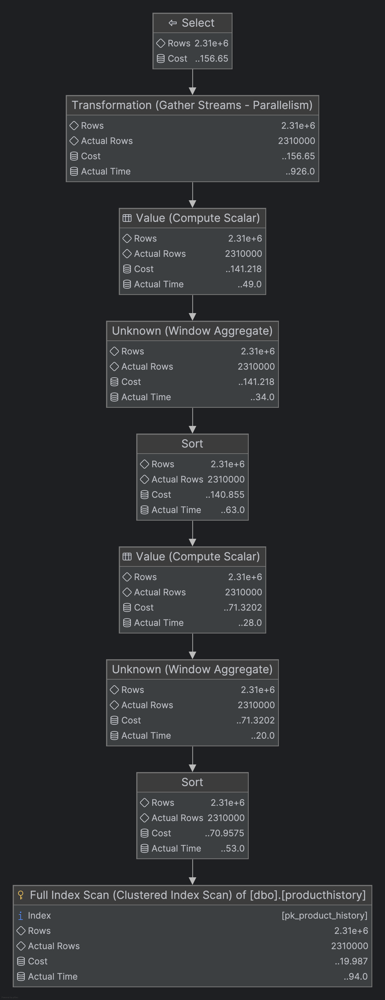
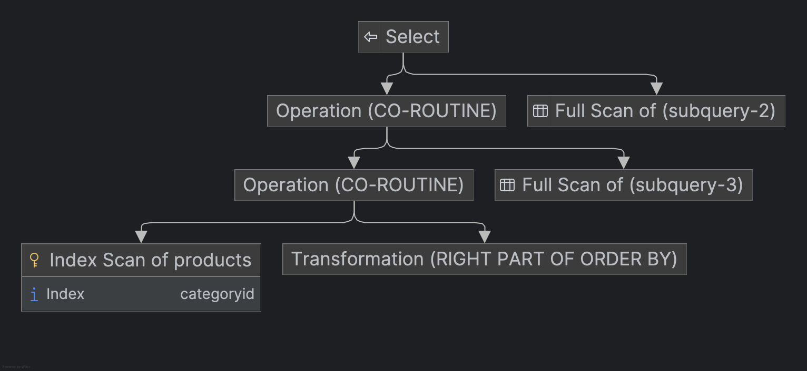

## SQL - Funkcje okna (Window functions) <br> Lab 2

---

**Imiona i nazwiska: Kacper Cienkosz, Miłosz Dubiel**

--- 


Celem ćwiczenia jest zapoznanie się z działaniem funkcji okna (window functions) w SQL, analiza wydajności zapytań i porównanie z rozwiązaniami przy wykorzystaniu "tradycyjnych" konstrukcji SQL

Swoje odpowiedzi wpisuj w miejsca oznaczone jako:

---
> Wyniki: 

```sql
--  ...
```

---

### Ważne/wymagane są komentarze.

Zamieść kod rozwiązania oraz zrzuty ekranu pokazujące wyniki, (dołącz kod rozwiązania w formie tekstowej/źródłowej)

Zwróć uwagę na formatowanie kodu

---

## Oprogramowanie - co jest potrzebne?

Do wykonania ćwiczenia potrzebne jest następujące oprogramowanie:
- MS SQL Server - wersja 2019, 2022
- PostgreSQL - wersja 15/16/17
- SQLite
- Narzędzia do komunikacji z bazą danych
	- SSMS - Microsoft SQL Managment Studio
	- DtataGrip lub DBeaver
-  Przykładowa baza Northwind/Northwind3
	- W wersji dla każdego z wymienionych serwerów

Oprogramowanie dostępne jest na przygotowanej maszynie wirtualnej

## Dokumentacja/Literatura

- Kathi Kellenberger,  Clayton Groom, Ed Pollack, Expert T-SQL Window Functions in SQL Server 2019, Apres 2019
- Itzik Ben-Gan, T-SQL Window Functions: For Data Analysis and Beyond, Microsoft 2020

- Kilka linków do materiałów które mogą być pomocne
	 - [https://learn.microsoft.com/en-us/sql/t-sql/queries/select-over-clause-transact-sql?view=sql-server-ver16](https://learn.microsoft.com/en-us/sql/t-sql/queries/select-over-clause-transact-sql?view=sql-server-ver16)
	- [https://www.sqlservertutorial.net/sql-server-window-functions/](https://www.sqlservertutorial.net/sql-server-window-functions/)
	- [https://www.sqlshack.com/use-window-functions-sql-server/](https://www.sqlshack.com/use-window-functions-sql-server/)
	- [https://www.postgresql.org/docs/current/tutorial-window.html](https://www.postgresql.org/docs/current/tutorial-window.html)
	- [https://www.postgresqltutorial.com/postgresql-window-function/](https://www.postgresqltutorial.com/postgresql-window-function/)
	- [https://www.sqlite.org/windowfunctions.html](https://www.sqlite.org/windowfunctions.html)
	- [https://www.sqlitetutorial.net/sqlite-window-functions/](https://www.sqlitetutorial.net/sqlite-window-functions/)


- W razie potrzeby - opis Ikonek używanych w graficznej prezentacji planu zapytania w SSMS jest tutaj:
	- [https://docs.microsoft.com/en-us/sql/relational-databases/showplan-logical-and-physical-operators-reference](https://docs.microsoft.com/en-us/sql/relational-databases/showplan-logical-and-physical-operators-reference)

## Przygotowanie

Uruchom SSMS
- Skonfiguruj połączenie  z bazą Northwind na lokalnym serwerze MS SQL 

Uruchom DataGrip (lub Dbeaver)
- Skonfiguruj połączenia z bazą Northwind3
	- na lokalnym serwerze MS SQL
	- na lokalnym serwerze PostgreSQL
	- z lokalną bazą SQLite

Można też skorzystać z innych narzędzi klienckich (wg własnego uznania)

Oryginalna baza Northwind jest bardzo mała. Warto zaobserwować działanie na nieco większym zbiorze danych.

Baza Northwind3 zawiera dodatkową tabelę product_history
- 2,2 mln wierszy

Bazę Northwind3 można pobrać z moodle (zakładka - Backupy baz danych)

Można też wygenerować tabelę product_history przy pomocy skryptu

Skrypt dla SQL Srerver

Stwórz tabelę o następującej strukturze:

```sql
create table product_history(
   id int identity(1,1) not null,
   productid int,
   productname varchar(40) not null,
   supplierid int null,
   categoryid int null,
   quantityperunit varchar(20) null,
   unitprice decimal(10,2) null,
   quantity int,
   value decimal(10,2),
   date date,
 constraint pk_product_history primary key clustered
    (id asc )
)
```

Wygeneruj przykładowe dane:

Dla 30000 iteracji, tabela będzie zawierała nieco ponad 2mln wierszy (dostostu ograniczenie do możliwości swojego komputera)

Skrypt dla SQL Srerver

```sql
declare @i int  
set @i = 1  
while @i <= 30000  
begin  
    insert product_history  
    select productid, ProductName, SupplierID, CategoryID,   
         QuantityPerUnit,round(RAND()*unitprice + 10,2),  
         cast(RAND() * productid + 10 as int), 0,  
         dateadd(day, @i, '1940-01-01')  
    from products  
    set @i = @i + 1;  
end;  
  
update product_history  
set value = unitprice * quantity  
where 1=1;
```


Skrypt dla Postgresql

```sql
create table product_history(
   id int generated always as identity not null  
       constraint pkproduct_history
            primary key,
   productid int,
   productname varchar(40) not null,
   supplierid int null,
   categoryid int null,
   quantityperunit varchar(20) null,
   unitprice decimal(10,2) null,
   quantity int,
   value decimal(10,2),
   date date
);
```

Wygeneruj przykładowe dane:

Skrypt dla Postgresql

```sql
do $$  
begin  
  for cnt in 1..30000 loop  
    insert into product_history(productid, productname, supplierid,   
           categoryid, quantityperunit,  
           unitprice, quantity, value, date)  
    select productid, productname, supplierid, categoryid,   
           quantityperunit,  
           round((random()*unitprice + 10)::numeric,2),  
           cast(random() * productid + 10 as int), 0,  
           cast('1940-01-01' as date) + cnt  
    from products;  
  end loop;  
end; $$;  
  
update product_history  
set value = unitprice * quantity  
where 1=1;
```


Wykonaj polecenia: `select count(*) from product_history`,  potwierdzające wykonanie zadania

---
> Wyniki: 

Dla wszystkich trzech systemów bazodanowych polecenie:

```sql
select count(*) from producthistory; -- 2310000
```

zwróciło wynik `2310000`.

---

# Zadanie 1

Baza: Northwind, tabela product_history

Napisz polecenie, które zwraca: id pozycji, id produktu, nazwę produktu, id_kategorii, cenę produktu, średnią cenę produktów w kategorii do której należy dany produkt. Wyświetl tylko pozycje (produkty) których cena jest większa niż średnia cena.

W przypadku długiego czasu wykonania ogranicz zbiór wynikowy do kilkuset/kilku tysięcy wierszy

pomocna może być konstrukcja ` with `

```sql
with t as (

....
)
select * from t
where id between ....
```

Napisz polecenie z wykorzystaniem podzapytania, join'a oraz funkcji okna. Porównaj zapytania. Porównaj czasy oraz plany wykonania zapytań.

Przetestuj działanie w różnych SZBD (MS SQL Server, PostgreSql, SQLite)

---

> Wyniki:

## MSSQL

### Podzapytanie

```sql
SELECT id,
       productid,
       productname,
       categoryid,
       unitprice
FROM producthistory
WHERE unitprice > (
    SELECT AVG(unitprice)
    FROM producthistory AS t
    WHERE t.categoryid = producthistory.categoryid
)
```

#### Plan zapytania:


#### Czas wykonania: 182 \[ms\]

#### Koszt: 49.168

### Join

```sql
SELECT id,
    productid,
    productname,
    pp.categoryid,
    unitprice
FROM producthistory AS pp
JOIN (
    SELECT categoryid,
        AVG(unitprice) AS avgprice
    FROM producthistory
    GROUP BY categoryid
) AS t ON pp.categoryid = t.categoryid
WHERE pp.unitprice > t.avgprice;
```

#### Plan zapytania:


#### Czas wykonania: 198 \[ms\]

#### Koszt: 49.168

### Funkcja okna

```sql
WITH t AS (
    SELECT id,
        productid,
        productname,
        categoryid,
        unitprice,
        AVG(unitprice) OVER (PARTITION BY categoryid) AS avgprice
    FROM producthistory
)

SELECT *
FROM t
WHERE t.unitprice > t.avgprice;
```

#### Plan zapytania:


#### Czas wykonania: 230 \[ms\]

#### Koszt: 69.7459

### Porównanie wyników

<!-- TODO -->

## PostgreSQL
<!-- TODO we can also check the version with WHERE id <= 10_000 -->

### Podzapytanie

```sql
WITH limited_data AS (
    SELECT *
    FROM producthistory
    ORDER BY id
    LIMIT 10000
)
SELECT id,
    productid,
    productname,
    categoryid,
    unitprice
FROM limited_data
WHERE unitprice > (
    SELECT AVG(unitprice)
    FROM limited_data AS t
    WHERE t.categoryid = limited_data.categoryid
);
```

#### Plan zapytania:


#### Czas wykonania: 3151.958 \[ms\]

#### Koszt: 2252228.45

### Join

```sql
SELECT id,
       productid,
       productname,
       pp.categoryid,
       unitprice
FROM producthistory AS pp
JOIN (
    SELECT categoryid,
           AVG(unitprice) AS avgprice
    FROM producthistory
    GROUP BY categoryid
) AS t ON pp.categoryid = t.categoryid
WHERE pp.unitprice > t.avgprice;
```

#### Plan zapytania:


#### Czas wykonania: 1174.49 \[ms\]

#### Koszt: 163587.09

### Funkcja okna

```sql
WITH t AS (
    SELECT id,
        productid,
        productname,
        categoryid,
        unitprice,
        AVG(unitprice) over (PARTITION BY categoryid) AS avgprice
    FROM producthistory
)

SELECT *
FROM t
WHERE t.unitprice > t.avgprice;
```

#### Plan zapytania:


#### Czas wykonania: 2522.537 \[ms\]

#### Koszt: 523998.9

### Porównanie wyników

<!-- TODO -->

## SQLite

### Podzapytanie

```sql
WITH limited_data AS (
    SELECT *
    FROM producthistory
    ORDER BY id
    LIMIT 100000
)
SELECT id,
    productid,
    productname,
    categoryid,
    unitprice
FROM limited_data
WHERE unitprice > (
    SELECT AVG(unitprice)
    FROM limited_data AS t
    WHERE t.categoryid = limited_data.categoryid
);
```
#### Plan zapytania:


#### Czas wykonania: 161229 \[ms\] (Nie ufam temu, to było mierzone sqlite3 CLI)

#### Koszt: --

### Join

```sql
SELECT id,
    productid,
    productname,
    pp.categoryid,
    unitprice
FROM producthistory AS pp
JOIN (
    SELECT categoryid,
        AVG(unitprice) AS avgprice
    FROM producthistory
    GROUP BY categoryid
) AS t ON pp.categoryid = t.categoryid
WHERE pp.unitprice > t.avgprice;
```

#### Plan zapytania:


#### Czas wykonania: 1462 \[ms\]

#### Koszt: --

### Funkcja okna

```sql
WITH t AS (
    SELECT id,
        productid,
        productname,
        categoryid,
        unitprice,
        AVG(unitprice) over (PARTITION BY categoryid) AS avgprice
    FROM producthistory
)

SELECT *
FROM t
WHERE t.unitprice > t.avgprice;
```

#### Plan zapytania:


#### Czas wykonania: 2602 \[ms\]

#### Koszt: --

### Porównanie wyników

<!-- TODO -->

## Porównanie wyników pomiędzy SZBD

<!-- TODO -->

---


# Zadanie 2

Baza: Northwind, tabela product_history

Lekka modyfikacja poprzedniego zadania

Napisz polecenie, które zwraca: id pozycji, id produktu, datę, nazwę produktu, id_kategorii, cenę produktu oraz
-  średnią cenę produktów w kategorii do której należy dany produkt.
-  łączną wartość sprzedaży produktów danej kategorii (suma dla pola value)
-  średnią cenę danego produktu w roku którego dotyczy dana pozycja
-  łączną wartość sprzedaży produktu w roku którego dotyczy dana pozycja (suma dla pola value)

Napisz polecenie z wykorzystaniem podzapytania, join'a oraz funkcji okna. Porównaj zapytania. W przypadku funkcji okna spróbuj użyć klauzuli WINDOW.

Podobnie jak poprzednio, w przypadku długiego czasu wykonania ogranicz zbiór wynikowy do kilkuset/kilku tysięcy wierszy

Porównaj czasy oraz plany wykonania zapytań.

Przetestuj działanie w różnych SZBD (MS SQL Server, PostgreSql, SQLite)


---
> Wyniki: 

## MSSQL

### Podzapytanie

```sql
SELECT id,
    productid,
    productname,
    categoryid,
    unitprice,
    (
        SELECT AVG(unitprice)
        FROM producthistory AS t
        WHERE t.categoryid = producthistory.categoryid
    ) AS avgpricecategory,
    (
        SELECT SUM(unitprice)
        FROM producthistory AS t
        WHERE t.categoryid = producthistory.categoryid
    ) AS sumpricecategory,
    (
        SELECT AVG(unitprice)
        FROM producthistory AS t
        WHERE t.productid = producthistory.productid
    ) AS avgpriceproduct,
    (
        SELECT SUM(unitprice)
        FROM producthistory AS t
        WHERE t.productid = producthistory.productid
    ) AS sumpriceproduct
FROM producthistory;
```

#### Plan zapytania:


#### Czas wykonania: 743 \[ms\]

#### Koszt: 121.366

### Join

```sql
SELECT id,
    pp.productid,
    productname,
    pp.categoryid,
    unitprice,
    avgpricecategory,
    sumpricecategory,
    avgpriceproduct,
    sumpriceproduct
FROM producthistory AS pp
    JOIN (
        SELECT categoryid,
            AVG(unitprice) AS avgpricecategory,
            SUM(VALUE) AS sumpricecategory
        FROM producthistory
        GROUP BY categoryid
    ) AS ct ON pp.categoryid = ct.categoryid
    JOIN (
        SELECT productid,
            AVG(unitprice) AS avgpriceproduct,
            SUM(VALUE) AS sumpriceproduct
        FROM producthistory
        GROUP BY productid
    ) AS pt ON pp.productid = pt.productid;
```

#### Plan zapytania:


#### Czas wykonania: 767 \[ms\]

#### Koszt: 78.3871

### Funkcja okna

```sql
SELECT id,
    productid,
    productname,
    categoryid,
    unitprice,
    AVG(unitprice) over (PARTITION BY categoryid) AS avgpricecategory,
    SUM(VALUE) over (PARTITION BY categoryid) AS sumpricecategory,
    AVG(unitprice) over (PARTITION BY productid) AS avgpriceproduct,
    SUM(VALUE) over (PARTITION BY productid) AS sumpriceproduct
FROM producthistory;
```

#### Plan zapytania:



#### Czas wykonania: 926 \[ms\]

#### Koszt: 156.65

### Porównanie wyników

<!-- TODO -->

## PostgreSQL

### Podzapytanie

```sql
WITH limited_data AS (
    SELECT *
    FROM producthistory
    ORDER BY id
    LIMIT 10000
)
SELECT id,
    productid,
    productname,
    categoryid,
    unitprice,
    (
        SELECT AVG(unitprice)
        FROM limited_data AS t
        WHERE t.categoryid = limited_data.categoryid
    ) AS avgpricecategory,
    (
        SELECT SUM(unitprice)
        FROM limited_data AS t
        WHERE t.categoryid = limited_data.categoryid
    ) AS sumpricecategory,
    (
        SELECT AVG(unitprice)
        FROM limited_data AS t
        WHERE t.productid = limited_data.productid
    ) AS avgpriceproduct,
    (
        SELECT SUM(unitprice)
        FROM limited_data AS t
        WHERE t.productid = limited_data.productid
    ) AS sumpriceproduct
FROM limited_data;
```

#### Plan zapytania:


#### Czas wykonania: 12130.597 \[ms\]

#### Koszt: 9006328.45

### Join

```sql
SELECT id,
    pp.productid,
    productname,
    pp.categoryid,
    unitprice,
    avgpricecategory,
    sumpricecategory,
    avgpriceproduct,
    sumpriceproduct
FROM producthistory AS pp
    JOIN (
        SELECT categoryid,
            AVG(unitprice) AS avgpricecategory,
            SUM(VALUE) AS sumpricecategory
        FROM producthistory
        GROUP BY categoryid
    ) AS ct ON pp.categoryid = ct.categoryid
    JOIN (
        SELECT productid,
            AVG(unitprice) AS avgpriceproduct,
            SUM(VALUE) AS sumpriceproduct
        FROM producthistory
        GROUP BY productid
    ) AS pt ON pp.productid = pt.productid;
```

#### Plan zapytania:


#### Czas wykonania: 1778.622 \[ms\]

#### Koszt: 250998.1

### Funkcja okna

```sql
SELECT id,
    productid,
    productname,
    categoryid,
    unitprice,
    AVG(unitprice) over category_window AS avgpricecategory,
    SUM(VALUE) over category_window AS sumpricecategory,
    AVG(unitprice) over product_window AS avgpriceproduct,
    SUM(VALUE) over product_window AS sumpriceproduct
FROM producthistory window category_window AS (PARTITION BY categoryid),
    product_window AS (PARTITION BY productid);
```

#### Plan zapytania:


#### Czas wykonania: 5436.37 \[ms\]

#### Koszt: 1073228.56

### Porównanie wyników

<!-- TODO -->

## SQLite

### <<QUERY TYPE>>

```sql
WITH limited_data AS (
    SELECT *
    FROM producthistory
    ORDER BY id
    LIMIT 10000
)

SELECT id,
       productid,
       productname,
       categoryid,
       unitprice,
       (
           SELECT AVG(unitprice)
           FROM limited_data AS t
           WHERE t.categoryid = limited_data.categoryid
       ) AS avgpricecategory,
       (
           SELECT SUM(unitprice)
           FROM limited_data AS t
           WHERE t.categoryid = limited_data.categoryid
       ) AS sumpricecategory,
       (
           SELECT AVG(unitprice)
           FROM limited_data AS t
           WHERE t.productid = limited_data.productid
       ) AS avgpriceproduct,
       (
           SELECT SUM(unitprice)
           FROM limited_data AS t
           WHERE t.productid = limited_data.productid
       ) AS sumpriceproduct
FROM limited_data;
```

#### Plan zapytania:


#### Czas wykonania: 12514 \[ms\]

#### Koszt: --

### <<QUERY TYPE>>

```sql
SELECT id,
       pp.productid,
       productname,
       pp.categoryid,
       unitprice,
       avgpricecategory,
       sumpricecategory,
       avgpriceproduct,
       sumpriceproduct
FROM producthistory AS pp
JOIN (
    SELECT categoryid,
           AVG(unitprice) AS avgpricecategory,
           SUM(VALUE) AS sumpricecategory
    FROM producthistory
    GROUP BY categoryid
) AS ct ON pp.categoryid = ct.categoryid
JOIN (
    SELECT productid,
           AVG(unitprice) AS avgpriceproduct,
           SUM(VALUE) AS sumpriceproduct
    FROM producthistory
    GROUP BY productid
) AS pt ON pp.productid = pt.productid;
```

#### Plan zapytania:


#### Czas wykonania: 6373 \[ms\]

#### Koszt: --

### <<QUERY TYPE>>

```sql
SELECT id,
       productid,
       productname,
       categoryid,
       unitprice,
       AVG(unitprice) over category_window AS avgpricecategory,
       SUM(VALUE) over category_window AS sumpricecategory,
       AVG(unitprice) over product_window AS avgpriceproduct,
       SUM(VALUE) over product_window AS sumpriceproduct
FROM producthistory window category_window AS (PARTITION BY categoryid),
    product_window AS (PARTITION BY productid);
```

#### Plan zapytania:


#### Czas wykonania: 6957 \[ms\]

#### Koszt: --

### Porównanie wyników

<!-- TODO -->
Nie ufam czasom wykonania – były mierzone sqlite3 CLI

## Porównanie wyników pomiędzy SZBD

<!-- TODO -->

---


# Zadanie 3 

Funkcje rankingu, `row_number()`, `rank()`, `dense_rank()`

Wykonaj polecenie, zaobserwuj wynik. Porównaj funkcje row_number(), rank(), dense_rank().  Skomentuj wyniki.

```sql 
select productid, productname, unitprice, categoryid,  
    row_number() over(partition by categoryid order by unitprice desc) as rowno,  
    rank() over(partition by categoryid order by unitprice desc) as rankprice,  
    dense_rank() over(partition by categoryid order by unitprice desc) as denserankprice  
from products;
```

---
> Wyniki: 

## MSSQL

```sql
SELECT productid,
       productname,
       unitprice,
       categoryid,
       row_number() over (PARTITION BY categoryid ORDER BY unitprice DESC) AS rowno,
       rank() over (PARTITION BY categoryid ORDER BY unitprice DESC) AS rankprice,
       dense_rank() over (PARTITION BY categoryid ORDER BY unitprice DESC) AS denserankprice
FROM products;
```

#### Plan zapytania:


#### Czas wykonania: 0.0 \[ms\]

#### Koszt: 0.0162292

## PostgreSQL

```sql
SELECT productid,
       productname,
       unitprice,
       categoryid,
       row_number() over (PARTITION BY categoryid ORDER BY unitprice DESC) AS rowno,
       rank() over (PARTITION BY categoryid ORDER BY unitprice DESC) AS rankprice,
       dense_rank() over (PARTITION BY categoryid ORDER BY unitprice DESC) AS denserankprice
FROM products;
```

#### Plan zapytania:


#### Czas wykonania: 6.11 \[ms\]

#### Koszt: 0.052

## SQLite

```sql
SELECT productid,
       productname,
       unitprice,
       categoryid,
       row_number() over (PARTITION BY categoryid ORDER BY unitprice DESC) AS rowno,
       rank() over (PARTITION BY categoryid ORDER BY unitprice DESC) AS rankprice,
       dense_rank() over (PARTITION BY categoryid ORDER BY unitprice DESC) AS denserankprice
FROM products;
```

#### Plan zapytania:



#### Czas wykonania: 4 \[ms\]

#### Koszt: --

## Porównanie wyników pomiędzy SZBD

<!-- TODO -->

## Skrócony rezultat zapytań (z MSSQL, TOP 15)

| productid | productname                | unitprice | categoryid | rowno | rankprice | denserankprice |
| :-------- | :------------------------- | :-------- | :--------- | :---- | :-------- | :------------- |
| 38        | Côte de Blaye              | 263.5000  | 1          | 1     | 1         | 1              |
| 43        | Ipoh Coffee                | 46.0000   | 1          | 2     | 2         | 2              |
| 2         | Chang                      | 19.0000   | 1          | 3     | 3         | 3              |
| 1         | Chai                       | 18.0000   | 1          | 4     | 4         | 4              |
| 39        | Chartreuse verte           | 18.0000   | 1          | 5     | 4         | 4              |
| 35        | Steeleye Stout             | 18.0000   | 1          | 6     | 4         | 4              |
| 76        | Lakkalikööri               | 18.0000   | 1          | 7     | 4         | 4              |
| 70        | Outback Lager              | 15.0000   | 1          | 8     | 8         | 5              |
| 67        | Laughing Lumberjack Lager  | 14.0000   | 1          | 9     | 9         | 6              |
| 34        | Sasquatch Ale              | 14.0000   | 1          | 10    | 9         | 6              |
| 75        | Rhönbräu Klosterbier       | 7.7500    | 1          | 11    | 11        | 7              |
| 24        | Guaraná Fantástica         | 4.5000    | 1          | 12    | 12        | 8              |
| 63        | Vegie-spread               | 43.9000   | 2          | 1     | 1         | 1              |
| 8         | Northwoods Cranberry Sauce | 40.0000   | 2          | 2     | 2         | 2              |
| 61        | Sirop d'érable             | 28.5000   | 2          | 3     | 3         | 3              |

## Porównanie funkcji

 * `row_number()` - nadaje unikalny numer dla każdego wiersza w grupie
 * `rank()` - nadaje numer dla każdego wiersza w grupie, ale w przypadku równych wartości, nadaje ten sam numer i "dziury" w numeracji (np. 1, 2, 2, 4)
 * `dense_rank()` - nadaje numer dla każdego wiersza w grupie. W przypadku równych wartości nadaje ten sam numer, ale nie ma "dziur" w numeracji (np. 1, 2, 2, 3)

---

Zadanie

Spróbuj uzyskać ten sam wynik bez użycia funkcji okna

---
> Wyniki: 

Najpierw przedstawmy zapytania równoważne dla każdej z użytych powyżej funkcji:

### row_number()

```sql
SELECT (
    SELECT COUNT(*)
    FROM products p2
    WHERE p2.categoryid = p1.categoryid
      AND (
        p2.unitprice > p1.unitprice
            OR (
            p2.unitprice = p1.unitprice
                AND p2.productid < p1.productid
            )
        )
) + 1 AS rowno
FROM products p1
ORDER BY categoryid, rowno;
```

### rank()

```sql
SELECT (
    SELECT COUNT(*)
    FROM products p2
    WHERE p2.categoryid = p1.categoryid
      AND p2.unitprice > p1.unitprice
) + 1 AS rankprice
FROM products p1
ORDER BY categoryid, rankprice;
```

### dense_rank()

```sql
SELECT (
    SELECT COUNT(DISTINCT p2.unitprice)
    FROM products p2
    WHERE p2.categoryid = p1.categoryid
      AND p2.unitprice > p1.unitprice
) + 1 AS denserankprice
FROM products p1
ORDER BY categoryid, denserankprice;
```

Teraz dokonajmy porównania wyników pomiędzy różnymi SZBD:

## MSSQL

```sql
SELECT p1.productid,
       p1.productname,
       p1.unitprice,
       p1.categoryid,
       (
           SELECT COUNT(*)
           FROM products p2
           WHERE p2.categoryid = p1.categoryid
               AND (
                   p2.unitprice > p1.unitprice
                   OR (
                       p2.unitprice = p1.unitprice
                       AND p2.productid < p1.productid
                   )
               )
       ) + 1 AS rowno,
       (
           SELECT COUNT(*)
           FROM products p2
           WHERE p2.categoryid = p1.categoryid
               AND p2.unitprice > p1.unitprice
       ) + 1 AS rankprice,
       (
           SELECT COUNT(DISTINCT p2.unitprice)
           FROM products p2
           WHERE p2.categoryid = p1.categoryid
               AND p2.unitprice > p1.unitprice
       ) + 1 AS denserankprice
FROM products p1
ORDER BY categoryid, rowno;
```

#### Plan zapytania:


#### Czas wykonania: 3 \[ms\]

#### Koszt: 0.964302

## PostgreSQL

```sql
SELECT p1.productid,
       p1.productname,
       p1.unitprice,
       p1.categoryid,
       (
           SELECT COUNT(*)
           FROM products p2
           WHERE p2.categoryid = p1.categoryid
               AND (
                   p2.unitprice > p1.unitprice
                   OR (
                       p2.unitprice = p1.unitprice
                       AND p2.productid < p1.productid
                   )
               )
       ) + 1 AS rowno,
       (
           SELECT COUNT(*)
           FROM products p2
           WHERE p2.categoryid = p1.categoryid
               AND p2.unitprice > p1.unitprice
       ) + 1 AS rankprice,
       (
           SELECT COUNT(DISTINCT p2.unitprice)
           FROM products p2
           WHERE p2.categoryid = p1.categoryid
               AND p2.unitprice > p1.unitprice
       ) + 1 AS denserankprice
FROM products p1
ORDER BY categoryid, rowno;
```

#### Plan zapytania:


#### Czas wykonania: 1.134 \[ms\]

#### Koszt: 538.85

## SQLite

```sql
SELECT p1.productid,
       p1.productname,
       p1.unitprice,
       p1.categoryid,
       (
           SELECT COUNT(*)
           FROM products p2
           WHERE p2.categoryid = p1.categoryid
             AND (
               p2.unitprice > p1.unitprice
                   OR (
                   p2.unitprice = p1.unitprice
                       AND p2.productid < p1.productid
                   )
               )
       ) + 1 AS rowno,
       (
           SELECT COUNT(*)
           FROM products p2
           WHERE p2.categoryid = p1.categoryid
             AND p2.unitprice > p1.unitprice
       ) + 1 AS rankprice,
       (
           SELECT COUNT(DISTINCT p2.unitprice)
           FROM products p2
           WHERE p2.categoryid = p1.categoryid
             AND p2.unitprice > p1.unitprice
       ) + 1 AS denserankprice
FROM products p1
ORDER BY categoryid, rowno;
```

#### Plan zapytania:


#### Czas wykonania: 5 \[ms\]

#### Koszt: --

## Porównanie wyników pomiędzy SZBD

<!-- TODO -->

---
# Zadanie 4

Baza: Northwind, tabela product_history

Dla każdego produktu, podaj 4 najwyższe ceny tego produktu w danym roku. Zbiór wynikowy powinien zawierać:
- rok
- id produktu
- nazwę produktu
- cenę
- datę (datę uzyskania przez produkt takiej ceny)
- pozycję w rankingu

Uporządkuj wynik wg roku, nr produktu, pozycji w rankingu

Spróbuj uzyskać ten sam wynik bez użycia funkcji okna, porównaj wyniki, czasy i plany zapytań. Przetestuj działanie w różnych SZBD (MS SQL Server, PostgreSql, SQLite)

---
> Wyniki: 

**MSSQL**

* podzapytanie

```sql
WITH limited_data AS (
    SELECT *
    FROM producthistory
    WHERE datepart(YEAR, DATE) = 1940
),
     t AS (
         SELECT datepart(YEAR, DATE) AS YEAR,
                ph.productid,
                productname,
                ph.unitprice,
                DATE,
                (
                    SELECT COUNT(*)
                    FROM limited_data AS ph2
                    WHERE datepart(YEAR, ph2.date) = datepart(YEAR, ph.date)
                      AND ph2.productid = ph.productid
                      AND (
                        ph2.unitprice > ph.unitprice
                            OR (
                            ph2.unitprice = ph.unitprice
                                AND ph2.date < ph.date
                            )
                        )
                ) + 1 AS ranking
         FROM limited_data AS ph
     )
SELECT *
FROM t
WHERE ranking < 5
ORDER BY YEAR,
         productid,
         ranking;
```

Query plan:


Czas wykonania: 242902 \[ms\]

Koszt: 4915.65

* funkcja okna

```sql
WITH t AS (
    SELECT datepart(YEAR, DATE) AS YEAR,
           productid,
           productname,
           unitprice,
           DATE,
           row_number() over (
               PARTITION BY datepart(YEAR, DATE),
               productid
               ORDER BY unitprice DESC
               ) AS ranking
    FROM producthistory
)
SELECT *
FROM t
WHERE ranking < 5
ORDER BY YEAR,
         productid,
         ranking;
```

Query plan:


Czas wykonania: 462 \[ms\]

Koszt: 75.3262

**PostgreSQL**

* podzapytanie

```sql
WITH limited_data AS (
    SELECT *
    FROM producthistory
    WHERE date_part('year', DATE) = 1940
    ORDER BY DATE
),
     t AS (
         SELECT date_part('year', DATE) AS YEAR,
                ph.productid,
                productname,
                ph.unitprice,
                DATE,
                (
                    SELECT COUNT(*)
                    FROM limited_data AS ph2
                    WHERE date_part('year', ph2.date) = date_part('year', ph.date)
                      AND ph2.productid = ph.productid
                      AND (
                        ph2.unitprice > ph.unitprice
                            OR (
                            ph2.unitprice = ph.unitprice
                                AND ph2.date < ph.date
                            )
                        )
                ) + 1 AS ranking
         FROM limited_data AS ph
         ORDER BY YEAR,
                  productid,
                  ranking
     )
SELECT *
FROM t
WHERE ranking < 5
ORDER BY YEAR,
         productid,
         ranking;
```

Query plan:


Czas wykonania: 24446.791 \[ms\]

Koszt: 5249164.55

* funkcja okna

```sql
WITH t AS (
    SELECT date_part('year', DATE) AS YEAR,
        productid,
        productname,
        unitprice,
        DATE,
        row_number() over (
            PARTITION BY date_part('year', DATE),
            productid
            ORDER BY unitprice DESC
        ) AS ranking
    FROM producthistory
    ORDER BY YEAR,
        productid,
        ranking
)
SELECT *
FROM t
WHERE ranking < 5
ORDER BY YEAR,
    productid,
    ranking;
```

Query plan:


Czas wykonania: 1876.405 \[ms\]

Koszt: 594899.67

**SQLite**

* podzapytanie

```sql
WITH limited_data AS (
    SELECT *
    FROM producthistory
    WHERE strftime('%Y', DATE) = '1940'
    ORDER BY DATE
),
t AS (
    SELECT strftime('%Y', DATE) AS YEAR,
        ph.productid,
        productname,
        ph.unitprice,
        DATE,
        (
            SELECT COUNT(*)
            FROM limited_data AS ph2
            WHERE strftime('%Y', ph2.date) = strftime('%Y', ph.date)
                AND ph2.productid = ph.productid
                AND (
                    ph2.unitprice > ph.unitprice
                    OR (
                        ph2.unitprice = ph.unitprice
                        AND ph2.date < ph.date
                    )
                )
        ) + 1 AS ranking
    FROM limited_data AS ph
    ORDER BY YEAR,
        productid,
        ranking
)
SELECT *
FROM t
WHERE ranking < 5
ORDER BY YEAR,
    productid,
    ranking;
```
Query plan:


Czas wykonania: 3370 \[ms\] (Nie ufam temu, to było mierzone sqlite3 CLI)

Koszt: --

* funkcja okna

```sql
WITH t AS (
    SELECT strftime('%Y', DATE) AS YEAR,
        productid,
        productname,
        unitprice,
        DATE,
        row_number() over (
            PARTITION BY strftime('%Y', DATE),
            productid
            ORDER BY unitprice DESC
        ) AS ranking
    FROM producthistory
    ORDER BY YEAR,
        productid,
        ranking
)
SELECT *
FROM t
WHERE ranking < 5
ORDER BY YEAR,
    productid,
    ranking;
```

Query plan:


Czas wykonania: 2953 \[ms\]

Koszt: --

---


# Zadanie 5 

Funkcje `lag()`, `lead()`

Wykonaj polecenia, zaobserwuj wynik. Jak działają funkcje `lag()`, `lead()`

```sql
select productid, productname, categoryid, date, unitprice,  
       lag(unitprice) over (partition by productid order by date)   
as previousprodprice,  
       lead(unitprice) over (partition by productid order by date)   
as nextprodprice  
from product_history  
where productid = 1 and year(date) = 2022  
order by date;  
```

```sql
with t as (select productid, productname, categoryid, date, unitprice,  
                  lag(unitprice) over (partition by productid   
order by date) as previousprodprice,  
                  lead(unitprice) over (partition by productid   
order by date) as nextprodprice  
           from product_history  
           )  
select * from t  
where productid = 1 and year(date) = 2022  
order by date;
```

---
> Wyniki: 

**MSSQL**

* podzapytanie

```sql

```

Query plan:


Czas wykonania:  \[ms\]

Koszt:

* join

```sql

```

Query plan:


Czas wykonania: \[ms\]

Koszt:

* funkcja okna

```sql

```

Query plan:


Czas wykonania:  \[ms\]

Koszt: 

**PostgreSQL**

* podstawowa funkcja okna

```sql
SELECT productid,
       productname,
       categoryid,
       date,
       unitprice,
       lag(unitprice) OVER (PARTITION BY productid ORDER BY date) AS previousprodprice,
       lead(unitprice) OVER (PARTITION BY productid ORDER BY date) AS nextprodprice
FROM producthistory
WHERE productid = 1
  AND DATE_PART('year', date) = 2022
ORDER BY date;
```

Query plan:


Czas wykonania:  \[ms\]

Koszt: 

* funkcja okna w podzapytaniu

```sql
WITH t AS (
  SELECT productid,
         productname,
         categoryid,
         date,
         unitprice,
         lag(unitprice) over (PARTITION BY productid ORDER BY date) AS previousprodprice,
         lead(unitprice) over (PARTITION BY productid ORDER BY date) AS nextprodprice
  FROM product_history
)
SELECT *
FROM t
WHERE productid = 1
  AND DATE_PART('year', date) = 2022
ORDER BY date;
```

Query plan:


Czas wykonania:  \[ms\]

Koszt: 

**SQLite**

* podzapytanie

```sql

```
Query plan:


Czas wykonania:  \[ms\] (Nie ufam temu, to było mierzone sqlite3 CLI)

Koszt: --

* join

```sql

```

Query plan:


Czas wykonania:  \[ms\]

Koszt: --

* funkcja okna

```sql

```

Query plan:


Czas wykonania:  \[ms\]

Koszt: --

---

Zadanie

Spróbuj uzyskać ten sam wynik bez użycia funkcji okna, porównaj wyniki, czasy i plany zapytań. Przetestuj działanie w różnych SZBD (MS SQL Server, PostgreSql, SQLite)

---
> Wyniki: 

```sql
SELECT productid,
  productname,
  categoryid,
  date,
  ph1.unitprice,
  (
    SELECT ph2.unitprice
    FROM producthistory AS ph2
    WHERE ph2.productid = ph1.productid
      AND DATE_PART('year', ph2.date) = 2022
      AND ph2.date < ph1.date
    ORDER BY ph2.date DESC
    LIMIT 1
  ) AS previousprodprice,
  (
    SELECT ph3.unitprice
    FROM producthistory AS ph3
    WHERE ph3.productid = ph1.productid
      AND DATE_PART('year', ph3.date) = 2022
      AND ph3.date > ph1.date
    ORDER BY ph3.date ASC
    LIMIT 1
  ) AS nextprodprice
FROM producthistory ph1
WHERE productid = 1
  AND DATE_PART('year', date) = 2022
ORDER BY date;
```

---


# Zadanie 6

Baza: Northwind, tabele customers, orders, order details

Napisz polecenie które wyświetla inf. o zamówieniach

Zbiór wynikowy powinien zawierać:
- nazwę klienta, nr zamówienia,
- datę zamówienia,
- wartość zamówienia (wraz z opłatą za przesyłkę),
- nr poprzedniego zamówienia danego klienta,
- datę poprzedniego zamówienia danego klienta,
- wartość poprzedniego zamówienia danego klienta.

---
> Wyniki: 

```sql
--  ...
```

---


# Zadanie 7 

Funkcje `first_value()`, `last_value()`

Baza: Northwind, tabele customers, orders, order details

Wykonaj polecenia, zaobserwuj wynik. Jak działają funkcje `first_value()`, `last_value()`. Skomentuj uzyskane wyniki. Czy funkcja `first_value` pokazuje w tym przypadku najdroższy produkt w danej kategorii, czy funkcja `last_value()` pokazuje najtańszy produkt? Co jest przyczyną takiego działania funkcji `last_value`. Co trzeba zmienić żeby funkcja last_value pokazywała najtańszy produkt w danej kategorii

```sql
select productid, productname, unitprice, categoryid,  
    first_value(productname) over (partition by categoryid   
order by unitprice desc) first,  
    last_value(productname) over (partition by categoryid   
order by unitprice desc) last  
from products  
order by categoryid, unitprice desc;
```

---
> Wyniki: 

```sql
--  ...
```

---

Zadanie

Spróbuj uzyskać ten sam wynik bez użycia funkcji okna, porównaj wyniki, czasy i plany zapytań. Przetestuj działanie w różnych SZBD (MS SQL Server, PostgreSql, SQLite)

---
> Wyniki: 

```sql
--  ...
```

---


# Zadanie 8

Baza: Northwind, tabele orders, order details

Napisz polecenie które wyświetla inf. o zamówieniach

Zbiór wynikowy powinien zawierać:
- Id klienta,
- nr zamówienia,
- datę zamówienia,
- wartość zamówienia (wraz z opłatą za przesyłkę),
- dane zamówienia klienta o najniższej wartości w danym miesiącu
	- nr zamówienia o najniższej wartości w danym miesiącu
	- datę tego zamówienia
	- wartość tego zamówienia
- dane zamówienia klienta o najwyższej wartości w danym miesiącu
	- nr zamówienia o najniższej wartości w danym miesiącu
	- datę tego zamówienia
	- wartość tego zamówienia

---
> Wyniki: 

```sql
--  ...
```

---


# Zadanie 9

Baza: Northwind, tabela product_history

Napisz polecenie które pokaże wartość sprzedaży każdego produktu narastająco od początku każdego miesiąca. Użyj funkcji okna

Zbiór wynikowy powinien zawierać:
- id pozycji
- id produktu
- datę
- wartość sprzedaży produktu w danym dniu
- wartość sprzedaży produktu narastające od początku miesiąca

W przypadku długiego czasu wykonania ogranicz zbiór wynikowy do kilkuset/kilku tysięcy wierszy

```sql
-- wyniki ...
```

Spróbuj wykonać zadanie bez użycia funkcji okna. Spróbuj uzyskać ten sam wynik bez użycia funkcji okna, porównaj wyniki, czasy i plany zapytań. Przetestuj działanie w różnych SZBD (MS SQL Server, PostgreSql, SQLite)

---
> Wyniki: 

```sql
--  ...
```

---


# Zadanie 10

Wykonaj kilka "własnych" przykładowych analiz. Czy są jeszcze jakieś ciekawe/przydatne funkcje okna (z których nie korzystałeś w ćwiczeniu)? Spróbuj ich użyć w zaprezentowanych przykładach.

---
> Wyniki: 

```sql
--  ...
```

---
Punktacja

|         |     |
| ------- | --- |
| zadanie | pkt |
| 1       | 2   |
| 2       | 2   |
| 3       | 2   |
| 4       | 2   |
| 5       | 2   |
| 6       | 2   |
| 7       | 2   |
| 8       | 2   |
| 9       | 2   |
| 10      | 2   |
| razem   | 20  |
